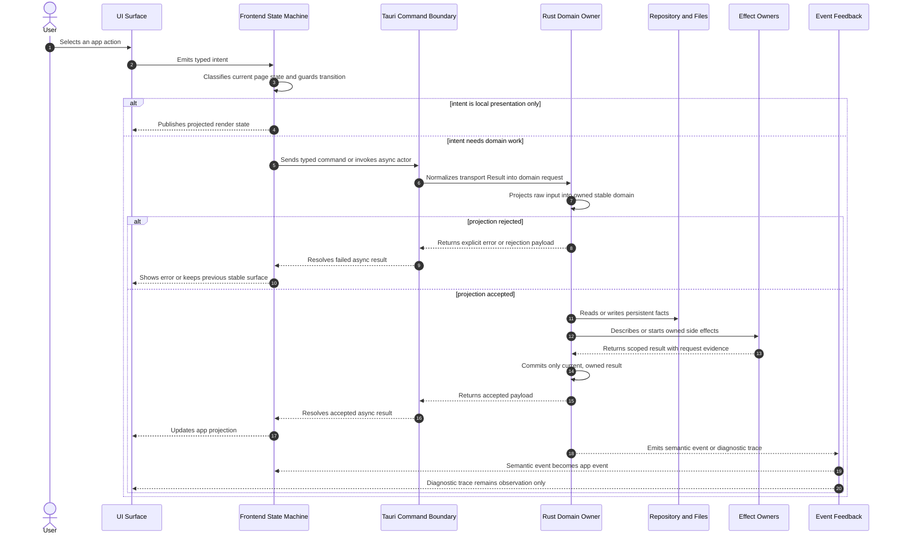
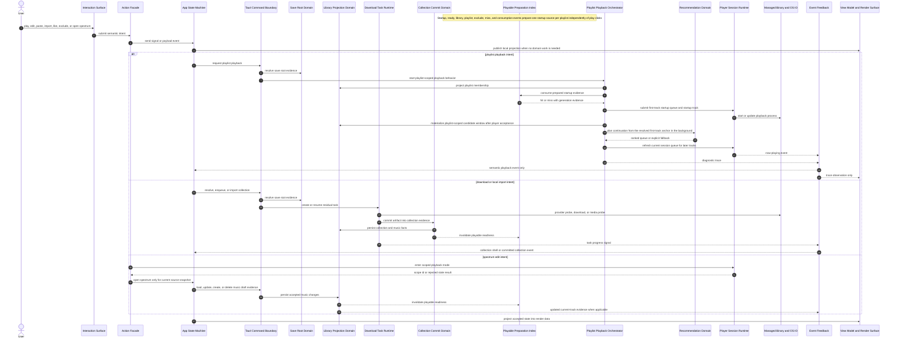

# Slisic Project Behavior Design

## Purpose

This document describes Slisic as a behavior system. It is not a call graph,
module index, or symbol map. GitNexus already owns code navigation and execution
flow discovery. This document owns the project-level behavioral contract:
participants, invariants, stable domains, interaction timing, side effects,
fallback boundaries, and the composition rules that keep local-first music
library behavior predictable.

## Behavior

Slisic turns user interaction into local music-library state, playback state,
and media-tool effects. The frontend owns user intent, screen state, drafts, and
presentation. The Tauri command boundary owns typed request/response transport.
The Rust domains own persistent library facts, download/import materialization,
playlist playback selection, player lifecycle, waveform analysis, and managed
binary effects. Events flowing back from Rust are semantic feedback only when
they are explicitly modeled as app events; diagnostic traces remain observation.

The project-level compositor is the app behavior boundary across:

- UI action owners;
- frontend state machines;
- Tauri command adapters;
- Rust domain services;
- repositories and local files;
- player and managed binaries;
- event feedback into the UI.

## Participants

| Participant                                 | Owns                                                                                                             | Does not own                                                    |
| ------------------------------------------- | ---------------------------------------------------------------------------------------------------------------- | --------------------------------------------------------------- |
| `AppBootstrapStore`                         | window kind, bootstrap readiness, updater start admission, warm-window ownership                                 | playlist state, playback identity, library facts                |
| `appLogic` state machine                    | page state, playlist/config/spectrum transitions, draft context, visible app state                               | persistence, media playback, download execution, waveform bytes |
| `pasteDownload` machine                     | pasted URL candidate lifecycle and candidate-local async result ownership                                        | collection membership, download task execution                  |
| `playlistCommit` machine                    | queued playlist draft commits and optimistic preview sequencing                                                  | playlist storage semantics after command acceptance             |
| React components and view models            | render projection, local interaction gestures, display geometry                                                  | stable domain construction, repository writes                   |
| `commandAdapter` / generated `cmd` bindings | typed transport and `Result` normalization at the Tauri boundary                                                 | domain meaning of successful payloads                           |
| `playlists` domain                          | collection, group, music, playlist, exclude, liked, and spectrum source facts                                    | playback queue consumption, provider probing, binary execution  |
| `collection_import` domain                  | collection shell, local folder projection, final file paths, manifests, music materialization                    | URL task scheduling and playlist playback policy                |
| `downloads` domain                          | URL resolution, task lifecycle, provider probing, leaf scheduling, retry and resume                              | final stable music ownership after collection commit            |
| `playlist_playback` domain                  | playable-source preparation, first-track selection, startup next-track planning, recommendation queue planning, exclude-and-skip behavior | low-level player process control, playlist row storage          |
| `player` domain                             | active playback request, session generation, queue consumption, spectrum playback scope, seek, waveform commands | playlist membership and recommendation policy                   |
| `utils::binaries`                           | managed binary installation and maintenance admission                                                            | library state, task semantics, playback semantics               |
| Trace/debug owners                          | observation and diagnostic persistence                                                                           | state transitions, fallback choice, cache semantics             |

## Core Invariants

- A user action enters exactly one behavior owner before it can become a domain
  command. Components do not write persistent domain state directly.
- Frontend state is a projection of accepted app behavior. Rust repositories are
  the source of persistent library facts.
- Stable library identity is constructed by domain owners, not by UI strings,
  cache entries, trace messages, or filesystem residue.
- Playback identity is scoped by playlist name, canonical music identity, file
  path, range, and current player generation.
- Download task rows contain residual work and diagnostics. Completed music is
  owned by collection records and manifests.
- Cache hit or miss can change latency, availability, or degraded presentation,
  but cannot decide membership, playable validity, or command legality.
- Fallback is always scoped to the behavior owner that declares it. Fallback may
  degrade availability; it must not manufacture stable state owned by another
  domain.
- Async results must carry enough request, candidate, scope, generation, or
  transaction evidence to be ignored when stale.
- Repeated actions, repeated async completions, and cancellation followed by a
  retry must not create extra semantic side effects.
- Diagnostic trace is removable without changing app behavior.

## Stable Domains

| Projection                                             | Owner                                              | Total | Failure expression                                                      |
| ------------------------------------------------------ | -------------------------------------------------- | ----- | ----------------------------------------------------------------------- |
| raw window metadata -> app bootstrap snapshot          | `AppBootstrapStore`                                | no    | bootstrap status becomes `error`                                        |
| raw app event -> app state transition                  | `appLogic`                                         | no    | explicit `error` state or ignored event                                 |
| clipboard text -> downloadable URL text                | `pasteDownload/core`                               | no    | candidate status `invalid_url`                                          |
| playlist draft -> playlist write request               | config view model / `playlistCommit` request owner | no    | commit remains failed and preview is retained or cleared by queue rules |
| raw URL -> collection download plan                    | `downloads::service` and `collection_import`       | no    | enqueue/resolve error                                                   |
| local folder -> collection shell / imported collection | `collection_import`                                | no    | task failure and collection shell cleanup by frontend candidate owner   |
| collection, group, music rows -> playlist selection    | `playlists::repo`                                  | no    | missing playlist or empty selection                                     |
| raw playlist source -> playable track                  | `playlist_playback::service`                       | no    | missing path, missing file, duplicate, excluded source                  |
| playback payload -> `PlaybackTrack`                    | `player::model`                                    | no    | command returns invalid payload error                                   |
| raw file path -> waveform track identity               | `SpectrumVisualizer` / player waveform boundary    | no    | no waveform plan or hidden playhead                                     |
| raw selection edits -> stable music range draft        | spectrum draft owner                               | no    | incomplete range blocks commit                                          |

Stable values require construction evidence and elimination rules. A value being
already normalized does not authorize arbitrary code to construct the stable
domain directly.

## Project-Level Interaction Sequence

The first sequence below is the project-wide behavior skeleton. It intentionally
does not show function calls. It shows which responsibility is triggered, which
owner transforms the behavior, where effects are interpreted, and how feedback
returns.

The second sequence is a representative cross-domain behavior chain. It keeps
the same abstraction level, but names the main project responsibilities so the
feedback and side-effect boundaries are visible.

## Main Behavior Chains

### Startup And Window Bootstrap

`AppBootstrapStore` sends app-ready evidence, resolves the current window kind,
records renderer readiness once, starts updater checks only for eligible window
metadata, and maintains warm-window ownership by named owners. It owns window
bootstrap state only. It does not own library loading or page state.

Project invariant: prepared windows, support windows, updater checks, and window
warm/cold effects cannot change playlist, playback, or library semantics.

### Library Loading And Page State

`appLogic` starts in `idle`, enters `loading`, invokes collection and playlist
loading, and then moves into `ready`, `config`, `play`, `spectrum`, or `error`.
Its context is the frontend projection used by the screen. It can optimistically
update visible surfaces after accepted events, but persistent facts remain owned
by Rust repositories.

Project invariant: page transitions may stop playback or exit spectrum scope
through effect owners, but page transition code cannot directly edit player
session internals or library rows.

### Paste Download And Collection Import

`pasteDownload` turns clipboard text into candidate items. Each candidate owns
its sequence id and accepts only async results for that id. Valid new URLs are
sent to the download domain. Existing collections and enqueued downloads feed
collection shell evidence back into `appLogic`.

`downloads` owns task scheduling and residual work. `collection_import` owns the
projection from temporary or local files into stable collection rows and
manifests. Local import first publishes a shell, then replaces it with a full
collection after playable files and manifest evidence are validated.

Project invariant: existing files, temporary files, and active task rows are
recovery or progress evidence only; they do not define playlist membership.

### Playlist Draft Commit

`playlistCommit` serializes playlist draft commits. It owns the active request,
the pending queue, and preview feedback into `appLogic`. The playlists domain
owns the accepted persistent playlist row and notifies playable-index owners
after mutations.

Project invariant: preview state is not persisted state. A queued preview can
shape UI feedback, but only command success can publish a saved playlist.

### Playlist Playback

The UI action supplies a playlist name and app state evidence. `appLogic` moves
to `play` only when the user intent should start playback. `playlist_playback`
then consumes a playlist-scoped startup source that was prepared independently
of the play action, resolves it into a playable first-track anchor, submits the
single-track startup queue to `player`, and only then starts background queue
planning for the first continuation and later continuations. The first track is
live random startup selection. Later tracks come from the recommendation chain
when available.

Project invariant: first-track preparation is not owned by the play button,
playitem click, player session, or recommendation loop. Runtime startup, ready
state, library changes, playlist changes, exclude changes, misses, and
prepared-source consumption are the only events that may schedule first-track
preparation. Consuming a prepared startup source immediately schedules its
replacement; it does not wait for the current track to finish.

Project invariant: playback start composes only first-track selection and
player submission. It must not fetch playlist candidate windows or invoke the
recommendation planner before `player` accepts playback. The startup queue is
`[first]`; background queue planning must attempt to replace it with
`[first, next]` immediately after acceptance. Player track-boundary waiting for
ordered queue supply is not a normal continuation strategy; if a boundary has
no next track, the upstream background queue-planning owner failed to satisfy
its contract.

Project invariant: the player consumes an explicit queue. It never queries
playlist membership and cannot widen the candidate universe.

### Spectrum Editing And Playback Scope

Opening spectrum creates a playback scope through the player domain before the
frontend commits the spectrum page transition. Late scope results are checked
against the source snapshot. Spectrum draft edits stay in frontend draft state
until back/commit transitions invoke update, create, and delete commands.

Project invariant: selection edits operate on music range evidence. Visual
padding, waveform cache state, and canvas rendering cannot become editable
audio range facts.

### Player Feedback And Exclude/Liked Updates

The player domain emits now-playing events, playback-exclude events, and
diagnostic traces. Now-playing and exclude events can become app events because
they carry semantic state. Diagnostic traces are recorded for observation and
must be removable without behavior changes.

Liked and exclude actions use the active player request snapshot to find the
current music identity, then update the playlists domain and notify playback
preparation owners.

Project invariant: event feedback is not a side-effect log that defines state.
It is accepted only when the receiving owner has an explicit event meaning.

## Effects

| Effect                         | Owner                                    | Semantic limits                                          |
| ------------------------------ | ---------------------------------------- | -------------------------------------------------------- |
| Tauri command invocation       | `commandAdapter` and generated bindings  | transport only; no domain construction                   |
| Repository read/write          | Rust domain repositories                 | persistent facts only after domain validation            |
| File moves and manifest writes | `collection_import`                      | final music evidence only after scoped commit            |
| yt-dlp process                 | `downloads::yt_dlp`                      | provider evidence only; no playlist membership decision  |
| FFmpeg waveform/local probe    | `player::waveform` / `collection_import` | media evidence only; no UI state transition              |
| Player process                 | `player::service`                        | active request and queue consumption only                |
| Binary maintenance             | `utils::binaries`                        | install/update admission only; defers around active work |
| Canvas and DOM presentation    | component effect owners                  | presentation only; no stable domain construction         |
| Trace/logging                  | trace owners                             | observation only                                         |

## Async, Cancellation, And Linear Resources

- Clipboard candidates are indexed by candidate id. Deleting a candidate removes
  the target for late resolve/enqueue results.
- Playlist commit has one active request. Finishing a request consumes it and
  activates the next queued request.
- Playback startup claims a player request. Superseded requests return a
  superseded session instead of committing stale playback.
- Playable-index refreshes are generation-stamped. Non-invalidating refreshes
  fill missing startup options, while library/playlist/exclude invalidations can
  replace obsolete evidence.
- A prepared startup source is a linear resource. It is consumed only after
  player submission accepts the startup queue, and consumption immediately
  schedules replacement preparation for the same playlist.
- Startup continuation planning is part of the playback-start transaction. It
  starts after `player` accepts the first-track startup queue. It may use the
  newest published model that can rank the resolved first-track anchor,
  including an older published model when a newer in-progress model cannot
  serve that anchor. It must not block the play action and must not defer the
  first continuation until track completion.
- Spectrum playback scope ids are linear handles. Enter must publish the scope
  before spectrum opens; exit commits only if the current scope still matches.
- Waveform tile and playback polling results belong to normalized file/scope
  identity and are ignored when mismatched.
- Download leaf work is residual and linear. A completed leaf is removed from
  residual task work only after stable collection persistence succeeds.

## Fallback Rules

- Bootstrap fallback may show support/error surfaces; it cannot create library
  facts.
- Paste fallback can mark a candidate invalid; it cannot repair arbitrary
  clipboard text into a stable collection.
- Download fallback can retry transient leaf work or recover unambiguous
  residue; it cannot complete partial provider lists silently.
- Local import fallback can use manifest evidence or raw playable files; it
  cannot accept non-playable files as music.
- Playback fallback can keep the current track or pick a replacement only in
  the declared recommendation mode; it cannot load extra playlist scope.
- Playback fallback cannot create an implicit compatibility path that recomputes
  first-track startup inside a play click or waits at a track boundary for a
  queue that startup planning should already have supplied.
- Spectrum fallback can render missing waveform columns or hide playhead; it
  cannot construct track identity, selection, or playback status.
- Trace fallback does not exist. Missing trace must never change behavior.

## Cache Rules

- The playable-source index is a preparation owner with generation and
  invalidation semantics. It is not the source of playlist membership.
- Audio-style embedding cache accelerates recommendation availability. It is
  not proof that a track is legal or playable.
- Waveform summary/tile caches accelerate drawing. They do not define file
  identity, audio duration, or selection validity.
- Browser or render caches can affect latency and presentation only.

## Checker And Test Coverage

The current project already contains sidecar tests around the main behavior
owners:

- app state and spectrum draft transitions under `src/flow/appLogic/*.test.ts`;
- paste-download candidate parsing and async behavior under
  `src/flow/pasteDownload/*.test.ts`;
- playlist commit queue behavior under `src/flow/playlistCommit/*.test.ts`;
- UI projection and geometry behavior under `src/components/**/*.test.ts`;
- download task, retry, residue, and provider parsing under
  `src-tauri/src/domain/downloads/*.test.rs`;
- collection import and manifest restore behavior under
  `src-tauri/src/domain/collection_import.test.rs`;
- playlist persistence under `src-tauri/src/domain/playlists/*.test.rs`;
- playback selection, playable index, and recommendation behavior under
  `src-tauri/src/domain/playlist_playback/*.test.rs`;
- player queue, session, seek, and waveform behavior under
  `src-tauri/src/domain/player/*.test.rs`.

Future behavior systems should derive checker tests from the same transition
definition whenever the transition can be expressed as a finite state model.

## Known Design Gaps

- `appLogic` uses an XState machine as the transition source, but the diagram
  and checker model are not generated from a separate transition definition.
  The current owner is `appLogic`; the gap is acceptable while sidecar tests
  cover the path invariants.
- Some frontend async effects are started inside machine actions or action
  wrappers. They remain scoped by ids, snapshots, or current state checks, but
  they are not yet represented as a unified algebraic effect description.
- Rust domain services are the transition owners for several behavior systems.
  They have focused tests and module-level design docs, but not all domains use
  a single edge-definition DSL that can derive decide/evolve/replay/diagram.

These gaps are not permissions for new hidden paths. New behavior should reduce
the gap by moving toward explicit transition definitions, typed stable domains,
and machine-checkable invariants.

## References

- `README.md`
- `src/App.tsx`
- `src/cmd/commandAdapter.ts`
- `src/flow/bootstrap/index.ts`
- `src/flow/appLogic/index.ts`
- `src/flow/appLogic/machine.ts`
- `src/flow/pasteDownload/machine.ts`
- `src/flow/playlistCommit/machine.ts`
- `src-tauri/src/app.rs`
- `src-tauri/src/domain/collection_import.rs`
- `src-tauri/src/domain/downloads/download-behavior.design.md`
- `src-tauri/src/domain/playlist_playback/playback-selection.design.md`
- `src/components/spectrum/SpectrumVisualizer.design.md`
