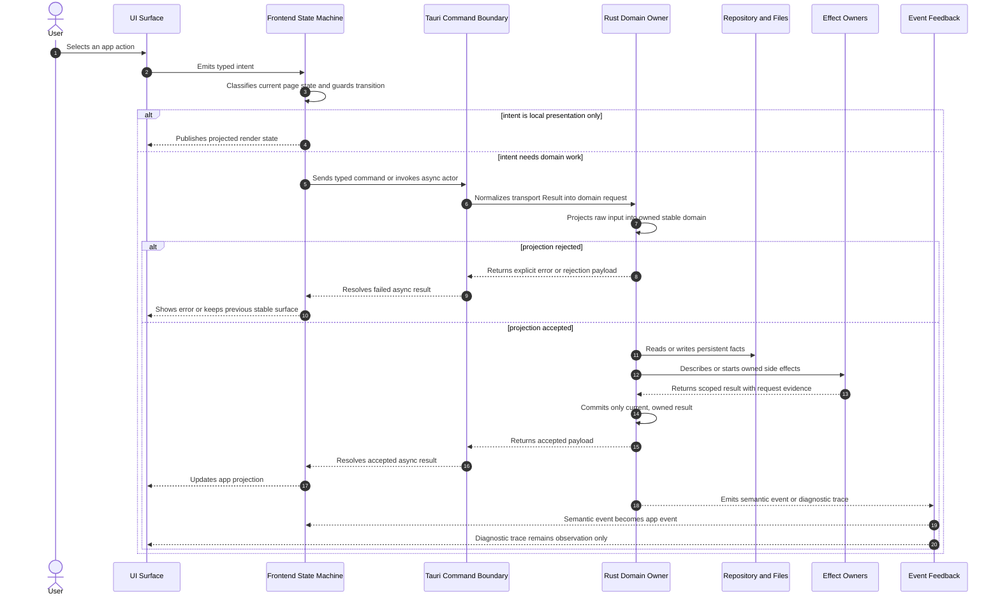
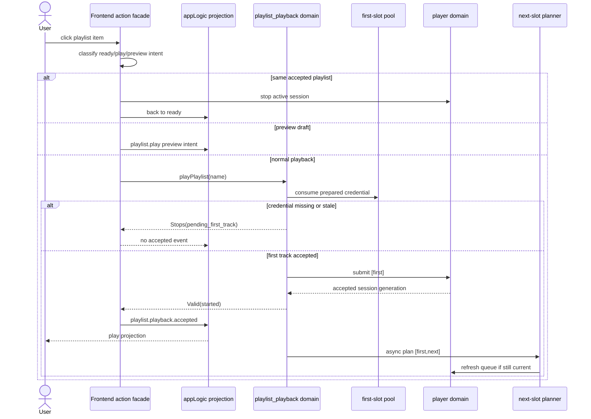
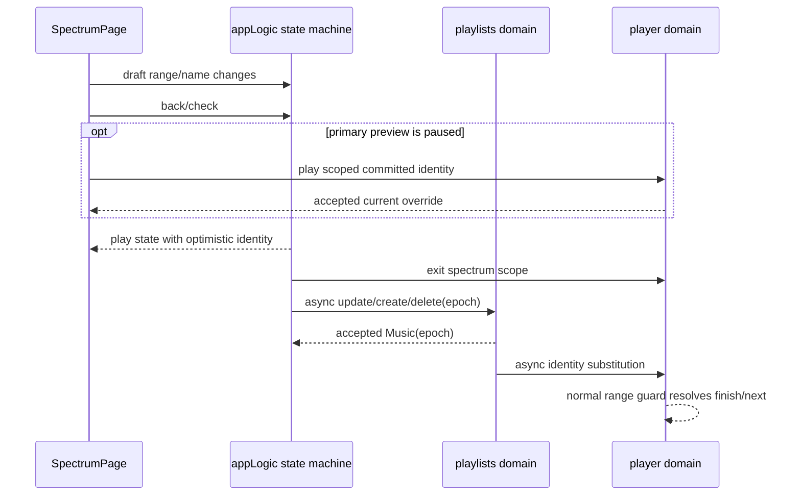

# Slisic Project Behavior Design

## Purpose

This document describes Slisic as a behavior system. It is not a call graph,
module index, or symbol map. GitNexus already owns code navigation and execution
flow discovery. This document owns the project-level behavioral contract:
participants, invariants, stable domains, interaction timing, side effects,
fallback boundaries, and the composition rules that keep local-first music
library behavior predictable.

## Behavior

Slisic turns user interaction into local music-library state, playback state,
and media-tool effects. The frontend owns user intent, screen state, drafts, and
presentation. The Tauri command boundary owns typed request/response transport.
The Rust domains own persistent library facts, download/import materialization,
playlist playback selection, player lifecycle, waveform analysis, and managed
binary effects. Events flowing back from Rust are semantic feedback only when
they are explicitly modeled as app events; diagnostic traces remain observation.

The project-level compositor is the app behavior boundary across:

- UI action owners;
- frontend state machines;
- Tauri command adapters;
- Rust domain services;
- repositories and local files;
- player and managed binaries;
- event feedback into the UI.

## Participants

| Participant                                 | Owns                                                                                                             | Does not own                                                    |
| ------------------------------------------- | ---------------------------------------------------------------------------------------------------------------- | --------------------------------------------------------------- |
| `AppBootstrapStore`                         | window kind, bootstrap readiness, updater start admission, warm-window ownership                                 | playlist state, playback identity, library facts                |
| `appLogic` state machine                    | page state, playlist/config/spectrum transitions, draft context, visible app state                               | persistence, media playback, download execution, waveform bytes |
| `pasteDownload` machine                     | pasted URL candidate lifecycle and candidate-local async result ownership                                        | collection membership, download task execution                  |
| `playlistCommit` machine                    | queued playlist draft commits and optimistic preview sequencing                                                  | playlist storage semantics after command acceptance             |
| React components and view models            | render projection, local interaction gestures, display geometry                                                  | stable domain construction, repository writes                   |
| `commandAdapter` / generated `cmd` bindings | typed transport and `Result` normalization at the Tauri boundary                                                 | domain meaning of successful payloads                           |
| `playlists` domain                          | collection, group, music, playlist, exclude, liked, and spectrum source facts                                    | playback queue consumption, provider probing, binary execution  |
| `collection_import` domain                  | collection shell, local folder projection, final file paths, manifests, music materialization                    | URL task scheduling and playlist playback policy                |
| `downloads` domain                          | URL resolution, task lifecycle, provider probing, leaf scheduling, retry and resume                              | final stable music ownership after collection commit            |
| `playlist_playback` domain                  | process-lifetime first-track preparation, first-track selection, startup next-track planning, recommendation queue planning, exclude-and-skip behavior | low-level player process control, playlist row storage          |
| `player` domain                             | active playback request, session generation, queue consumption, spectrum playback scope, seek, waveform commands | playlist membership and recommendation policy                   |
| `utils::binaries`                           | managed binary installation and maintenance admission                                                            | library state, task semantics, playback semantics               |
| Trace/debug owners                          | observation and diagnostic persistence                                                                           | state transitions, fallback choice, cache semantics             |

## Core Invariants

- A user action enters exactly one behavior owner before it can become a domain
  command. Components do not write persistent domain state directly.
- Frontend state is a projection of accepted app behavior. Rust repositories are
  the source of persistent library facts.
- Stable library identity is constructed by domain owners, not by UI strings,
  cache entries, trace messages, or filesystem residue.
- Playback identity is scoped by playlist name, canonical music identity, file
  path, range, and current player generation.
- Download task rows contain residual work and diagnostics. Completed music is
  owned by collection records and manifests.
- Cache hit or miss can change latency, availability, or degraded presentation,
  but cannot decide membership, playable validity, or command legality.
- Fallback is always scoped to the behavior owner that declares it. Fallback may
  degrade availability; it must not manufacture stable state owned by another
  domain.
- Async results must carry enough request, candidate, scope, generation, or
  transaction evidence to be ignored when stale.
- Repeated actions, repeated async completions, and cancellation followed by a
  retry must not create extra semantic side effects.
- Diagnostic trace is removable without changing app behavior.

## Stable Domains

| Projection                                             | Owner                                              | Total | Failure expression                                                      |
| ------------------------------------------------------ | -------------------------------------------------- | ----- | ----------------------------------------------------------------------- |
| raw window metadata -> app bootstrap snapshot          | `AppBootstrapStore`                                | no    | bootstrap status becomes `error`                                        |
| raw app event -> app state transition                  | `appLogic`                                         | no    | explicit `error` state or ignored event                                 |
| clipboard text -> downloadable URL text                | `pasteDownload/core`                               | no    | candidate status `invalid_url`                                          |
| playlist draft -> playlist write request               | config view model / `playlistCommit` request owner | no    | commit remains failed and preview is retained or cleared by queue rules |
| raw URL -> collection download plan                    | `downloads::service` and `collection_import`       | no    | enqueue/resolve error                                                   |
| local folder -> collection shell / imported collection | `collection_import`                                | no    | task failure and collection shell cleanup by frontend candidate owner   |
| meta save root, owner folder, music path -> local audio path | `playlists::repo` / training input view            | no    | no completed path or projected file unavailable                         |
| collection, group, music rows -> playlist selection    | `playlists::repo`                                  | no    | missing playlist or empty selection                                     |
| raw playlist source -> playable track                  | `playlist_playback::service`                       | no    | missing path, missing file, duplicate, excluded source                  |
| playback payload -> `PlaybackTrack`                    | `player::model`                                    | no    | command returns invalid payload error                                   |
| raw file path -> waveform track identity               | `SpectrumVisualizer` / player waveform boundary    | no    | no waveform plan or hidden playhead                                     |
| raw selection edits -> stable music range draft        | spectrum draft owner                               | no    | incomplete range blocks commit                                          |

Stable values require construction evidence and elimination rules. A value being
already normalized does not authorize arbitrary code to construct the stable
domain directly.

## Categorical Behavior Coordinates

This project uses a small category-theory vocabulary as a design coordinate
system. It is not an implementation dependency and does not authorize new
abstraction layers by itself. It follows the local Ya source model where
`Transition`, `Event`, `State`, `Scope`, `Stops`, and `Valid` are first-class
behavior shapes.

| Coordinate | Slisic interpretation |
| --- | --- |
| Object | A stable domain with owner evidence, such as `Ready`, `AcceptedPlayback`, `SpectrumScope`, `MusicDraft`, `FirstSlotPool`, or `PlayerSession`. |
| Morphism | A total or partial behavior arrow between owned objects. A partial morphism returns an explicit rejection object instead of mutating another owner. |
| Event | Replayable evidence that a morphism was accepted by its owner. Events are not command attempts and not diagnostic logs. |
| State | The frontend-visible fixed point produced by accepted events. It is not a waiting room for an unresolved side effect. |
| Scope | A linear capability, such as a spectrum playback scope or prepared first-slot credential. It must be acquired, used, and released by the owner that created it. |
| Stops/Valid | The shape of command results. `pending_first_track`, `superseded`, stale scope, and missing identity are rejected morphisms with evidence; only `started` is valid playback evidence. |
| Functor | A projection preserving behavior laws, such as backend playback session -> frontend `play` projection. It cannot invent accepted state from a failed command. |
| Natural transformation | Cross-owner substitution that preserves identity coordinates, such as persisted spectrum range update -> player active identity substitution. |

Composition law: every cross-domain workflow must factor as
`classify intent -> owner morphism -> accepted event -> projection`. Shortcuts
that project command attempts directly into state are invalid, even when they
reduce latency locally.

Effect law: app state transitions produce replayable frontend facts only.
Backend refreshes, Tauri commands, player scope calls, persistence commits, and
diagnostic subscriptions are interpreted by action/runtime effect owners that
observe state or user intent. State machine `entry` actions must not call backend
commands directly; otherwise test projection, ready projection, and backend
lifecycle work become the same morphism.

Closed paths:

- A click intent is not a `play` state.
- A backend `pending_first_track` result is not a hidden loading state.
- A trace event is not a morphism.
- A cache hit is not construction evidence.
- A scope id is not reusable after exit or source mismatch.
- Entering `ready` in the state machine is not itself a backend refresh command.

## Project-Level Interaction Sequence

The first sequence below is the project-wide behavior skeleton. It intentionally
does not show function calls. It shows which responsibility is triggered, which
owner transforms the behavior, where effects are interpreted, and how feedback
returns.



The second sequence is a representative cross-domain behavior chain. It keeps
the same abstraction level, but names the main project responsibilities so the
feedback and side-effect boundaries are visible.

```mermaid
sequenceDiagram
  autonumber
  actor User
  participant Surface as Interaction Surface
  participant Action as Action Facade
  participant AppState as App State Machine
  participant Cmd as Tauri Command Boundary
  participant Meta as Save Root Domain
  participant Library as Library Projection Domain
  participant Download as Download Task Runtime
  participant Commit as Collection Commit Domain
  participant Index as Playable Preparation Index
  participant Playback as Playlist Playback Orchestrator
  participant Reco as Recommendation Domain
  participant Player as Player Session Runtime
  participant Binary as Managed Binary and OS IO
  participant Feedback as Event Feedback
  participant View as View Model and Render Surface

  Note over Index: Program startup begins first-track preparation for every playable playlist; ready, library, playlist, exclude, miss, and consumption events only refill or invalidate that independent pool

  User->>Surface: play, edit, paste, import, like, exclude, or open spectrum
  Surface->>Action: submit semantic intent
  Action->>AppState: send signal or payload event
  AppState->>View: publish local projection when no domain work is needed

  alt playlist playback intent
    AppState->>Cmd: request playlist playback
    Cmd->>Meta: resolve save root evidence
    Cmd->>Playback: start playlist-scoped playback behavior
    Playback->>Library: project playlist membership
    Playback->>Index: consume prepared startup evidence
    Index-->>Playback: hit or miss with generation evidence
    Playback->>Player: submit first-track startup queue and startup track
    Player->>Binary: start or update playback process
    Playback->>Library: materialize playlist-scoped candidate window after player acceptance
    Playback->>Reco: plan continuation from the resolved first-track anchor in the background
    Reco-->>Playback: ranked queue or explicit fallback
    Playback->>Player: refresh current session queue for later tracks
    Player-->>Feedback: now-playing event
    Playback-->>Feedback: diagnostic trace
    Feedback-->>AppState: semantic playback event only
    Feedback-->>View: trace observation only
  else download or local import intent
    AppState->>Cmd: resolve, enqueue, or import collection
    Cmd->>Meta: resolve save root evidence
    Cmd->>Download: create or resume residual task
    Download->>Binary: provider probe, download, or media probe
    Download->>Commit: commit artifact into collection evidence
    Commit->>Library: persist collection and music facts
    Commit-->>Index: invalidate playable readiness
    Download-->>Feedback: task progress signal
    Feedback-->>AppState: collection shell or committed collection event
  else spectrum edit intent
    Action->>Player: enter scoped playback mode
    Player-->>Action: scope id or rejected stale result
    Action->>AppState: open spectrum only for current source snapshot
    AppState->>Cmd: load, update, create, or delete music draft evidence
    Cmd->>Library: persist accepted music changes
    Library-->>Index: invalidate playable readiness
    Library-->>Feedback: updated current-track evidence when applicable
  end

  AppState->>View: project accepted state into render data
```

## Main Behavior Chains

### Startup And Window Bootstrap

`AppBootstrapStore` sends app-ready evidence, resolves the current window kind,
records renderer readiness once, starts updater checks only for eligible window
metadata, and maintains warm-window ownership by named owners. It owns window
bootstrap state only. It does not own library loading or page state.

Project invariant: prepared windows, support windows, updater checks, and window
warm/cold effects cannot change playlist, playback, or library semantics.

### Library Loading And Page State

`appLogic` starts in `idle`, enters `loading`, invokes collection and playlist
loading, and then moves into `ready`, `config`, `play`, `spectrum`, or `error`.
Its context is the frontend projection used by the screen. It can optimistically
update visible surfaces after accepted events, but persistent facts remain owned
by Rust repositories.

Project invariant: page transitions may stop playback or exit spectrum scope
through effect owners, but page transition code cannot directly edit player
session internals or library rows.

### Paste Download And Collection Import

`pasteDownload` turns clipboard text into candidate items. Each candidate owns
its sequence id and accepts only async results for that id. Valid new URLs are
sent to the download domain. Existing collections and enqueued downloads feed
collection shell evidence back into `appLogic`.

`downloads` owns task scheduling and residual work. `collection_import` owns the
projection from temporary or local files into stable collection rows and
manifests. Local import first publishes a shell, then replaces it with a full
collection after playable files and manifest evidence are validated.

Project invariant: existing files, temporary files, and active task rows are
recovery or progress evidence only; they do not define playlist membership.

### Playlist Draft Commit

`playlistCommit` serializes playlist draft commits. It owns the active request,
the pending queue, and preview feedback into `appLogic`. The playlists domain
owns the accepted persistent playlist row and notifies playable-index owners
after mutations.

Project invariant: preview state is not persisted state. A queued preview can
shape UI feedback, but only command success can publish a saved playlist.

### Playlist First-Track Preparation

`playlist_playback::playable_index` owns the first-track preparation lifecycle.
It starts at program startup, prepares a small playlist-scoped pool of
centerless startup sources for every playlist that can appear as a playitem,
and keeps that pool independent from any later click. Ready-entry, library
mutation, playlist mutation, exclude mutation, playback miss, audio-style model
publication, and prepared-source consumption are refresh signals for this same
pool. They are not playback commands.

Project invariant: first-track preparation is an independent backend lifecycle.
The play button, playitem click, frontend ready state, player session, and
recommendation loop may observe or consume prepared evidence, but they do not
compute it. A click that finds no prepared source may report an explicit miss
and schedule repair; it must not synchronously rebuild first-track evidence or
block the frontend while preparing one.

Project invariant: the preparation pool is per playable playlist at the
semantic boundary. The implementation may batch, sample, or share prepared
sources across playlists when that reduces work and remains unobservable to the
user, but sharing is only a preparation-layer optimization. Consumption is still
playlist-scoped and generation-stamped; consuming one playitem's prepared source
must not consume another visible playitem's source.

Project invariant: consuming a prepared source is linear. Successful player
submission consumes one matching playlist/generation/source credential from the
pool and immediately schedules replacement preparation for that playlist.
Consumption must not clear other prepared credentials for the same playlist.
The pool depth absorbs stop/replay bursts while the backend refill is still
active; replay can consume the next already prepared credential instead of
waiting for the refill. Replacement does not wait for the current track to
finish and does not require another ready transition.

Project invariant: audio-style recommendation has a double-buffered service
surface. `stable` is the only model surface that playback and first-slot
preparation may read. `nightly` is the in-progress training candidate and is
not a user-visible availability gate. Each completed nightly snapshot may
replace `stable` immediately when the stable surface is not being read, and the
final training snapshot must replace `stable` when it completes. Progressive
promotion only wakes first-track preparation when `stable` changes from absent
to present; later generation improvements do not refresh an already full
first-track pool. A prepared first-track snapshot must record whether it came
from audio-style or cold-start random fallback. The model-available refresh may
replace an unconsumed random fallback snapshot because model availability
changed its semantic quality; it must not replace an unconsumed audio-style
snapshot. If no `stable` model exists yet, first-track preparation uses a
playlist-scoped repository random projection as a cold-start source. That random
source is prepared in the backend pool; it is not sampled on the click path.
If a `stable` model exists but cannot produce a scoped candidate for a playlist,
that is a recommendation miss, not a playlist playback miss. First-track
preparation must use the same playlist-scoped random fallback in that case; only
an empty playlist-scoped fallback means the first-slot pool has no playable
evidence for that playlist.

Project invariant: the model lifecycle is owned only by the audio-style model
runtime. Program startup starts the model loop, and stable library-input changes
enqueue debounced retraining. First-track preparation and playback queue
planning only read the published `stable` surface and may emit diagnostic
readiness status before falling back; they must not request, schedule,
coalesce, or debounce model training. Library mutation owners publish
library-input change evidence to the playlist-playback composition boundary;
they must not import the recommendation runtime or call a training API directly.

Project invariant: audio-style training is concurrent leaf work with one model
publication owner. Training input is the set of `Music` rows that have
`path=Some(...)` and a valid range; `path=None` means the music has no completed
local media and is not a training input. Training does not traverse playlist,
collection, group, or playback-source graphs to discover media. Its repository
view projects each trainable `Music` row into a flat training input that already
contains an absolute path and only the fields needed for embedding identity,
range, and liked state. The root coordinate for that absolute path is
`MetaInfo.save_path`, falling back to the default `Documents/slisic` root created
by the meta service. If `Music.path` is already absolute, the view preserves it.
If `Music.path` is relative and collection ownership evidence exists, the view
projects `MetaInfo.save_path / collection.folder / Music.path`. If ownership
evidence is absent, the view projects `MetaInfo.save_path / Music.path`; missing
owner evidence must never exclude the music from training eligibility. `group`,
owner, and collection folder evidence are path-projection evidence, not
model-training state, and they must not be used as a training eligibility gate.
Training input loading must not hold a single long-running database query while
the app is becoming interactive. The repository loads the flat music input first
and then loads owner-folder projection evidence in bounded chunks with scheduler
yield points, so startup first-track preparation and other foreground reads keep
their own database progress path.
The model runtime then rejects provider `.part`, Slisic temporary stems, cache
temp files, and any other transient download residue. Worker threads may
decode/cache different tracks concurrently. Worker count is a training-runtime
policy derived from pending track count, available CPU parallelism, tensor
backend availability, and a bounded cap; it is not a fixed business constant and
it does not belong to playback or first-slot owners. A heartbeat folds completed
leaf embeddings into `nightly` snapshots. Only that heartbeat/finalization owner
can publish model generations, promote `stable`, or report leaf failures. A
failed decode is leaf-local evidence, not a failed training run while at least
one embedding can serve the model. Opening the embedding cache is not a cache
maintenance pass: training startup may read individual cache entries lazily, but
whole-directory cache garbage collection is an explicit maintenance action and
must not block model availability at program startup.

Project invariant: embedding availability is a model/cache status, not a
library fact. `Music` owns source identity, range, liked state, grouping, URL,
and completed media path. It must not store a generic `has_embedding` flag,
because embedding availability depends on the audio-style fingerprint version,
cache key, decode result, and current model publication. If the UI needs to
show embedding status, the audio-style owner should expose a derived status
view keyed by music identity, path, range, and embedding version.

Project invariant: first-track preparation and audio-style model training must
emit structured lifecycle logs through the application logger. Each refresh or
training pass has a run id, owner target, reason, generation when applicable,
start, finish, elapsed time, produced counts, commit result, and failure cause.
Diagnostic UI events may mirror this information, but ad hoc stdout text is not
the lifecycle record.

### Playlist Playback

The UI action supplies a playlist name and app state evidence. The frontend
action facade classifies the intent. Preview playback remains a frontend draft
intent. Normal playback invokes the backend playback-start morphism directly.
`playlist_playback` consumes a playlist-scoped startup source that was prepared
independently of the play action, resolves it into a playable first-track
anchor, submits the single-track startup queue to `player`, and only then
returns `started`. The action facade emits `playlist.playback.accepted` only
for that accepted result. `appLogic` moves to `play` only from that accepted
event. The first track is centerless audio-style startup selection. Later tracks
come from the recommendation chain when available.

Project invariant: playlist start is epoch-owned by the frontend action facade.
Only the latest outstanding normal playback start may emit
`playlist.playback.accepted`. Stop, same-playlist toggle, app reset, or a newer
play intent closes older async return paths. A stale `started` backend result is
diagnostic evidence only; it cannot project `play`.

Project invariant: first-track selection consumes only the already prepared
pool. It may eliminate an unplayable prepared source and emit a miss, but it
must not call playlist sampling, model ranking, or candidate-window
materialization on the click path. The user-visible transition from playitem
intent to playback acceptance must be bounded by prepared evidence consumption
and player submission, not by first-track preparation. A miss while a refill is
already active is still a pool-availability failure, not permission to move
sampling into the click path.

Project invariant: `play` is accepted playback, not a click-intent placeholder.
If startup returns `pending_first_track`, `superseded`, `null`, or an error, no
frontend playback event is emitted and `appLogic` remains in or returns to
`ready` with no `playingPlaylistName` and no now-playing identity. The backend
first-slot pool may continue refilling, but the frontend must stay retryable and
must not render a play page without an accepted player session. There is no
legal `playStarting` display state.

Project invariant: accepted playback evidence and player now-playing evidence
are independently owned events and may arrive in either order. A normal play
intent records a pending playlist coordinate, so an early now-playing event may
be cached as player evidence but must not project `play` by itself. When
`playlist.playback.accepted` arrives for the same playlist, `appLogic` consumes
that cached evidence and projects the current track surface atomically with the
accepted `play` state. A now-playing event for a different playlist is ignored
for that transaction. UI rendering must not depend on whether the backend event
beat the command result by a few milliseconds.

Project invariant: playback start composes only first-track selection and
player submission. It must not fetch playlist candidate windows or invoke the
recommendation planner before `player` accepts playback. The startup queue is
`[first]`; background queue planning must attempt to replace it with
`[first, next]` immediately after acceptance. Player track-boundary waiting for
ordered queue supply is not a normal continuation strategy; if a boundary has
no next track, the upstream background queue-planning owner failed to satisfy
its contract.

Project invariant: next-track planning reads the `stable` audio-style model
first. If `stable` exists but the current anchor has no embedding, the playback
queue owner still stays inside audio-style semantics by using centerless
selection over embedded candidates in the already materialized playlist-scoped
candidate window. SQL random is allowed only when there is no stable model or
the stable audio-style surface cannot produce any distinct embedded next track.
This fallback is background queue planning only; it is not FirstSlot
preparation, play-click work, player boundary waiting, or a wider playlist
scan.

Project invariant: next-track queue refresh is linear per active session. The
periodic queue-fill path and download-change refresh path may both observe the
same missing-next condition, but they must pass through the same refresh gate
before sampling. After entering the gate, the owner rechecks whether the active
queue already contains an unconsumed next track for the same anchor. If it does,
the observation is stale and no model sampling or random fallback is allowed.

Project invariant: the player consumes an explicit queue. It never queries
playlist membership and cannot widen the candidate universe.



### Spectrum Editing And Playback Scope

Opening spectrum creates a playback scope through the player domain before the
frontend commits the spectrum page transition. Late scope results are checked
against the source snapshot. Spectrum draft edits stay in frontend draft state
until back/commit transitions invoke update, create, and delete commands.

Project invariant: selection edits operate on music range evidence. Visual
padding, waveform cache state, and canvas rendering cannot become editable
audio range facts.

Project invariant: committing a spectrum range edit is a cross-domain
substitution, not a UI resume shortcut. The frontend draft owns editable range
evidence until `back/check`. The app state machine owns only page state and the
commit epoch. The playlists domain owns the persisted music identity update.
The player domain owns substituting an accepted identity into the active
session, active request, active playback range, and spectrum loop signal.

Project invariant: `back/check` returns to `play` immediately. Persistence is a
background epoch-owned effect. A late persistence result may patch collections
only when its epoch still matches the current app context; it must not hold the
app in a transaction display state, resume media by itself, or reopen spectrum.

Project invariant: a paused spectrum preview is a scoped current override. If
`check` commits a range while the primary spectrum track is paused, the spectrum
page may issue exactly one scoped player request before sending `back`: it
projects the paused absolute position into the committed range identity and
starts that accepted request. After the player accepts the request, later scope
exit only closes the scoped loop signal and restores playlist continuation mode;
it cannot cancel the accepted playback run. This lets a paused preview at the
new end finish through the normal player range guard and then continue through
the playlist next-slot owner.

Project invariant: player session substitution is a separate player effect.
Persistence can request identity substitution after the playlists domain accepts
the new music identity. That substitution synchronizes active identity/range and
emits diagnostics, but it must not resume a paused preview merely because
persistence completed.



Only `play` is a legal source state for opening spectrum. There are no legal
spectrum transaction display states. Commit progress belongs to the background
epoch effect and diagnostic trace, not to the app state space.

### Player Feedback And Exclude/Liked Updates

The player domain emits now-playing events, playback-exclude events, and
diagnostic traces. Now-playing and exclude events can become app events because
they carry semantic state. Diagnostic traces are recorded for observation and
must be removable without behavior changes.

Liked and exclude actions use the active player request snapshot to find the
current music identity, then update the playlists domain and notify playback
preparation owners.

Project invariant: event feedback is not a side-effect log that defines state.
It is accepted only when the receiving owner has an explicit event meaning.

## Effects

| Effect                         | Owner                                    | Semantic limits                                          |
| ------------------------------ | ---------------------------------------- | -------------------------------------------------------- |
| Tauri command invocation       | `commandAdapter` and generated bindings  | transport only; no domain construction                   |
| Repository read/write          | Rust domain repositories                 | persistent facts only after domain validation            |
| File moves and manifest writes | `collection_import`                      | final music evidence only after scoped commit            |
| yt-dlp process                 | `downloads::yt_dlp`                      | provider evidence only; no playlist membership decision  |
| FFmpeg waveform/local probe    | `player::waveform` / `collection_import` | media evidence only; no UI state transition              |
| Player process                 | `player::service`                        | active request and queue consumption only                |
| Binary maintenance             | `utils::binaries`                        | install/update admission only; defers around active work |
| Canvas and DOM presentation    | component effect owners                  | presentation only; no stable domain construction         |
| Trace/logging                  | trace owners                             | observation only                                         |

## Async, Cancellation, And Linear Resources

- Clipboard candidates are indexed by candidate id. Deleting a candidate removes
  the target for late resolve/enqueue results.
- Playlist commit has one active request. Finishing a request consumes it and
  activates the next queued request.
- Playback startup claims a player request. Superseded requests return a
  superseded session instead of committing stale playback.
- First-track preparation is a process-lifetime backend pool. Program startup
  fills every currently playable playlist to the target prepared depth when an
  audio-style model can serve centerless selection, or with playlist-scoped
  repository random sources when no stable model exists yet or when the stable
  model has no scoped candidate for that playlist; ready, model publication,
  and invalidation events refresh the pool; consumption removes one prepared
  credential and refills the consumed playlist independently.
- Playable-index refreshes are generation-stamped. Non-invalidating refreshes
  fill missing startup options, while library/playlist/exclude invalidations can
  replace obsolete evidence.
- A prepared startup source is a linear resource. It is consumed only after
  player submission accepts the startup queue, and consumption immediately
  schedules replacement preparation for the same playlist. The prepared pool is
  not linear as a whole: each credential is linear, so consuming one credential
  must preserve the remaining credentials and their generation evidence.
- Startup continuation planning is part of the playback-start transaction. It
  starts after `player` accepts the first-track startup queue. It may use the
  newest published model that can rank the resolved first-track anchor,
  including an older published model when a newer in-progress model cannot
  serve that anchor. When a stable model exists but cannot rank the anchor, it
  uses centerless audio-style selection over embedded playlist candidates
  before considering SQL random. It must not block the play action and must not
  defer the first continuation until track completion.
- Spectrum playback scope ids are linear handles. Enter must publish the scope
  before spectrum opens; exit commits only if the current scope still matches.
- Waveform tile and playback polling results belong to normalized file/scope
  identity and are ignored when mismatched.
- Download leaf work is residual and linear. A completed leaf is removed from
  residual task work only after stable collection persistence succeeds.

## Fallback Rules

- Bootstrap fallback may show support/error surfaces; it cannot create library
  facts.
- Paste fallback can mark a candidate invalid; it cannot repair arbitrary
  clipboard text into a stable collection.
- Download fallback can retry transient leaf work or recover unambiguous
  residue; it cannot complete partial provider lists silently.
- Local import fallback can use manifest evidence or raw playable files; it
  cannot accept non-playable files as music.
- Playback fallback can keep the current track or pick a replacement only in
  the declared recommendation mode; it cannot load extra playlist scope.
- Playback next-track fallback uses stable audio-style first, including
  centerless audio-style when the anchor lacks an embedding, and then
  playlist-scoped SQL random from the existing candidate window only when no
  stable audio-style path can produce a distinct next track. It cannot wait for
  `nightly`, block playback, or discard an available fallback next when the
  model is unavailable.
- Playback fallback cannot create an implicit compatibility path that recomputes
  first-track startup inside a play click or waits at a track boundary for a
  queue that startup planning should already have supplied.
- First-track preparation fallback can schedule repair after a miss, but the
  repair is backend pool work. It cannot become a synchronous play-click
  fallback or a frontend loading requirement.
- First-track preparation fallback is playlist-scoped. `model_unavailable` and
  `no_scoped_model_candidate` both degrade to repository random inside the
  playlist selection; neither may widen membership, block the click, or commit
  an empty first slot while a playable random source exists.
- Spectrum fallback can render missing waveform columns or hide playhead; it
  cannot construct track identity, selection, or playback status.
- Trace fallback does not exist. Missing trace must never change behavior.

## Cache Rules

- The playable-source index is a preparation owner with generation and
  invalidation semantics. It is not the source of playlist membership.
- Audio-style embedding cache accelerates recommendation availability. It is
  not proof that a track is legal or playable.
- Waveform summary/tile caches accelerate drawing. They do not define file
  identity, audio duration, or selection validity.
- Browser or render caches can affect latency and presentation only.

## Checker And Test Coverage

The current project already contains sidecar tests around the main behavior
owners:

- app state and spectrum draft transitions under `src/flow/appLogic/*.test.ts`;
- paste-download candidate parsing and async behavior under
  `src/flow/pasteDownload/*.test.ts`;
- playlist commit queue behavior under `src/flow/playlistCommit/*.test.ts`;
- UI projection and geometry behavior under `src/components/**/*.test.ts`;
- download task, retry, residue, and provider parsing under
  `src-tauri/src/domain/downloads/*.test.rs`;
- collection import and manifest restore behavior under
  `src-tauri/src/domain/collection_import.test.rs`;
- playlist persistence under `src-tauri/src/domain/playlists/*.test.rs`;
- playback selection, playable index, and recommendation behavior under
  `src-tauri/src/domain/playlist_playback/*.test.rs`;
- player queue, session, seek, and waveform behavior under
  `src-tauri/src/domain/player/*.test.rs`.

Future behavior systems should derive checker tests from the same transition
definition whenever the transition can be expressed as a finite state model.

## Known Design Gaps

- `appLogic` uses an XState machine as the transition source, but the diagram
  and checker model are not generated from a separate transition definition.
  The current owner is `appLogic`; the gap is acceptable while sidecar tests
  cover the path invariants.
- Some frontend async effects are started inside machine actions or action
  wrappers. They remain scoped by ids, snapshots, or current state checks, but
  they are not yet represented as a unified algebraic effect description.
- Rust domain services are the transition owners for several behavior systems.
  They have focused tests and module-level design docs, but not all domains use
  a single edge-definition DSL that can derive decide/evolve/replay/diagram.

These gaps are not permissions for new hidden paths. New behavior should reduce
the gap by moving toward explicit transition definitions, typed stable domains,
and machine-checkable invariants.

## References

- `README.md`
- `src/App.tsx`
- `src/cmd/commandAdapter.ts`
- `src/flow/bootstrap/index.ts`
- `src/flow/appLogic/index.ts`
- `src/flow/appLogic/machine.ts`
- `src/flow/pasteDownload/machine.ts`
- `src/flow/playlistCommit/machine.ts`
- `src-tauri/src/app.rs`
- `src-tauri/src/domain/collection_import.rs`
- `src-tauri/src/domain/downloads/download-behavior.design.md`
- `src-tauri/src/domain/playlist_playback/playback-selection.design.md`
- `src/components/spectrum/SpectrumVisualizer.design.md`
