# Slisic Behavior Lifecycles

## Purpose

This document is the project-level behavior contract for Slisic. It is not a
call graph, not a module index, and not a global composition shortcut. It records the
independent lifecycles that must stay understandable on their own, then records
how those lifecycles exchange evidence.

The old project behavior document collapsed lifecycles, transfers, effects, and
render optimizations into one global composition story. That made the system
look smaller on paper while making important UI and backend lifetimes easier to
erase. The replacement rule is:

1. Model each lifecycle as its own timeline.
2. Model evidence transfer between lifecycles separately.
3. Do not use transfer code to invent lifecycle state.
4. Do not use lifecycle state to hide transfer failure.
5. Treat UI timing behavior as behavior, not decoration.

## Notation

Lifecycle descriptions use a compact transition notation. The notation is
descriptive, not executable source code.

```ts
Action =
  | ["input", text: String]
  | ["submit"];

// State
typing(input: String) =
  next().is(
    | ["input", text] => typing(input.concat(text))
    | ["submit"] => sending(input)
  );

sending(input: String) =
  send(
    input,
    sent = () => typing(""),
    error = (reason) => crashed(input, reason)
  );

crashed(input: String, reason: String) =
  _action = next();
  crashed(input, reason);
```

Slisic uses the same shape:

- `Action` lists accepted inputs.
- A state function lists legal next actions and effect callbacks.
- Effect callbacks are named explicitly.
- A state does not call another lifecycle's hidden implementation.
- A transfer line names the evidence being consumed.
- A rejection keeps the state legal and retryable.

## Lifecycle Inventory

The following lifecycles have independent clocks. They may observe each other
through evidence, but they do not become one lifecycle.

| Lifecycle | Owner | Clock | Stable Output |
| --- | --- | --- | --- |
| `AppBootstrap` | bootstrap loader plus `appLogic` | app run, retry, startup data acceptance | `loading`, `ready`, or `error` with stable app snapshot |
| `PlaylistItemClick` | frontend action facade plus `appLogic` | user click and backend playback result | `ready`, `play`, or retained current accepted play base |
| `PlaylistInteractionResponse` | playlist page view model and title handoff models | app projection, click overlay, playback surface, Torph stages | immediate title lock, visible target, icons, preparing flag, restore release |
| `PlaybackSurface` | playlist page view model and local render model | accepted app state plus player now-playing events plus Torph stages | visible playlist title, track title, preparing text, icons, restore motion |
| `PlaylistDraftCommit` | list config, appLogic, playlist persistence commands | config check/back, draft changes, commit result | immediate return, title handoff, background playlist upsert evidence |
| `PasteDownloadCandidate` | `pasteDownload` machine plus list config candidate projection | paste, URL resolution, title probe, enqueue, task signals, delete/reset | candidate item state and collection shell evidence |
| `AudioStyleModelRuntime` | `playlist_playback::recommendation` | library/download/import changes, embedding decode, training publication | stable model snapshot and completed snapshot history |
| `DownloadTaskRuntime` | `downloads::service` | enqueue, resolve, probing, downloading, persisting, terminal status | task status, leaf status, task change signal |
| `CollectionImport` | `collection_import` | shell creation, collection planning, local import, downloaded leaf finalization | collection shell, music rows, collection manifest |
| `FirstSlot` | `playlist_playback::playable_index` | startup, ready, model publication, playlist/library/exclude invalidation, prepared-source consumption | prepared first-track credentials per playlist |
| `PlaybackStart` | `playlist_playback::service` | one backend `playPlaylist(name)` request | `started`, `pending_first_track`, `superseded`, or error |
| `PlayerSession` | `player::service` | accepted playback session generation and track boundaries | now-playing events, queue consumption, stop, pause, resume |
| `NextTrack` | `playlist_playback::service` and recommendation runtime | player acceptance and queue repair signals | refreshed explicit player queue |
| `LoudnessEvidence` | downloads, player, playlists repository | completed file or active playback track without loudness | persisted non-zero LUFS evidence and current-session normalization |
| `SpectrumScope` | player domain and spectrum page | open spectrum, scoped playback, close scope | spectrum page, scoped preview, or returned play state |
| `TraceLifecycle` | trace registry and enabled probes | install, enable probes, record, clear, save | optional JSONL diagnostic evidence |

The rest of this document expands the lifecycles that currently carry the
highest boundary risk. Some lifecycles already have deeper module-local design
documents; the project document still records their project-level state
machines so cross-owner transfers can be reviewed without reading a call graph.

## Coverage Boundary

Project-level lifecycles are expanded here when they cross at least one of
these boundaries:

- user-visible page timing;
- backend effect ownership;
- async result identity;
- process-lifetime cargo slots;
- collection, playlist, player, model, download, or trace ownership.

Local lifecycles stay in their module documents or tests when their owner is
single and their transfers are already represented here:

| Local lifecycle | Current home | Project-level treatment |
| --- | --- | --- |
| `SpectrumVisualizer` | `src/components/spectrum/SpectrumVisualizer.design.md` | local viewport/tile/canvas/selection/playhead lifecycle; project document only tracks spectrum scope transfers |
| `SpectrumMusicCommitTransaction` | `src/flow/appLogic/spectrumMusicCommitTransaction.ts` tests and spectrum page tests | represented as `spectrum music commit` transfer; expand later if title/range commit starts affecting playback/session authority |
| `PlaybackExcludeTransaction` | `src/flow/appLogic/playbackExcludeTransaction.ts` tests | represented through player/session and playlist mutation transfer; expand later if exclude recovery starts owning playback continuation |
| `PlaybackContinuationModeEffectOwner` | `src/flow/appLogic/playbackContinuationModeEffectOwner.ts` and playback mode tests | local backend mode effect owner for spectrum entry/exit |
| `Updater` | `src/flow/updater/machine.ts` | isolated idle/check/ok/err retry loop; no current project-level cargo consumer |
| title handoff/return models | `src/components/playListTitle*.model.ts` tests and page view-model tests | folded into `PlaylistInteractionResponse` because their observable job is UI timing |
| context reset lifecycle | `src/flow/appLogic/core.ts` and machine tests | implementation guard for preserving owner coordinates during app state reset |

If any local lifecycle starts deciding another owner's state, or if another
owner starts waiting on it, it must be promoted into this document with its own
clock, owned state, transfers, and closed paths.

## High-Level State Motion

This overview shows how the independent lifecycles move together at the app
level. It is intentionally not a call graph. Arrows name the accepted evidence
that allows a visible state change. Side lanes show lifecycles that keep running
without becoming the app state.

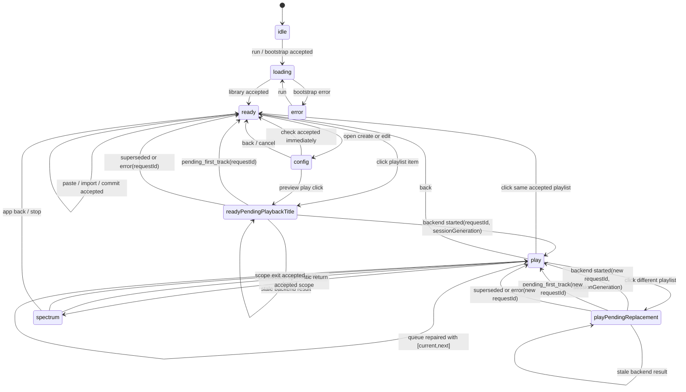

The same motion as lifecycle lanes:

```text
UserClick lane:
  click(name)
    -> open pending request id
    -> call backend playPlaylist(name)
    -> wait for started | stopped | error
    -> emit accepted playback only for current request id

FirstSlot lane:
  startup
    -> fill prepared credentials for playlists
    -> ready/model/library/exclude/consumed signals refill or invalidate
    -> click reads credential
    -> player acceptance consumes credential
    -> consumption schedules same-playlist replacement

AudioStyleModelRuntime lane:
  library/download/import evidence changed
    -> decode missing embeddings on its own clock
    -> publish stable model snapshot when training finishes
    -> external owners read snapshot or fall back without blocking model work

DownloadTaskRuntime lane:
  enqueue or local import task
    -> resolving/downloading/persisting leaf statuses
    -> publish task change signals
    -> collection/music rows appear only through import/download owners
    -> ready/config/check only project current evidence

PlayerSession lane:
  accepted startup [first]
    -> emit nowPlaying
    -> play current track
    -> consume explicit next from queue
    -> emit next nowPlaying
    -> repeat play -> play until stopped or exhausted

NextTrack lane:
  player accepted first
    -> inspect queue
    -> if missing distinct next, plan [current,next]
    -> commit queue only if session and anchor still current
    -> later player boundary remains play -> play

Loudness lane:
  trackWillPlay(track loudness == 0.0)
    -> measure in background
    -> persist finite non-zero LUFS
    -> update current session if generation still current
    -> emit refreshed nowPlaying evidence

PlaybackSurface lane:
  machine enters play
    -> show playlist title and center item
    -> player track arrives: show track title
    -> player non-playable Preparing arrives: show Preparing...
    -> machine leaves play: restore text by Torph stages
```

Important reading rule: `play -> play` is normal. It represents now-playing
updates, next-track queue consumption, queue repair, loudness evidence refresh,
and liked/exclude projection that preserve the accepted playback session.
`play -> ready` is only explicit stop/back or same-playlist toggle, not next
track and not loudness.

## Cargo Slots And Authority Boundaries

The project-level rule is:

```text
lifecycle owns clock + mutation + terminal closure
consumer reads cargo slot + sends scoped signal + accepts rejection
transfer does not move ownership
```

A cargo slot is a stable exposed place where one lifecycle leaves evidence for
another lifecycle. It is not a cache shortcut and not a second owner. A consumer
may read the slot, consume a linear credential through the owner API, or send a
wake/request signal. It must not recreate the producer's internal task, decide
that the producer is "done", or mutate the producer's state for convenience.

### Access Kinds

| Access | Meaning | May mutate owner state? | Required identity |
| --- | --- | --- | --- |
| `wake` | tell an owner that new evidence may exist | owner decides later | reason plus affected scope |
| `read` | copy stable evidence without taking it | no | slot key and evidence generation when available |
| `consume` | spend a linear credential through owner validation | only owner mutates | credential id plus generation |
| `project` | derive UI/app output from accepted evidence | no producer mutation | accepted request/session identity |
| `command` | ask an effect owner to act | owner may reject | request, generation, scope, or transaction id |

`wake` is not ownership. `read` is not consumption. `project` is not truth
creation. A `command` enters the target owner and may be refused without forcing
the caller into an illegal state.

### Authority Review Table

| Owner lifecycle | Cargo slot | Consumers | Consumer power | Forbidden takeover |
| --- | --- | --- | --- | --- |
| `AudioStyleModelRuntime` | `stableModelSnapshot(modelGeneration)` plus completed snapshot history | `FirstSlot`, `NextTrack` | read snapshot for centerless or anchored proposal | click path, player boundary, or UI trains the model, waits for model completion, or turns model absence into `Preparing...` |
| `DownloadTaskRuntime` | `DownloadTaskChangeSignal(taskId, url, collectionUrl, status)` and persisted task rows | app projection, playlist queue repair, first-slot refresh triggers | observe status and wake affected owners | config/check/ready declares a task complete, clears active tasks, or replaces task state because the visible page changed |
| `PasteDownloadCandidate` | candidate item state plus root title and enqueue/task evidence | list config view, app draft collection upsert | project candidate rows and pass collection shell evidence to draft | check/back/reset declares active download completion, title probe becomes collection truth, or candidate rows own backend task status |
| `CollectionImport` | collection shell, collection manifest, persisted music rows | playlists repo, config library projection, download task runtime | read canonical collection/music rows after import owner commits | playlist config invents collection rows, infers group membership, or treats pasted URL parsing as downloaded music evidence |
| playlist repository | playlist playback selection and collection membership | `FirstSlot`, `PlaybackStart`, `NextTrack`, `PlayerSession` identity substitution | read scoped membership and canonical music rows | player or frontend scans the whole library to choose first/next or widens fallback outside playlist membership |
| `FirstSlot` | prepared first credential pool keyed by playlist, generation, credential id | `PlaybackStart` | read one credential, discard invalid credential, consume accepted credential | click path refills synchronously, frontend consumes credentials, player reads first slot, or miss becomes `Preparing...` |
| `PlaybackStart` | accepted result: `started`, `pending_first_track`, `superseded`, error | `PlaylistItemClick`, `appLogic` | close matching request or enter accepted play | frontend manufactures track/preparing evidence or keeps pending overlay after matching closure |
| `NextTrack` | explicit queue proposal for current session generation and anchor | `PlayerSession` | replace session queue only when still current and missing distinct next | player calls recommendation model, model publication replaces existing next, or stale attempt commits |
| `PlayerSession` | active session generation, active track, active range, now-playing event, playback status | `appLogic`, `PlaybackSurface`, `SpectrumScope`, `LoudnessEvidence` | project play state, surface text, spectrum scope, loudness update | UI chooses tracks, playback mutates click overlay, or now-playing from stale generation creates current play |
| `LoudnessEvidence` | finite non-zero LUFS for a track identity | `PlayerSession`, playlists repo | normalize playback and refresh now-playing for same identity | missing loudness blocks playback or measured LUFS applies to another file/range |
| `PlaylistInteractionResponse` | display lock, focused title, visible text, icon/preparing projection | rendered playlist page | preserve immediate human response | backend trace or task status owns visual timing, or app state deletes title handoff details |
| trace registry | diagnostic trace lines | humans and tests during diagnosis | observe timing after enabling trace | trace event becomes a state transition, wait state, or source of truth |

### Boundary Smells

The following patterns indicate that one side has occupied another side's task:

- A lifecycle waits for another lifecycle to finish before exposing its own
  immediate state. Example: click response waiting for first-slot refill.
- A consumer recomputes another owner cargo slot for latency. Example:
  `PlayerSession` scanning playlist membership to find next.
- A wake signal changes the consumer's current state directly. Example:
  model publication replacing an existing distinct next.
- A page state transition declares an unrelated async task complete. Example:
  check/back returning to `ready` while active download/import tasks are still
  owned by `DownloadTaskRuntime`.
- A diagnostic trace name becomes a semantic wait state. Example:
  "waiting for model" blocking playback despite random fallback being legal.
- A read path secretly mutates the producer. Example: reading a first credential
  also refills or consumes it.
- A projection hides missing owner evidence by inventing fallback truth. Example:
  UI deriving `Preparing...` from pending click phase.
- An async result lacks request, generation, attempt, transaction, or scope
  identity and can overwrite the current future when it arrives late.

When one of these appears, the fix is not a local branch. The fix is to restore
the owner slot: let the producer speak by publishing evidence, and let the
consumer stay legal while the slot is missing.

## Lifecycle: PlaylistItemClick

### Boundary

`PlaylistItemClick` is the click request lifecycle. It starts when the user
clicks a playlist item and ends when that one request is accepted, rejected,
stopped, superseded, or proven stale.

The lifecycle owns intent, request identity, request closure, and accepted-play
projection. It does not own any lifecycle that can continue without this click.
First-slot preparation, player now-playing, next queue repair, loudness
measurement, playback surface text, ready restoration, and spectrum scope all
belong to other lifecycles.

This boundary is the important correction: a click may transfer evidence to
other owners, but it may not allocate their state or invent their evidence.

### Participants

| Participant | Owns |
| --- | --- |
| `PlayListPage` | dispatches the click and preserves per-item render refs |
| `appLogic.action.playPlaylist` | classifies current page state, creates request id, starts backend command |
| `appLogic.machine` | stores pending playback request evidence and accepted play projection |

No backend, player, first-slot, next-track, loudness, spectrum, or view-model
module is a participant of this lifecycle. They appear only as external evidence
sources or transfer targets.

### Owned State

```ts
ClickIntent = {
  source: "ready" | "play";
  playlistName: String;
  requestId: Number;
};

PendingPlaybackRequest = {
  phase: "starting";
  playlistName: String;
  requestId: Number;
};

FailedPlaybackEvidence = {
  phase: "failed";
  playlistName: String;
  requestId: Number;
  reason: StopReason | null;
  error: String | null;
};

AcceptedPlayback = {
  playlistName: String;
  requestId: Number;
  sessionGeneration: Number;
  initialTrack: PlaybackTrackPayload | null;
};

Base =
  | ["ready"]
  | ["play", current: AcceptedPlayback];

Overlay =
  | ["none"]
  | ["pendingFromReady", intent: ClickIntent]
  | ["pendingReplacement", intent: ClickIntent]
  | ["failed", evidence: FailedPlaybackEvidence];
```

`Base` is the app playback projection. `Overlay` is the click transaction
projection. A pending click is not a new base page state. A replacement click
does not snapshot the prior accepted playback; the current `play` base keeps
evolving while the pending overlay exists.

`requestId` is the linear token for the overlay. `sessionGeneration` is the
linear token for accepted playback. Backend callbacks, initial track evidence,
and pending now-playing evidence can be consumed only while they match the
current pending request or accepted session.

### External Evidence

| Evidence | Source owner | Meaning inside `PlaylistItemClick` |
| --- | --- | --- |
| `backend.started` | `playlist_playback::service` and `player::service` | request accepted by backend/player and may enter `play` |
| `backend.stopped` | `playlist_playback::service` | request closed without accepted playback |
| `backend.error` | `playlist_playback::service` | request failed and should close overlay while preserving current accepted play when one exists |
| `stale` | request identity guard | callback belongs to a closed or superseded request and must be ignored by current state |

### Transition

```ts
Action =
  | ["click", playlistName: String]
  | ["backend.started", requestId: Number, session: StartedSession]
  | ["backend.stopped", requestId: Number, reason: StopReason]
  | ["backend.error", requestId: Number, reason: String]
  | ["play.evolved", current: AcceptedPlayback]
  | ["stale", requestId: Number];

state(base: Base, overlay: Overlay) =
  next().is(
    | ["click", playlistName] =>
        click(base, overlay, playlistName)
    | ["backend.started", requestId, session] =>
        acceptIfCurrent(base, overlay, requestId, session)
    | ["backend.stopped", requestId, reason] =>
        closeIfCurrent(base, overlay, requestId, reason)
    | ["backend.error", requestId, reason] =>
        failIfCurrent(base, overlay, requestId, reason)
    | ["play.evolved", current] =>
        evolveAcceptedPlay(base, overlay, current)
    | ["stale", requestId] =>
        state(base, overlay)
  );

click(["ready"], overlay, playlistName) =
  state(
    ["ready"],
    openPendingFromReady(newIntent("ready", playlistName), replacing = overlay)
  );

click(["play", current], overlay, current.playlistName) =
  stopCurrentThenReady(current, closing = overlay);

click(["play", current], overlay, playlistName) =
  state(
    ["play", current],
    openPendingReplacement(newIntent("play", playlistName), replacing = overlay)
  );

openPendingFromReady(intent: ClickIntent, replacing: Overlay) =
  backendPlay(intent);
  ["pendingFromReady", intent];

openPendingReplacement(intent: ClickIntent, replacing: Overlay) =
  backendPlay(intent);
  ["pendingReplacement", intent];

acceptIfCurrent(base, ["pendingFromReady", intent], intent.requestId, session) =
  state(acceptAsPlay(intent, session), ["none"]);

acceptIfCurrent(base, ["pendingReplacement", intent], intent.requestId, session) =
  state(replacePlay(intent, session), ["none"]);

acceptIfCurrent(base, overlay, requestId, session) =
  state(base, overlay);

closeIfCurrent(["ready"], ["pendingFromReady", intent], intent.requestId, "pending_first_track") =
  state(["ready"], ["none"]);

closeIfCurrent(["play", current], ["pendingReplacement", intent], intent.requestId, "pending_first_track") =
  state(["play", current], ["none"]);

closeIfCurrent(base, overlay, requestId, "stale") =
  state(base, overlay);

closeIfCurrent(base, overlay, requestId, reason) =
  failIfCurrent(base, overlay, requestId, reason);

failIfCurrent(["ready"], ["pendingFromReady", intent], intent.requestId, reason) =
  state(["ready"], failed(intent, reason));

failIfCurrent(["play", current], ["pendingReplacement", intent], intent.requestId, reason) =
  state(["play", current], failed(intent, reason));

failIfCurrent(base, overlay, requestId, reason) =
  state(base, overlay);

evolveAcceptedPlay(["play", current], overlay, nextCurrent)
  if current.requestId == nextCurrent.requestId
    && current.sessionGeneration == nextCurrent.sessionGeneration =
    state(["play", nextCurrent], overlay);

evolveAcceptedPlay(base, overlay, nextCurrent) =
  state(base, overlay);
```

The same transition, reduced to the two source cases:

```ts
ready(overlay) =
  next().is(
    | ["click", playlistName] =>
        ready(pendingFromReady(newIntent("ready", playlistName), replacing = overlay))
  );

play(current: AcceptedPlayback, overlay) =
  next().is(
    | ["click", current.playlistName] =>
        stopCurrentThenReady(current, closing = overlay)
    | ["click", playlistName] =>
        play(current, pendingReplacement(newIntent("play", playlistName), replacing = overlay))
    | ["play.evolved", nextCurrent] =>
        evolveAcceptedPlay(["play", current], overlay, nextCurrent)
  );
```

### Request Closure Rules

`pending_first_track` is backend negative evidence for this request, not a
frontend preparing state and not a request to refill first evidence on the click
path.

```ts
["ready"] + pendingFromReady + pending_first_track => ["ready"] + none
["play", current] + pendingReplacement + pending_first_track => ["play", current] + none

base + overlay + stale => base + overlay
```

For a ready-source click, closing the request returns to `ready` immediately.
For a play-source replacement click, closing the request keeps the current
accepted playback base alive. The retained playback is the current evolved playback at
closure time, not a snapshot captured when the click happened. A failed or
missing first request cannot erase an accepted session that it never owned.

Pending replacement is replaceable:

```ts
["ready"] + pendingFromReady(A) + click(B)
  => ["ready"] + pendingFromReady(B)

["play", current] + pendingReplacement(B) + click(C)
  => ["play", current] + pendingReplacement(C)

["play", current] + pendingReplacement(B) + click(current.playlistName)
  => stop current and close pending overlay
```

The replaced request is not cancelled by mutating current state. It becomes a
request whose callbacks can only be stale no-ops.

### UI Projection Rules

`PlaylistItemClick` has exactly one UI projection of its own: title handoff for
the clicked item while the request is pending.

Rules:

- pending from `ready` may keep the clicked playlist title visible and lock the
  list around that title;
- pending replacement from `play` may mark the requested playlist as pending,
  but the accepted playback base remains current and keeps evolving until backend
  acceptance;
- accepted `play` transfers to `PlaybackSurface`; title-to-track timing after
  acceptance is owned there;
- `Preparing...` may appear only from `PlaybackSurface` after accepted `play`
  and non-playable player now-playing evidence;
- title handoff is not preparing;
- request failure text is negative request evidence, not playable track text.

### State Motion

```mermaid
stateDiagram-v2
  [*] --> Ready
  Ready --> "Ready + PendingFromReady": click playlist
  "Ready + PendingFromReady" --> "Ready + PendingFromReady": click replacement
  "Ready + PendingFromReady" --> Play: backend.started current request
  "Ready + PendingFromReady" --> Ready: pending_first_track current request
  "Ready + PendingFromReady" --> "Ready + Failed": backend.error current request
  "Ready + PendingFromReady" --> "Ready + PendingFromReady": stale callback ignored

  Play --> Ready: click same accepted playlist
  Play --> "Play + PendingReplacement": click different playlist
  "Play + PendingReplacement" --> "Play + PendingReplacement": play evolves / click replacement
  "Play + PendingReplacement" --> Play: backend.started replaces accepted session
  "Play + PendingReplacement" --> Play: pending_first_track current request closes overlay
  "Play + PendingReplacement" --> "Play + Failed": backend.error current request closes overlay
  "Play + PendingReplacement" --> "Play + PendingReplacement": stale callback ignored
```

This diagram is deliberately small. It does not show player now-playing,
first-slot preparation, next-track self-cycles, loudness refresh, spectrum, or
surface restoration because those are equal-rank lifecycles, not substates of
the click request. `Ready + ...` and `Play + ...` labels are product states:
base state plus overlay state.

### Transfers Out And Observed Evidence

| Transfer | Direction | Rule |
| --- | --- | --- |
| click intent -> backend play request | out | request id must be attached before the effect starts |
| backend started -> accepted play | in | only current request can enter `play` |
| backend stopped/error -> close pending intent | in | ready-source closes to `ready`; play-source closes overlay and preserves current `play` base |
| same playlist click -> stop current | out | explicit stop path, not a replacement request |
| pending now-playing evidence -> accepted play | observed | consumed only when playlist and session generation match current request |

### Does Not Own

- FirstSlot preparation.
- Backend first-source resolution internals.
- Player now-playing.
- Preparing text.
- NextTrack queue repair.
- Loudness measurement or normalization evidence.
- Spectrum scope.
- Ready text restoration after Torph stages.
- Trace recording.

### Invariants

- No pending click request may enter `play` without current `backend.started`
  evidence.
- No stale backend callback may mutate `ready`, `play`, now-playing, or surface
  state.
- No `play.evolved` evidence may create `play` from `ready`; it may only evolve
  an already accepted session with the same generation.
- No `pending_first_track` result may create `play`.
- No pending click may create `Preparing...`.
- No replacement click may destroy the current accepted playback unless the new
  request is accepted or the same accepted playlist is explicitly stopped.
- No replacement click may restore a captured old `play` snapshot; retained play
  is the current evolved base state.
- No failed request evidence may remain an active pending request.
- No external lifecycle may be reimplemented on the click path for perceived
  convenience.

## Minimal Playback Start Path

This is the shortest complete description of what happens after a playlist item
click. It is the reference path for checking whether the interaction is instant,
flowing, and correctly owned.

```text
User clicks playlist item
  -> Frontend emits PlayPlaylistSignal(playlistName, requestId)
  -> Frontend opens PendingTitle overlay only
  -> Backend PlaybackStart receives PlayPlaylistSignal
  -> Backend reads FirstSlot(playlistName)
     -> none: return pending_first_track
     -> hit: submit first credential to PlayerSession
  -> PlayerSession accepts or rejects the submitted first track
     -> accepted: return started(sessionGeneration, initialTrack)
     -> rejected: return error
  -> Backend starts NextTrack repair after session acceptance
  -> Frontend consumes only current result evidence
     -> pending_first_track: close matching PendingTitle; no Preparing
     -> started: enter play and emit surface.acceptedTitle
     -> error/superseded/stale: close matching overlay or ignore stale
  -> PlaybackSurface consumes accepted surface evidence
     -> surface.acceptedTitle: show playlist title immediately
     -> surface.nonPlayableStatus("Preparing..."): show Preparing
     -> surface.track(track): show track title and icons
```

`started` means the backend/player accepted an active playback session
generation. It does not mean the low-level player has already completed
`play_request.ok`. This distinction preserves immediate UI response without
letting the click path manufacture track or preparing evidence.

The frontend side of this path has only two powers:

- emit `PlayPlaylistSignal(playlistName, requestId)`;
- project accepted evidence into immediate UI response.

It must not:

- read `FirstSlot`;
- scan playlist membership;
- choose the first track;
- choose or repair next track;
- decide `Preparing...`;
- wait for first-slot refill before showing a response;
- treat trace events as behavior;
- keep a pending overlay after matching request closure.

The backend side owns first and next:

```text
PlaybackStart owns:
  PlayPlaylistSignal -> FirstSlot.read -> PlayerSession.submit(first)

FirstSlot owns:
  prepared first credentials and refill after consumption or invalidation

NextTrack owns:
  queue repair and [current,next] after session acceptance

PlaybackSurface owns:
  acceptedTitle -> Preparing or track text
```

This path is minimal because every arrow either transfers evidence to its owner
or projects accepted evidence to the user. There is no frontend detour that
constructs playback data, no hidden fallback that computes first/next on the
click path, and no UI state that stands in for backend truth.

## Lifecycle: PlaylistInteractionResponse

### Boundary

`PlaylistInteractionResponse` is the user-perceived response lifecycle for the
playlist page. It starts from frontend projection evidence and ends when the
visible target, text, icons, scroll lock, and title handoff are either stable or
released.

It answers a different question from `PlaylistItemClick`:

- `PlaylistItemClick` asks whether a playback request is legally pending,
  accepted, failed, stale, or closed.
- `PlaylistInteractionResponse` asks what the user sees immediately, what stays
  fluid while backend evidence is late, and which later evidence is allowed to
  change the visible title, track text, icons, preparing flag, and restore path.

This lifecycle is the audit surface for "instant" and "flowing" interaction.
If a performance trace shows a pause, the first question is which response state
failed to appear in the expected turn.

### Participants

| Participant | Owns |
| --- | --- |
| `PlayListPage.view-model` | visible item text, playback target, icon visibility, preparing flag, commit gesture, scroll lock |
| `playListTitleHandoff.model` | display lock kind, title share arrow, target retain lease |
| `playListPlaybackSurface.model` | accepted playback title, track text, non-playable preparing text, restore phase |
| Torph transition stages | evidence that a visual return has started and can be released |

It does not own click legality, backend playback start, first-slot preparation,
player queue, loudness, or spectrum scope. It only consumes their accepted
projection evidence.

### Perceptual State

```ts
ResponseSurface =
  | ["list", target: null]
  | ["acceptedTitle", playlistName: String]
  | ["track", playlistName: String, trackName: String, liked: Boolean | null]
  | ["preparing", playlistName: String]
  | ["returning", playlistName: String, started: Boolean];

FocusOverlay =
  | ["none"]
  | ["pendingTitle", playlistName: String, requestId: Number];

DisplayLock =
  | ["none"]
  | ["opening-playback", playlistName: String]
  | ["playback-surface", playlistName: String]
  | ["return-handoff", playlistName: String];

ResponseOutput = {
  text: String;
  playbackTargetKey: String | null;
  shouldLockScroll: Boolean;
  shouldShowPlaybackIcons: Boolean;
  isPlaybackPreparing: Boolean;
  commitGesture: "secondary-only" | "primary-and-secondary" | "disabled";
};
```

`ResponseSurface` is not app state. It is the visible playback/list surface.
`FocusOverlay` is the temporary user-attention layer created by a pending click.
The overlay can focus a new pending title while an accepted playback surface
keeps evolving underneath.

`AcceptedTargetId` is the already-filtered app projection identity for accepted
playback. It includes the accepted playlist, request id, and player session
generation. The response lifecycle does not consume raw player events.
`CloseReason` includes `pending_first_track`, `error`, `superseded`, and
`stale`; all of them close only the matching overlay.

### Transition

```ts
Action =
  | ["ready.list"]
  | ["click.pending", playlistName: String, requestId: Number]
  | ["click.closed", playlistName: String, requestId: Number, reason: CloseReason]
  | ["surface.acceptedTitle", playlistName: String, acceptedTargetId: AcceptedTargetId]
  | ["surface.track", acceptedTargetId: AcceptedTargetId, playlistName: String, trackName: String, liked: Boolean | null]
  | ["surface.nonPlayableStatus", acceptedTargetId: AcceptedTargetId, playlistName: String, text: "Preparing..."]
  | ["surface.closed", playlistName: String]
  | ["torph.stage", playlistName: String, stage: "idle" | "prepare" | "animate"];

response(surface: ResponseSurface, overlay: FocusOverlay) =
  next().is(
    | ["ready.list"] =>
        response(["list", null], overlay)
    | ["click.pending", playlistName, requestId] =>
        response(surface, ["pendingTitle", playlistName, requestId])
    | ["click.closed", playlistName, requestId, reason] =>
        response(surface, closeMatchingOverlay(overlay, playlistName, requestId))
    | ["surface.acceptedTitle", playlistName, acceptedTargetId] =>
        response(
          ["acceptedTitle", playlistName],
          closeMatchingOverlayForAcceptedTarget(overlay, acceptedTargetId)
        )
    | ["surface.track", acceptedTargetId, playlistName, trackName, liked] =>
        response(
          ["track", playlistName, trackName, liked],
          closeMatchingOverlayForAcceptedTarget(overlay, acceptedTargetId)
        )
    | ["surface.nonPlayableStatus", acceptedTargetId, playlistName, "Preparing..."] =>
        response(
          ["preparing", playlistName],
          closeMatchingOverlayForAcceptedTarget(overlay, acceptedTargetId)
        )
    | ["surface.closed", playlistName] =>
        response(surfaceAfterClosed(surface, playlistName), overlay)
    | ["torph.stage", playlistName, stage] =>
        response(surfaceAfterTorph(surface, playlistName, stage), overlay)
  );

surfaceAfterClosed(["list", null], playlistName) =
  ["list", null];

surfaceAfterClosed(["acceptedTitle", playlistName], playlistName) =
  ["list", null];

surfaceAfterClosed(["track", playlistName, trackName, liked], playlistName) =
  ["returning", playlistName, started = false];

surfaceAfterClosed(["preparing", playlistName], playlistName) =
  ["returning", playlistName, started = false];

surfaceAfterClosed(surface, playlistName) =
  surface;

surfaceAfterTorph(["returning", playlistName, false], playlistName, "prepare" | "animate") =
  ["returning", playlistName, started = true];

surfaceAfterTorph(["returning", playlistName, true], playlistName, "idle") =
  ["list", null];

surfaceAfterTorph(surface, playlistName, stage) =
  surface;

closeMatchingOverlay(["pendingTitle", playlistName, requestId], playlistName, requestId) =
  ["none"];

closeMatchingOverlay(overlay, playlistName, requestId) =
  overlay;

closeMatchingOverlayForAcceptedTarget(["pendingTitle", playlistName, requestId], acceptedTargetId)
  if acceptedTargetId.playlistName == playlistName
    && acceptedTargetId.requestId == requestId =
  ["none"];

closeMatchingOverlayForAcceptedTarget(overlay, acceptedTargetId) =
  overlay;

visibleResponse(surface: ResponseSurface, ["pendingTitle", playlistName, requestId]) =
  outputPendingTitle(playlistName);

visibleResponse(["list", null], ["none"]) =
  outputList();

visibleResponse(["acceptedTitle", playlistName], ["none"]) =
  outputAcceptedTitle(playlistName);

visibleResponse(["track", playlistName, trackName, liked], ["none"]) =
  outputTrack(playlistName, trackName, liked);

visibleResponse(["preparing", playlistName], ["none"]) =
  outputPreparing(playlistName);

visibleResponse(["returning", playlistName, started], ["none"]) =
  outputReturning(playlistName, started);

displayLock(surface: ResponseSurface, ["pendingTitle", playlistName, requestId]) =
  ["opening-playback", playlistName];

displayLock(["acceptedTitle", playlistName], ["none"]) =
  ["opening-playback", playlistName];

displayLock(["track", playlistName, trackName, liked], ["none"]) =
  ["playback-surface", playlistName];

displayLock(["preparing", playlistName], ["none"]) =
  ["playback-surface", playlistName];

displayLock(["returning", playlistName, started], ["none"]) =
  started ? ["none"] : ["return-handoff", playlistName];

displayLock(["list", null], ["none"]) =
  ["none"];
```

### State Motion

```mermaid
stateDiagram-v2
  [*] --> "List + None"
  "List + None" --> "List + PendingTitle": click.pending same frontend turn
  "AcceptedTitle + None" --> "AcceptedTitle + PendingTitle": click.pending replacement
  "Track + None" --> "Track + PendingTitle": click.pending replacement
  "Preparing + None" --> "Preparing + PendingTitle": click.pending replacement

  "List + PendingTitle" --> "List + PendingTitle": click.pending replaces target
  "AcceptedTitle + PendingTitle" --> "AcceptedTitle + PendingTitle": click.pending replaces target
  "AcceptedTitle + PendingTitle" --> "Track + PendingTitle": surface.track evolves underneath
  "AcceptedTitle + PendingTitle" --> "Preparing + PendingTitle": surface.nonPlayableStatus evolves underneath
  "Track + PendingTitle" --> "Track + PendingTitle": surface.track evolves underneath / click.pending replaces target
  "Preparing + PendingTitle" --> "Track + PendingTitle": surface.track evolves underneath

  "List + PendingTitle" --> "List + None": click.closed closes matching overlay
  "AcceptedTitle + PendingTitle" --> "AcceptedTitle + None": click.closed closes matching overlay
  "Track + PendingTitle" --> "Track + None": click.closed closes matching overlay
  "Preparing + PendingTitle" --> "Preparing + None": click.closed closes matching overlay

  "List + PendingTitle" --> "AcceptedTitle + None": surface.acceptedTitle current request
  "AcceptedTitle + PendingTitle" --> "AcceptedTitle + None": surface.acceptedTitle replacement accepted
  "Track + PendingTitle" --> "AcceptedTitle + None": surface.acceptedTitle replacement accepted
  "Preparing + PendingTitle" --> "AcceptedTitle + None": surface.acceptedTitle replacement accepted

  "List + None" --> "AcceptedTitle + None": surface.acceptedTitle before first render sync
  "AcceptedTitle + None" --> "Track + None": surface.track
  "AcceptedTitle + None" --> "Preparing + None": surface.nonPlayableStatus(Preparing)
  "AcceptedTitle + None" --> "List + None": surface.closed before track text

  "Track + None" --> "Track + None": surface.track / liked refresh / loudness evidence
  "Track + None" --> "Preparing + None": surface.nonPlayableStatus(Preparing)
  "Track + None" --> "Returning + None": surface.closed

  "Preparing + None" --> "Track + None": surface.track
  "Preparing + None" --> "Returning + None": surface.closed

  "Returning + None" --> "Returning + None": torph.prepare / torph.animate
  "Returning + None" --> "List + None": torph.idle after transition started
```

### Immediacy Rules

- `click.pending` must create `PendingTitle` in the same frontend action and
  next render turn. It must not wait for backend playback, first-slot refill,
  player now-playing, loudness, or trace recording.
- `click.closed(..., pending_first_track)` closes the matching pending title
  overlay. It does not create `Preparing...`; it reveals the current underlying
  surface, which may be `List`, `AcceptedTitle`, `Track`, or `Preparing`.
- `surface.acceptedTitle` must create `AcceptedTitle` immediately, even when the
  player has not emitted a track yet. This is the intentional title-to-track
  handoff.
- `Preparing` is immediate only relative to accepted playback surface
  non-playable status evidence.
  It is never an optimistic frontend response to a pending click.
- `Track` replaces title or preparing text only when surface track evidence is
  current for the accepted playback target.
- `Returning` releases only after Torph stage evidence proves the return motion
  started. A direct `idle` without `prepare` or `animate` cannot release it.

### Flow Rules

- While a pending replacement exists, the accepted play base can keep evolving.
  The response may focus the pending title overlay, but no old playback surface
  state is restored from a captured snapshot.
- Scroll lock is a response output, not a backend lock. It is used to preserve
  the perceptual target while the handoff is active.
- Icons appear only when there is playback surface track text. A playlist title
  handoff has no icons.
- `isPlaybackPreparing` is derived from playback surface text plus
  non-playable evidence. It is not derived from pending request phase.
- Request closure evidence can explain why a pending title disappeared, but it
  cannot remain an active response lock.
- Display lock is derived from `ResponseSurface + FocusOverlay`, not from backend
  execution. It is the checker for whether the response is immediate.

### Response Audit Table

| User-visible moment | Required evidence | Expected response |
| --- | --- | --- |
| user clicks playlist from ready | `click.pending(name, requestId)` | same-turn `PendingTitle(name)`, `opening-playback` lock, title text, no icons |
| backend has no first slot | current `click.closed(name, requestId, pending_first_track)` | matching pending title closes; no preparing text |
| backend accepts play | current `surface.acceptedTitle(name, acceptedTargetId)` | `AcceptedTitle(name)` before track evidence |
| accepted surface reports playable track | current `surface.track(target, name, track)` | track text and icons replace title |
| accepted surface reports non-playable preparing | current `surface.nonPlayableStatus(target, name, "Preparing...")` | `Preparing...`, icons visible, preparing flag true |
| playback stops after track text | `surface.closed(name)` then Torph stages | return handoff holds until motion starts, then releases |
| stale backend callback arrives | stale request id | no visible response change |

## Lifecycle: FirstSlot

### Boundary

`FirstSlot` is a process-lifetime backend lifecycle. Its rank is the same as
the program's main app behavior: it starts at runtime initialization and keeps
running through startup, ready projections, model publication, playlist/library
changes, exclude changes, and prepared-source consumption.

It does not wait for a click. It does not belong to frontend state. It does not
render preparing. It does not own the player session. It does not own next-track
planning.

### Participants

| Participant | Owns |
| --- | --- |
| `playlist_playback::playable_index` | prepared first credentials, generation, credential id, active and pending refreshes |
| `playlists::repo` | playlist-scoped membership and playable source projection |
| audio-style recommendation runtime | stable model and centerless first-source selection |
| `playlist_playback::service` | elimination from prepared source to playable track |
| `player::service` | final player acceptance before prepared credential consumption |

### Transition

```ts
Action =
  | ["startup"]
  | ["ready"]
  | ["audioStyleModelAvailable"]
  | ["playlistChanged", playlistName: String]
  | ["playlistDeleted", playlistName: String]
  | ["libraryChanged"]
  | ["excludeChanged"]
  | ["preparedSourceConsumed", playlistName: String]
  | ["refresh.finished", generation: Number, prepared: PreparedPool]
  | ["read", playlistName: String]
  | ["consume", credential: FirstCredential]
  | ["discard", credential: FirstCredential];

runtime() =
  pool({}, generation = 0, active = none, pending = none);

pool(slots: Map<PlaylistName, FirstCredential[]>, generation: Number, active, pending) =
  next().is(
    | ["startup"] =>
        refreshingAll(reason = "startup", generation = nextGeneration())
    | ["ready"] =>
        slotsFull(slots)
          ? pool(slots, generation, active, pending)
          : refreshingAll(reason = "ready", generation = nextGeneration())
    | ["audioStyleModelAvailable"] =>
        refreshingMissingOrRandomFallback(reason = "audio_style_model_available")
    | ["playlistChanged", playlistName] =>
        refreshingPlaylist(playlistName, reason = "playlist_changed", replace = true)
    | ["playlistDeleted", playlistName] =>
        pool(remove(slots, playlistName), nextGeneration(), active, pending)
    | ["libraryChanged"] =>
        refreshingAll(reason = "library_changed", replace = true)
    | ["excludeChanged"] =>
        refreshingAll(reason = "exclude_changed", replace = true)
    | ["preparedSourceConsumed", playlistName] =>
        refreshingPlaylist(playlistName, reason = "prepared_source_consumed", replace = false)
    | ["read", playlistName] =>
        provideFirstUnconsumedCredential(slots[playlistName])
    | ["consume", credential] =>
        credentialStillCurrent(slots, credential)
          ? refreshingPlaylist(
              credential.playlistName,
              reason = "prepared_source_consumed",
              replace = false,
              base = removeCredential(slots, credential)
            )
          : pool(slots, generation, active, pending)
    | ["discard", credential] =>
        credentialStillCurrent(slots, credential)
          ? refreshingPlaylist(credential.playlistName, reason = "prepared_source_consumed", replace = false)
          : pool(slots, generation, active, pending)
  );

refreshingPlaylist(playlistName: String, reason: RefreshReason, replace: Boolean, base = slots) =
  preparePlaylistSource(
    playlistName,
    reason,
    committed = (credential) => pool(upsertCredential(base, playlistName, credential, replace), generation, none, pending),
    empty = () => pool(markMissingButRetryable(base, playlistName), generation, none, pending)
  );
```

### First Credential Shape

```ts
FirstCredential = {
  playlistName: String;
  generation: Number;
  credentialId: Number;
  source: PlaylistPlaybackTrackSource;
  sourceKind: "audio_style" | "random_fallback";
};
```

`generation` protects whole-refresh ownership. `credentialId` protects
per-source linear consumption. A stale consume cannot remove a newer credential.

### Preparation Rules

- Startup begins a global refresh.
- Ready refresh fills missing credentials and does not replace a full pool.
- Audio-style model availability can replace random fallback evidence when
  better model evidence becomes available.
- Playlist, library, and exclude changes invalidate affected existing
  credentials.
- Prepared-source consumption removes one credential and schedules replacement
  for the same playlist.
- The pool target is small and bounded. It exists to provide immediate first
  evidence, not to cache whole playlists.

### Selection Rules

```ts
preparePlaylistSource(playlistName: String) =
  loadPlaylistSelection(playlistName,
    missing = () => empty(),
    found = (selection) =>
      audioStyleCenterless(selection,
        ready = (source) => credential(source, "audio_style"),
        modelUnavailable = () => playlistScopedRandom(selection),
        noScopedCandidate = () => playlistScopedRandom(selection),
        randomEmpty = () => empty()
      )
  );
```

Rules:

- Audio-style centerless selection is preferred.
- Random fallback is playlist-scoped.
- No path may widen membership beyond the playlist selection.
- No empty credential may be committed as playable evidence.
- File-path validation remains a playback-service elimination step.

### Consumption By PlaybackStart

```ts
PlaybackStart consumes FirstSlot as evidence:

read(playlistName) -> FirstCredential | none
FirstCredential -> resolveSourceTrack(saveRoot, playlistSelection)
resolve ok -> player.submit([track])
player accepted -> FirstSlot.consume(credential)
player rejected -> FirstSlot keeps credential unless explicit discard is required
resolve failed -> FirstSlot.discard(credential), then retry read loop
none -> return pending_first_track
```

This loop may discard stale, empty, out-of-scope, or unplayable prepared
credentials. It still does not prepare a new first credential on the click path.
Discard schedules pool repair in the FirstSlot lifecycle.

### FirstSlot Must Not

- block the UI click while preparing;
- render `Preparing...`;
- call player APIs;
- own next-track queue repair;
- store a whole playlist queue;
- treat trace events as refresh commands;
- let the frontend create or consume credentials;
- allow a `pending_first_track` request to enter `play`.

## Lifecycle: NextTrack

### Boundary

`NextTrack` is the backend queue repair lifecycle for accepted playlist
playback. It starts only after a `PlayerSession` generation has been accepted,
then keeps the explicit session queue shaped as `[current, next]` whenever a
distinct next track is missing.

It owns when the recommendation model is consulted for next-track planning. It
does not own click intent, first-slot preparation, model training, low-level
playback, now-playing rendering, or preparing text.

The important boundary is timing: first playback must not wait for next-track
planning, and next-track planning must not be smuggled into click handling or
player boundary consumption.

### Participants

| Participant | Owns |
| --- | --- |
| `playlist_playback::service` | queue fill loop, refresh gate, playlist-scoped candidate windows, commit decision |
| audio-style recommendation runtime | stable and completed model snapshots, anchored and centerless proposals |
| `playlists::repo` | playlist membership and random candidate windows |
| `player::service` | current session generation, active anchor evidence, explicit queue replacement |
| `PlaybackStrategySet` | consumption of the explicit queue after the active track |

### Owned State

```ts
NextTrackRuntime =
  | ["inactive"]
  | ["watching", generation: Number, playlistName: String, anchor: Track, attempt: NextRepairAttempt | null]
  | ["closed", generation: Number, reason: CloseReason];

NextRepairAttempt =
  | ["planning", attemptId: Number, generation: Number, playlistName: String, anchor: Track, model: ModelEvidence]
  | ["excludingCurrent", attemptId: Number, generation: Number, playlistName: String, current: Track, model: ModelEvidence]
  | ["waitingForPlayableCandidate", attemptId: Number, generation: Number, playlistName: String, anchor: Track]
  | ["closed", attemptId: Number, reason: CloseReason];

ModelEvidence =
  | ["ready", modelGeneration: Number]
  | ["modelUnavailable"]
  | ["missingCurrentEmbedding", modelGeneration: Number];

QueueProposal =
  | ["audioStyle", modelGeneration: Number, queue: TrackQueue]
  | ["centerlessAudioStyle", modelGeneration: Number, queue: TrackQueue]
  | ["playlistScopedRandom", queue: TrackQueue]
  | ["empty"];

RecommendationMode =
  | ["keepCurrent"]
  | ["excludeCurrent"];
```

`ModelEvidence` is diagnostic and planning evidence, not a wait state. A missing
model or missing current embedding cannot block playback and cannot create
`Preparing...`.

`attemptId` is the linear token for async queue repair. Candidate loading,
model proposal, and fallback proposal may commit only through the matching
attempt id, session generation, playlist name, and active anchor.

### Transition

```ts
Action =
  | ["session.accepted", generation: Number, playlistName: String, first: Track, queue: TrackQueue]
  | ["player.anchorChanged", generation: Number, playlistName: String, anchor: Track, queue: TrackQueue]
  | ["queue.snapshot", generation: Number, anchor: Track, queue: TrackQueue]
  | ["download.changed"]
  | ["library.changed"]
  | ["excludeCurrent", generation: Number, current: Track]
  | ["model.published", modelGeneration: Number]
  | ["planning.finished", attemptId: Number, generation: Number, anchor: Track, proposal: QueueProposal]
  | ["session.ended", generation: Number];

inactive() =
  next().is(
    | ["session.accepted", generation, playlistName, first, queue] =>
        watching(generation, playlistName, first, startAttempt(generation, playlistName, first, queue))
  );

watching(generation: Number, playlistName: String, anchor: Track, attempt: NextRepairAttempt | null) =
  next().is(
    | ["player.anchorChanged", generation, playlistName, nextAnchor, queue] =>
        watching(generation, playlistName, nextAnchor, startAttempt(generation, playlistName, nextAnchor, queue))
    | ["queue.snapshot", generation, anchor, queue] =>
        watching(generation, playlistName, anchor, startAttempt(generation, playlistName, anchor, queue))
    | ["excludeCurrent", generation, current] =>
        watching(generation, playlistName, current, excludeAttempt(newAttemptId(), generation, playlistName, current, inspectModel(current)))
    | ["planning.finished", attemptId, generation, anchor, proposal] =>
        watching(generation, playlistName, anchor, finishAttempt(attempt, attemptId, generation, playlistName, anchor, proposal))
    | ["download.changed"] =>
        watching(generation, playlistName, anchor, retryIfWaiting(attempt))
    | ["library.changed"] =>
        watching(generation, playlistName, anchor, retryIfWaiting(attempt))
    | ["model.published", _modelGeneration] =>
        watching(generation, playlistName, anchor, retryIfWaiting(attempt))
    | ["session.ended", generation] =>
        ["closed", generation, "session_ended"]
  );

startAttempt(generation: Number, playlistName: String, anchor: Track, queue: TrackQueue) =
  queue.hasDistinctNextAfter(anchor)
    ? null
    : planAttempt(newAttemptId(), generation, playlistName, anchor, inspectModel(anchor));

planAttempt(attemptId: Number, generation: Number, playlistName: String, anchor: Track, model: ModelEvidence) =
  loadPlaylistScopedCandidates(
    playlistName,
    finished = (candidates) => {
      proposal = chooseProposal(anchor, candidates, model, mode = ["keepCurrent"]);
      emit(["planning.finished", attemptId, generation, anchor, proposal]);
    }
  );
  ["planning", attemptId, generation, playlistName, anchor, model];

excludeAttempt(attemptId: Number, generation: Number, playlistName: String, current: Track, model: ModelEvidence) =
  loadPlaylistScopedCandidates(
    playlistName,
    finished = (candidates) => {
      proposal = chooseProposal(current, candidates, model, mode = ["excludeCurrent"]);
      emit(["planning.finished", attemptId, generation, current, proposal]);
    }
  );
  ["excludingCurrent", attemptId, generation, playlistName, current, model];

chooseProposal(anchor: Track, candidates: Track[], model: ModelEvidence, mode: RecommendationMode) =
  anchored = model.allowsAnchored()
    ? tryAnchoredAudioStyle(anchor, candidates, mode)
    : none;
  centerless = model.allowsCenterless()
    ? tryCenterlessAudioStyle(anchor, candidates, mode)
    : none;
  anchored ?? centerless ?? playlistScopedRandom(anchor, candidates, mode) ?? ["empty"];

finishAttempt(
  ["planning", attemptId, generation, playlistName, anchor, _model],
  attemptId,
  generation,
  playlistName,
  anchor,
  proposal
) =
  !sessionStillCurrent(generation, playlistName) || !activeAnchorStill(anchor)
    ? ["closed", attemptId, "stale"]
    : proposal.hasDistinctNextAfter(anchor)
      ? commitAttempt(attemptId, generation, playlistName, anchor, proposal)
      : ["waitingForPlayableCandidate", attemptId, generation, playlistName, anchor];

finishAttempt(
  ["excludingCurrent", attemptId, generation, playlistName, current, _model],
  attemptId,
  generation,
  playlistName,
  current,
  proposal
) =
  !sessionStillCurrent(generation, playlistName) || !activeAnchorStill(current)
    ? ["closed", attemptId, "stale"]
    : proposal.hasAnyTrack()
      ? commitAttempt(attemptId, generation, playlistName, current, proposal)
      : ["closed", attemptId, "empty_exclude_recovery"];

finishAttempt(attempt, attemptId, generation, playlistName, anchor, proposal) =
  attempt;

commitAttempt(attemptId: Number, generation: Number, playlistName: String, anchor: Track, proposal: QueueProposal) =
  updateSessionQueue(proposal.queue);
  ["closed", attemptId, "committed"];

retryIfWaiting(["waitingForPlayableCandidate", attemptId, generation, playlistName, anchor]) =
  startAttempt(generation, playlistName, anchor, currentQueueSnapshot(generation));

retryIfWaiting(attempt) =
  attempt;
```

### Recommendation Timing

There are exactly two model-consumption paths in this playback chain:

1. `FirstSlot` uses centerless model evidence while preparing first credentials
   in the background.
2. `NextTrack` uses model evidence while repairing a missing distinct next for
   an already accepted session.

No other owner may call the recommendation model for playlist playback start or
continuation.

Rules:

- Normal playlist start submits `[first]` only. It does not compute `[first,
  next]` on the click path.
- `NextTrack` may start immediately after session acceptance, but its result is
  asynchronous evidence for the player queue and is not awaited by the click
  result.
- A player boundary consumes the explicit queue. It does not call the
  recommendation model and does not scan playlist membership.
- If the queue already contains a distinct next after the active anchor, model
  publication must not replace that unconsumed next.
- If the active anchor changed while candidate loading or model proposal was in
  flight, the proposal is stale and must not commit.
- If no model exists, use playlist-scoped random fallback.
- If the model exists but the current anchor has no embedding, try centerless
  audio-style selection over embedded playlist candidates.
- If an audio-style proposal is incomplete, older completed snapshots may be
  tried before playlist-scoped random fallback.
- A fallback must remain inside playlist membership. It cannot widen to the
  whole library.
- `ExcludeCurrent` is a separate recovery mode. It may propose an immediate
  replacement after an explicit exclude command, and it must not reinsert the
  excluded current track.

### State Motion

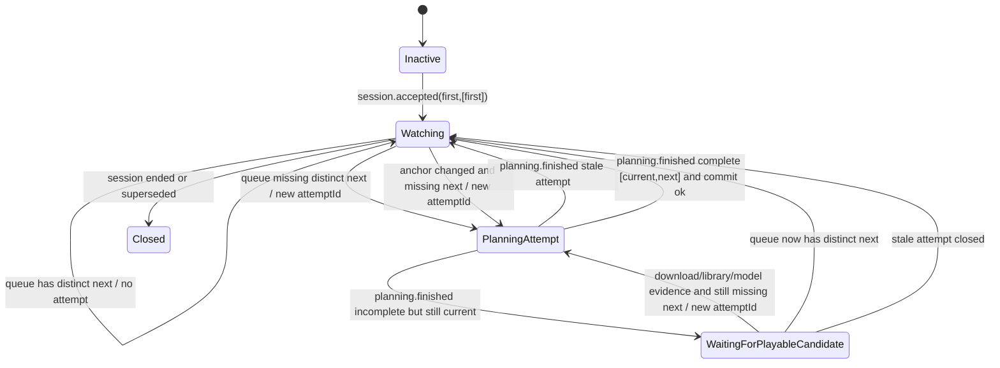

### NextTrack Must Not

- run before accepted session evidence;
- block first playback or click response;
- render `Preparing...`;
- call the model from frontend or `PlaylistItemClick`;
- call the model from `PlayerSession` track boundary resolution;
- replace an existing distinct next only because a newer model was published;
- commit a proposal whose session generation or active anchor is stale;
- treat `modelUnavailable` or `missingCurrentEmbedding` as a terminal state;
- widen fallback candidates beyond playlist membership;
- use trace names as semantic wait states.

### Current Playback Chain Audit

The current source already preserves these design anchors:

- `PlaybackStart` reads `FirstSlot` and submits `[first]`, not `[first,next]`.
- `NextTrack` starts after accepted session evidence and repairs a missing
  distinct next asynchronously.
- `PlayerSession` consumes an explicit queue; in ordered queue mode it selects
  the track after the current identity and does not own recommendation policy.
- Readiness traces for `modelUnavailable` and `missingCurrentEmbedding` are
  diagnostic. They are not playback wait states.
- Existing distinct next evidence is not replaced merely because a model
  generation changed.

The remaining design defects to guard are:

- Queue repair currently has to prove both current session and current anchor at
  commit time. Checking only the session generation leaves room for a stale
  anchor proposal to replace the queue after the player has advanced.
- The trace name `playlist-playback-next-slot-waiting-for-model` is behaviorally
  misleading. The lifecycle does not wait for the model; it records model
  evidence and may fall back while preserving playback liveness.
- A low-level player `play_request` failure is logged by `PlayerSession`, but the
  user-visible state should be driven by structured session/now-playing evidence,
  not diagnostic trace inference.
- Model publication wakes `FirstSlot` preparation, but it must not wake a current
  `NextTrack` into replacing an already available distinct next.

## Lifecycle: PlayerSession

### Boundary

`PlayerSession` is the backend playback lifecycle after player acceptance. It
owns active session generation, current track identity, active playback range,
pause/resume, seek, queue consumption, now-playing emission, and playback
normalization.

It does not own click intent, first-slot preparation, playlist membership,
next-track recommendation policy, playlist page rendering, or spectrum page
state. Those lifecycles may send scoped commands or evidence to it, but the
session itself decides whether the command applies to the current active track
and generation.

### Participants

| Participant | Owns |
| --- | --- |
| `player::service` | active playback process, active track, active range, session generation |
| `PlaybackTrack` | playlist name, canonical music id, file path, URL, start/end range, liked, loudness |
| `ffplayr::Playback` | low-level play, pause, resume, seek, stop, status |
| `PlaybackStatusPayload` | current path, paused/playing, position, active track range projection |
| `LoudnessEvidence` | finite LUFS measurement and persisted replacement evidence |

### Owned State

```ts
PlayerSession =
  | ["inactive"]
  | ["starting", generation: Number, queue: TrackQueue, initial: Track]
  | ["playing", generation: Number, active: ActiveTrack, queue: TrackQueue, range: ActiveRange, paused: Boolean]
  | ["seeking", generation: Number, active: ActiveTrack, queue: TrackQueue, requestedRange: ActiveRange, resumePolicy: ResumePolicy]
  | ["stopping", generation: Number]
  | ["failed", generation: Number, active: Track, reason: String]
  | ["ended", generation: Number];

ActiveTrack = {
  playlistName: String;
  canonicalMusicId: String;
  musicUrl: String;
  filePath: String;
  startMs: Number;
  endMs: Number;
  liked: Boolean;
  loudness: Number; // 0 means missing evidence
};

ActiveRange = {
  startMs: Number;
  endMs: Number;
};

PlaybackNormalization =
  | ["none"]
  | ["target", targetLufs: -18.0, integratedLufs: Number];
```

`ActiveTrack` is the identity. `ActiveRange` is the current playback window over
that identity. Updating `ActiveRange` does not create a new track; it changes the
playback request for the same active track. Updating loudness does not change
track identity; it is a natural transformation over the same identity.

### Transition

```ts
Action =
  | ["startAccepted", generation: Number, queue: TrackQueue, first: Track]
  | ["playRequest.ok", generation: Number, track: Track, range: ActiveRange]
  | ["playRequest.error", generation: Number, track: Track, reason: String]
  | ["pause", generation: Number]
  | ["resume", generation: Number]
  | ["beginSeek", generation: Number]
  | ["seek", generation: Number, positionMs: Number, endMs: Number]
  | ["cancelSeek", generation: Number]
  | ["trackFinished", generation: Number]
  | ["queue.updated", generation: Number, queue: TrackQueue]
  | ["liked.updated", generation: Number, identity: TrackIdentity, liked: Boolean]
  | ["loudness.measured", generation: Number, identity: TrackIdentity, lufs: Number]
  | ["stop", generation: Number]
  | ["superseded", generation: Number];

inactive() =
  next().is(
    | ["startAccepted", generation, queue, first] =>
        starting(generation, queue, first)
  );

starting(generation: Number, queue: TrackQueue, first: Track) =
  submitPlayback(first, range = trackRange(first), normalization = normalization(first));
  next().is(
    | ["playRequest.ok", generation, first, range] =>
        emitNowPlaying(generation, first);
        requestLoudnessIfMissing(generation, first);
        playing(generation, first, queue, range, paused = false)
    | ["playRequest.error", generation, first, reason] =>
        emitPlaybackFailed(generation, first, reason);
        failed(generation, first, reason)
    | ["superseded", generation] =>
        ended(generation)
  );

playing(generation: Number, active: ActiveTrack, queue: TrackQueue, range: ActiveRange, paused: Boolean) =
  next().is(
    | ["pause", generation] =>
        playing(generation, active, queue, range, paused = true)
    | ["resume", generation] =>
        playing(generation, active, queue, range, paused = false)
    | ["beginSeek", generation] =>
        seeking(generation, active, queue, range, resumePolicy(paused))
    | ["seek", generation, positionMs, endMs] =>
        playing(generation, active, queue, seekRange(positionMs, endMs), paused = pauseAfterSeek(paused))
    | ["liked.updated", generation, active.identity, liked] =>
        emitNowPlaying(generation, active.withLiked(liked));
        playing(generation, active.withLiked(liked), queue.withLiked(active.identity, liked), range, paused)
    | ["loudness.measured", generation, active.identity, lufs] =>
        emitNowPlaying(generation, active.withLoudness(lufs));
        playing(generation, active.withLoudness(lufs), queue.withLoudness(active.identity, lufs), range, paused)
    | ["queue.updated", generation, nextQueue] =>
        playing(generation, active, nextQueue, range, paused)
    | ["trackFinished", generation] =>
        queue.nextAfter(active)
          ? starting(generation, queue.after(active), queue.nextAfter(active))
          : ended(generation)
    | ["stop", generation] =>
        stopping(generation)
    | ["superseded", generation] =>
        ended(generation)
  );

seeking(generation: Number, active: ActiveTrack, queue: TrackQueue, range: ActiveRange, resume: ResumePolicy) =
  next().is(
    | ["seek", generation, positionMs, endMs] =>
        playing(generation, active, queue, seekRange(positionMs, endMs), paused = pauseAfterSeek(resume))
    | ["cancelSeek", generation] =>
        playing(generation, active, queue, range, paused = pauseAfterCancel(resume))
    | ["superseded", generation] =>
        ended(generation)
  );

stopping(generation: Number) =
  stopPlayback();
  ended(generation);

failed(generation: Number, active: Track, reason: String) =
  next().is(
    | ["superseded", generation] =>
        ended(generation)
    | ["stop", generation] =>
        stopping(generation)
  );
```

### Natural Transformations

The session has track identity as its object:

```text
TrackIdentity = playlistName + musicUrl + filePath + startMs + endMs
```

Natural transformations preserve that identity while changing evidence or
projection:

| Transformation | Source evidence | Target projection | Law |
| --- | --- | --- | --- |
| liked update | playlist liked change | active track and queued tracks with same canonical id | preserves file/range identity |
| loudness update | finite LUFS measurement | active track, session queue, persisted music row, now-playing payload | preserves file/range identity |
| active range update | seek or spectrum loop signal | playback request start/end and status payload | preserves active track identity |
| normalization projection | non-zero loudness | playback request with target `-18.0` LUFS | only applies when loudness evidence exists |

The loudness law is:

```ts
normalization(track) =
  track.loudness == 0.0
    ? none
    : target(targetLufs = -18.0, integratedLufs = track.loudness);
```

Missing loudness does not block playback. It starts a side measurement. When
measurement finishes and the session generation is still current, the same track
identity is updated and now-playing evidence may be re-emitted. The measurement
does not rerun `PlaylistItemClick`, does not change `FirstSlot`, and does not
manufacture `Preparing...`.

### Internal Rules

- Pause and resume operate on the current playback process only. They do not
  change playlist membership, first-slot state, or click overlay.
- Seek changes `ActiveRange` for the current active track only. Invalid or
  out-of-scope seek evidence returns no status and preserves the session.
- `PlaybackStatusPayload.playback_start_ms` and `playback_end_ms` project
  `ActiveRange` when it exists; otherwise they project the track's original
  `start_ms` and `end_ms`.
- Track boundary consumes the explicit session queue. It does not scan playlist
  membership.
- Queue updates are evidence from `NextTrack`; player consumes them but does not
  own recommendation policy.
- Superseded generation closes the session. Late pause, seek, status, loudness,
  or now-playing evidence for an old generation cannot mutate the current
  session.

### State Motion

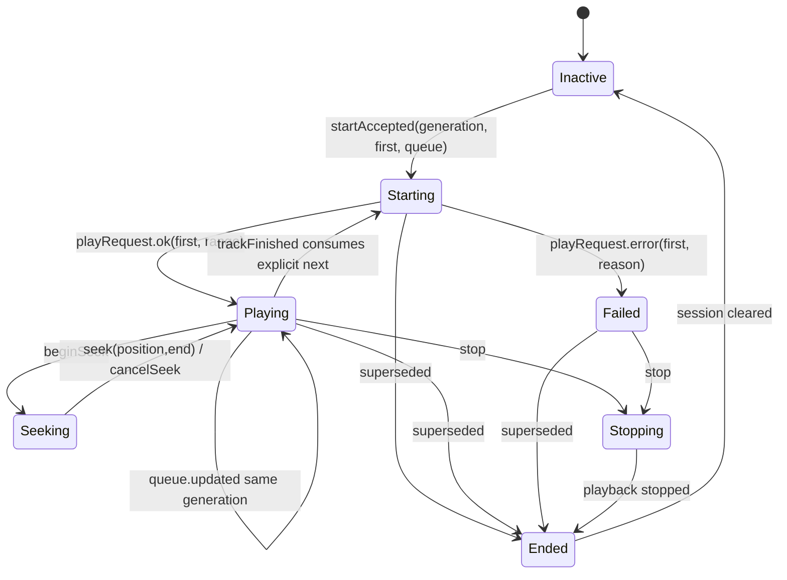

### PlayerSession Must Not

- read `FirstSlot`;
- decide first-track preparation;
- compute playlist membership;
- own recommendation policy for next track;
- mutate click overlay or page response state;
- apply loudness evidence to a different file/range identity;
- apply seek or pause commands to a stale generation;
- treat missing loudness as a reason to block play.

## Lifecycle: PlaybackStart

### Boundary

`PlaybackStart` is one backend `playPlaylist(name)` request. It is the only
place where a click request may be eliminated into a player start command. It
owns request-scoped backend admission, first credential read/discard/consume,
and the returned `PlayPlaylistSession` status.

It does not own first-slot preparation, UI title handoff, player session
internals, next-track repair, model training, or download waiting. A missing
first credential is a completed negative result for this request.

### Owned State

```ts
PlaybackStart =
  | ["idle"]
  | ["claimed", request: RequestHandle, playlistName: String]
  | ["readingFirst", request: RequestHandle, playlistName: String]
  | ["submittingPlayer", request: RequestHandle, playlistName: String, credential: FirstCredential, first: Track]
  | ["started", request: RequestHandle, sessionGeneration: Number, initialTrack: Track]
  | ["pendingFirstTrack", request: RequestHandle]
  | ["superseded", request: RequestHandle]
  | ["failed", request: RequestHandle, reason: String];
```

### Transition

```ts
Action =
  | ["playPlaylist", playlistName: String]
  | ["first.read.none"]
  | ["first.read.credential", credential: FirstCredential]
  | ["first.invalid", credential: FirstCredential]
  | ["track.resolved", credential: FirstCredential, track: Track]
  | ["player.accepted", sessionGeneration: Number]
  | ["player.rejected", reason: String]
  | ["request.superseded"]
  | ["error", reason: String];

idle() =
  next().is(
    | ["playPlaylist", playlistName] =>
        claimed(claimPlaybackStartRequest(), playlistName)
  );

claimed(request: RequestHandle, playlistName: String) =
  readingFirst(request, playlistName);

readingFirst(request: RequestHandle, playlistName: String) =
  readFirstSlot(playlistName);
  next().is(
    | ["first.read.none"] =>
        pendingFirstTrack(request)
    | ["first.read.credential", credential] =>
        credentialInScope(credential, playlistName)
          ? resolveTrack(credential)
          : discardFirstCredential(credential); readingFirst(request, playlistName)
    | ["first.invalid", credential] =>
        discardFirstCredential(credential);
        readingFirst(request, playlistName)
    | ["track.resolved", credential, track] =>
        submittingPlayer(request, playlistName, credential, track)
    | ["request.superseded"] =>
        superseded(request)
    | ["error", reason] =>
        failed(request, reason)
  );

submittingPlayer(request: RequestHandle, playlistName: String, credential: FirstCredential, first: Track) =
  submitPlayerSession(request, queue = [first]);
  next().is(
    | ["player.accepted", sessionGeneration] =>
        consumeFirstCredential(credential);
        started(request, sessionGeneration, first)
    | ["player.rejected", reason] =>
        failed(request, reason)
    | ["request.superseded"] =>
        superseded(request)
  );
```

### State Motion

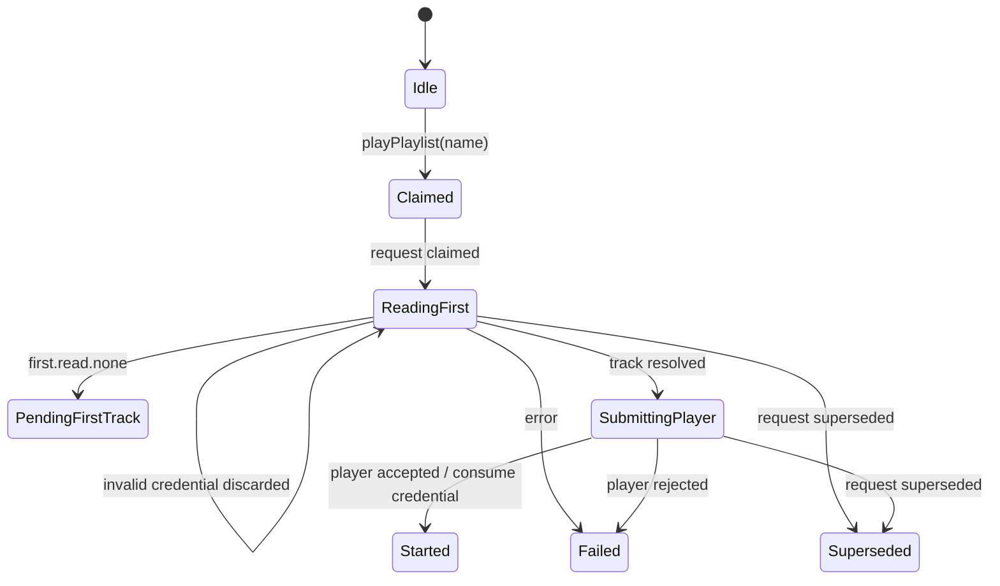

### PlaybackStart Must Not

- synchronously refill `FirstSlot`;
- scan playlist membership to invent a first track;
- return `started` without player acceptance;
- consume a first credential before player acceptance;
- emit `Preparing...`;
- wait for downloads, model training, or import completion.

## Lifecycle: PlaybackSurface

### Boundary

`PlaybackSurface` is the visible play surface after the app has accepted
playback. It owns the visible playlist title, track text, non-playable
`Preparing...` text, icons, liked affordance, and restore release. It is not the
click lifecycle and it is not the player.

### Owned State

```ts
PlaybackSurface =
  | ["inactive"]
  | ["acceptedTitle", playlistName: String]
  | ["track", playlistName: String, trackName: String, liked: Boolean | null]
  | ["preparing", playlistName: String]
  | ["restoring", playlistName: String, transitionStarted: Boolean];
```

### Transition

```ts
Action =
  | ["machine.play", playlistName: String]
  | ["nowPlaying.track", playlistName: String, trackName: String, liked: Boolean | null]
  | ["nowPlaying.nonPlayable", playlistName: String, text: "Preparing..."]
  | ["machine.leftPlay", playlistName: String]
  | ["torph.stage", playlistName: String, stage: "idle" | "prepare" | "animate"];

inactive() =
  next().is(
    | ["machine.play", playlistName] =>
        acceptedTitle(playlistName)
  );

acceptedTitle(playlistName: String) =
  next().is(
    | ["nowPlaying.track", playlistName, trackName, liked] =>
        track(playlistName, trackName, liked)
    | ["nowPlaying.nonPlayable", playlistName, "Preparing..."] =>
        preparing(playlistName)
    | ["machine.leftPlay", playlistName] =>
        inactive()
  );

track(playlistName: String, trackName: String, liked: Boolean | null) =
  next().is(
    | ["nowPlaying.track", playlistName, nextTrackName, nextLiked] =>
        track(playlistName, nextTrackName, nextLiked)
    | ["nowPlaying.nonPlayable", playlistName, "Preparing..."] =>
        preparing(playlistName)
    | ["machine.leftPlay", playlistName] =>
        restoring(playlistName, transitionStarted = false)
  );

preparing(playlistName: String) =
  next().is(
    | ["nowPlaying.track", playlistName, trackName, liked] =>
        track(playlistName, trackName, liked)
    | ["machine.leftPlay", playlistName] =>
        restoring(playlistName, transitionStarted = false)
  );

restoring(playlistName: String, transitionStarted: Boolean) =
  next().is(
    | ["torph.stage", playlistName, "prepare" | "animate"] =>
        restoring(playlistName, transitionStarted = true)
    | ["torph.stage", playlistName, "idle"] =>
        transitionStarted ? inactive() : restoring(playlistName, false)
    | ["machine.play", playlistName] =>
        acceptedTitle(playlistName)
  );
```

### State Motion

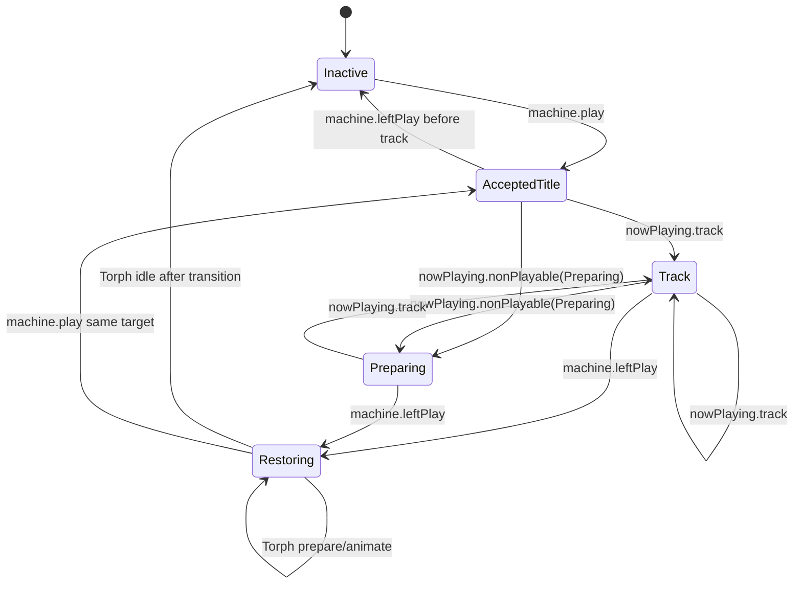

### PlaybackSurface Must Not

- interpret a pending click as `Preparing...`;
- enter `track` from stale now-playing evidence;
- release restore before Torph proves a visual return has started;
- choose a playback track;
- mutate `PlayerSession` or `PlaylistItemClick`.

## Lifecycle: PlaylistDraftCommit

### Boundary

`PlaylistDraftCommit` is the config/check lifecycle. It owns draft dirtiness,
commit request construction, immediate return to the playlist page, title
handoff, and acceptance of later playlist upsert evidence. It does not own
download progress or collection import terminal state.

### Owned State

```ts
PlaylistDraftCommit =
  | ["idle"]
  | ["editing", draft: ConfigDraft, baseline: ConfigDraft | null]
  | ["returningClean", titleHandoff: TitleHandoff | null]
  | ["dispatchingCommit", request: PlaylistWriteRequest, preview: PlaylistPreview]
  | ["returnedPendingCommit", request: PlaylistWriteRequest, preview: PlaylistPreview]
  | ["committed", playlistName: String]
  | ["failed", request: PlaylistWriteRequest, reason: String];
```

### Transition

```ts
Action =
  | ["openCreate"]
  | ["openEdit", playlistName: String]
  | ["draft.loaded", draft: ConfigDraft]
  | ["draft.changed", draft: ConfigDraft]
  | ["check"]
  | ["back"]
  | ["commit.accepted", playlist: Playlist]
  | ["commit.failed", reason: String];

editing(draft: ConfigDraft, baseline: ConfigDraft | null) =
  next().is(
    | ["draft.changed", nextDraft] =>
        editing(nextDraft, baseline)
    | ["check"] =>
        hasDraftChanges(draft, baseline)
          ? dispatchingCommit(resolveCommitRequest(draft, baseline), preview(draft))
          : returningClean(resolveCleanTitleHandoff(draft, baseline))
    | ["back"] =>
        returningClean(resolveBackTitleHandoff(draft, baseline))
  );

dispatchingCommit(request: PlaylistWriteRequest, preview: PlaylistPreview) =
  sendCommitInBackground(request);
  returnToReadyImmediately(preview);
  returnedPendingCommit(request, preview);

returnedPendingCommit(request: PlaylistWriteRequest, preview: PlaylistPreview) =
  next().is(
    | ["commit.accepted", playlist] =>
        committed(playlist.name)
    | ["commit.failed", reason] =>
        failed(request, reason)
  );
```

### State Motion

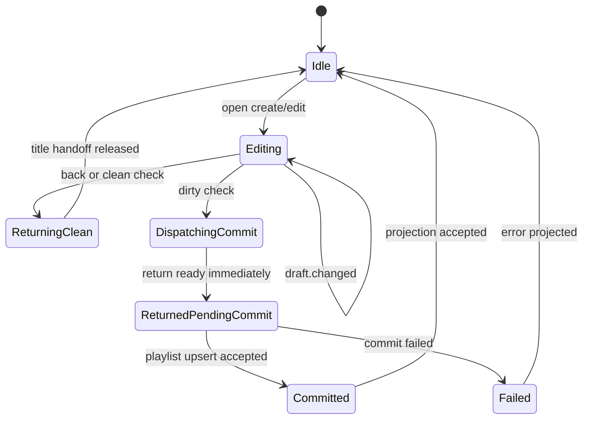

### PlaylistDraftCommit Must Not

- wait for downloads or imports before returning to `ready`;
- mark download/import tasks complete;
- infer collection membership from draft projection;
- block the title return animation on persistence;
- treat root-title parsing as downloaded music evidence.

## Lifecycle: PasteDownloadCandidate

### Boundary

`PasteDownloadCandidate` is the frontend config candidate lifecycle for pasted
download URLs. It owns candidate rows, clipboard URL validation, root-title
evidence display, enqueue/task evidence display, delete/reset, and transfer of
collection shell evidence into the draft.

It does not own backend task progress, collection import finalization, playlist
commit, check/back return, or playlist playback readiness. A candidate can stay
active after config returns to `ready`, because the backend download task keeps
its own clock.

### Owned State

```ts
PasteDownloadCandidate =
  | ["empty"]
  | ["checking", id: CandidateId, rawText: String]
  | ["enqueueing", id: CandidateId, sourceUrl: String, displayText: String]
  | ["preparing", id: CandidateId, taskId: String, sourceUrl: String, displayText: String]
  | ["invalidUrl", id: CandidateId, error: String]
  | ["enqueueFailed", id: CandidateId, error: String]
  | ["released", id: CandidateId, reason: ReleaseReason];

ReleaseReason =
  | "existing_collection"
  | "terminal_task_collection_loaded"
  | "deleted"
  | "reset";
```

`displayText` is local presentation cargo. It may use root-title shell evidence
or task shell evidence, but it is not a collection row and not music evidence.

### Transition

```ts
Action =
  | ["paste", rawText: String]
  | ["url.resolved", id: CandidateId, resolution: UrlResolution]
  | ["url.resolveFailed", id: CandidateId, error: String]
  | ["rootTitle.resolved", id: CandidateId, title: String, collectionShell: CollectionShell]
  | ["rootTitle.failed", id: CandidateId, error: String]
  | ["enqueue.accepted", id: CandidateId, task: DownloadTask, collectionShell: CollectionShell | null]
  | ["enqueue.failed", id: CandidateId, error: String]
  | ["task.changed", taskId: String, signal: DownloadTaskChangeSignal]
  | ["task.collectionLoaded", taskId: String, collection: Collection]
  | ["task.collectionFailed", taskId: String, error: String]
  | ["delete", id: CandidateId]
  | ["reset"];

empty() =
  next().is(
    | ["paste", rawText] =>
        checking(newCandidateId(), rawText)
  );

checking(id: CandidateId, rawText: String) =
  resolvePastedDownloadUrl(rawText);
  next().is(
    | ["url.resolved", id, ["invalid_url", error]] =>
        invalidUrl(id, error)
    | ["url.resolved", id, ["existing_collection", collection]] =>
        sendDraftCollectionShell(collection);
        released(id, "existing_collection")
    | ["url.resolved", id, ["new_url", sourceUrl]] =>
        startTitleProbe(id, sourceUrl);
        enqueueCollectionDownload(sourceUrl);
        enqueueing(id, sourceUrl, displayText = sourceUrl)
    | ["url.resolveFailed", id, error] =>
        enqueueFailed(id, error)
    | ["delete", id] =>
        released(id, "deleted")
    | ["reset"] =>
        released(id, "reset")
  );

enqueueing(id: CandidateId, sourceUrl: String, displayText: String) =
  next().is(
    | ["rootTitle.resolved", id, title, collectionShell] =>
        sendDraftCollectionShell(collectionShell);
        enqueueing(id, sourceUrl, displayText = title)
    | ["enqueue.accepted", id, task, collectionShell] =>
        if collectionShell != null then sendDraftCollectionShell(collectionShell);
        task.isTerminal()
          ? released(id, "terminal_task_collection_loaded")
          : preparing(id, task.id, task.collectionUrl ?? sourceUrl, task.collectionName ?? displayText)
    | ["enqueue.failed", id, error] =>
        enqueueFailed(id, error)
    | ["delete", id] =>
        released(id, "deleted")
    | ["reset"] =>
        released(id, "reset")
  );

preparing(id: CandidateId, taskId: String, sourceUrl: String, displayText: String) =
  next().is(
    | ["rootTitle.resolved", id, title, collectionShell] =>
        sendDraftCollectionShell(collectionShell);
        preparing(id, taskId, sourceUrl, title)
    | ["task.changed", taskId, signal] =>
        signal.isFailed()
          ? enqueueFailed(id, signal.error)
          : preparing(
              id,
              taskId,
              signal.collectionUrl ?? sourceUrl,
              signal.collectionName ?? displayText
            )
    | ["task.collectionLoaded", taskId, collection] =>
        sendDraftCollectionShell(collection);
        released(id, "terminal_task_collection_loaded")
    | ["task.collectionFailed", taskId, error] =>
        enqueueFailed(id, error)
    | ["delete", id] =>
        released(id, "deleted")
    | ["reset"] =>
        released(id, "reset")
  );
```

### State Motion

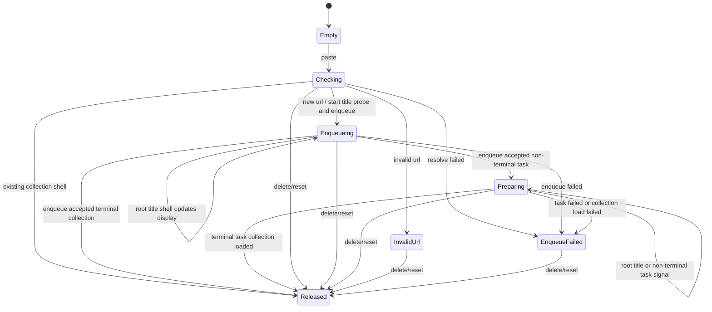

### PasteDownloadCandidate Must Not

- block `PlaylistDraftCommit` from returning to `ready`;
- mark a backend task complete;
- treat root-title shell evidence as persisted music;
- remove an active candidate only because collection shell evidence arrived;
- decide collection folder naming;
- decide playback readiness or first-slot availability;
- keep the config check visual in processing after the candidate has been
  admitted to backend task ownership.

## Lifecycle: DownloadTaskRuntime

### Boundary

`DownloadTaskRuntime` owns task and leaf progress for remote downloads,
auto-update, and local import task signals. It owns enqueue admission,
transaction-conflict retry, root probe scheduling, residual leaf work, leaf
download/finalization, terminal task status, and task change signals.

It does not own playlist config page state, first-track selection, playback
session state, or collection folder naming. Folder and music rows are
`CollectionImport` cargo.

### Owned State

```ts
DownloadTaskRuntime =
  | ["idle"]
  | ["admitting", url: NormalizedUrl, trigger: DownloadTrigger]
  | ["queued", task: DownloadTask]
  | ["resolving", task: DownloadTask]
  | ["downloading", task: DownloadTask, activeLeafs: LeafSet]
  | ["persisting", task: DownloadTask, finalizingLeafs: LeafSet]
  | ["completed", task: DownloadTask]
  | ["completedWithErrors", task: DownloadTask]
  | ["failed", task: DownloadTask, reason: String]
  | ["interrupted", task: DownloadTask];

DownloadLeaf =
  | ["queued"]
  | ["probing"]
  | ["downloading"]
  | ["persisting"]
  | ["measuringLoudness"]
  | ["completed"]
  | ["failed", reason: String]
  | ["cancelled"]
  | ["interrupted"];
```

### Transition

```ts
Action =
  | ["enqueue", url: Url, trigger: DownloadTrigger]
  | ["activeTask.exists", task: DownloadTask]
  | ["preparedShell.exists", shell: CollectionShell]
  | ["task.saved", task: DownloadTask]
  | ["rootProbe.ok", plan: CollectionSyncPlan]
  | ["rootProbe.error", reason: String]
  | ["leaf.prepared", leaf: Leaf]
  | ["leaf.downloaded", leaf: Leaf, tempFile: Path]
  | ["leaf.finalized", leaf: Leaf]
  | ["leaf.failed", leaf: Leaf, reason: String]
  | ["pipeline.drained"]
  | ["process.interrupted"];

idle() =
  next().is(
    | ["enqueue", url, trigger] =>
        admitting(normalize(url), trigger)
  );

admitting(url: NormalizedUrl, trigger: DownloadTrigger) =
  retryTransactionConflictInsideDownloadOwner();
  next().is(
    | ["activeTask.exists", task] =>
        queued(attachPreparedShellIfAny(task))
    | ["preparedShell.exists", shell] =>
        queued(saveTaskWithShell(url, trigger, shell))
    | ["task.saved", task] =>
        queued(task)
  );

queued(task: DownloadTask) =
  next().is(
    | ["rootProbe.ok", plan] =>
        resolving(persistResidualPlan(task, plan))
    | ["rootProbe.error", reason] =>
        failed(task, reason)
    | ["process.interrupted"] =>
        interrupted(task)
  );

resolving(task: DownloadTask) =
  prepareResidualLeafs(task);
  next().is(
    | ["leaf.prepared", leaf] =>
        downloading(markLeafReady(task, leaf), activeLeafs = [leaf])
    | ["leaf.failed", leaf, reason] =>
        resolving(markLeafFailed(task, leaf, reason))
    | ["pipeline.drained"] =>
        terminalFromResidualLeafs(task)
  );

downloading(task: DownloadTask, activeLeafs: LeafSet) =
  next().is(
    | ["leaf.downloaded", leaf, tempFile] =>
        persisting(markLeafPersisting(task, leaf), finalizingLeafs = [leaf])
    | ["leaf.failed", leaf, reason] =>
        resolving(markLeafFailed(task, leaf, reason))
    | ["process.interrupted"] =>
        interrupted(task)
  );

persisting(task: DownloadTask, finalizingLeafs: LeafSet) =
  next().is(
    | ["leaf.finalized", leaf] =>
        resolving(removeResidualLeaf(task, leaf))
    | ["leaf.failed", leaf, reason] =>
        resolving(markLeafFailed(task, leaf, reason))
  );
```

### State Motion

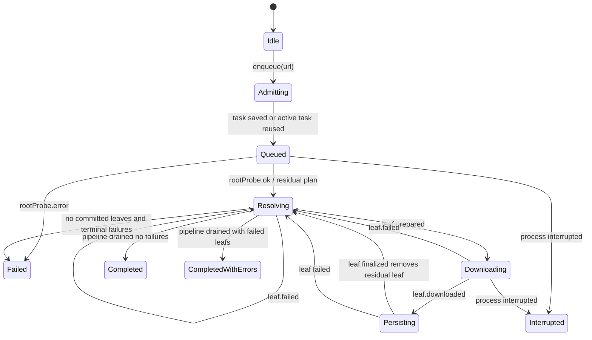

### DownloadTaskRuntime Must Not

- be completed by `ready`, `check`, `back`, or page projection;
- use UI trace as state;
- let pasted URL parsing create playable music;
- own collection folder naming;
- block config return while residual task work continues;
- ask playback to retry download admission.

## Lifecycle: CollectionImport

### Boundary

`CollectionImport` owns canonical collection identity after shell evidence is
accepted: collection URL, title, folder, manifest, final file moves, group rows,
music rows, and local import materialization. It is the only owner allowed to
turn committed files into stable music evidence.

### Owned State

```ts
CollectionImport =
  | ["empty"]
  | ["shellPrepared", shell: CollectionShell]
  | ["planning", shell: CollectionShell]
  | ["materializing", plan: CollectionSyncPlan]
  | ["manifestRestoring", collection: Collection]
  | ["committingLeaf", collection: Collection, leaf: LeafCompletion]
  | ["importingLocal", shell: CollectionShell]
  | ["committed", collection: Collection]
  | ["failed", shell: CollectionShell | null, reason: String];
```

### Transition

```ts
Action =
  | ["rootShell.accepted", shell: CollectionShell]
  | ["collectionPlan.accepted", plan: CollectionSyncPlan]
  | ["localShell.accepted", shell: CollectionShell]
  | ["manifest.found", collection: Collection]
  | ["leafCompletion.accepted", leaf: LeafCompletion]
  | ["fileCommit.ok", relativePath: String]
  | ["musicRows.persisted", collection: Collection]
  | ["error", reason: String];

empty() =
  next().is(
    | ["rootShell.accepted", shell] =>
        shellPrepared(shell)
    | ["localShell.accepted", shell] =>
        importingLocal(shell)
  );

shellPrepared(shell: CollectionShell) =
  persistCollectionShell(shell);
  committed(collectionFromShell(shell));

planning(shell: CollectionShell) =
  next().is(
    | ["collectionPlan.accepted", plan] =>
        materializing(plan)
    | ["error", reason] =>
        failed(shell, reason)
  );

materializing(plan: CollectionSyncPlan) =
  loadOrCreateCollection(plan);
  next().is(
    | ["manifest.found", collection] =>
        manifestRestoring(collection)
    | ["leafCompletion.accepted", leaf] =>
        committingLeaf(collectionFromPlan(plan), leaf)
  );

committingLeaf(collection: Collection, leaf: LeafCompletion) =
  finalizeDownloadedLeaf(collection, leaf);
  next().is(
    | ["fileCommit.ok", relativePath] =>
        persistMusicRows(collection, leaf, relativePath)
    | ["musicRows.persisted", collection] =>
        committed(collection)
    | ["error", reason] =>
        failed(collectionShell(collection), reason)
  );
```

### State Motion

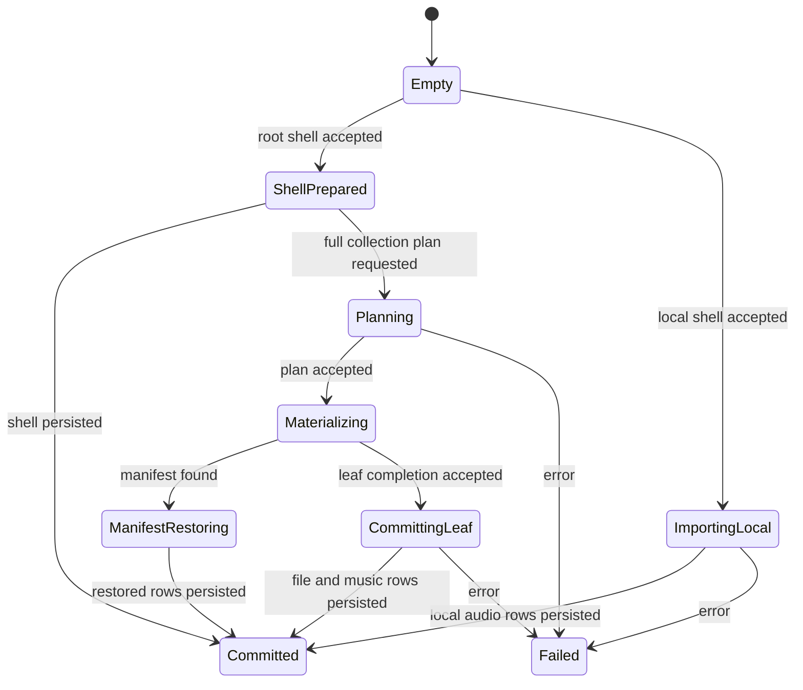

### CollectionImport Must Not

- decide playback readiness;
- decide playlist membership outside persisted rows;
- retry provider downloads;
- expose partial temp files as music;
- let download task page state rename or complete a collection;
- create a second folder authority in downloads or UI.

## Lifecycle: AudioStyleModelRuntime

### Boundary

`AudioStyleModelRuntime` owns audio-style embedding cache, training runs,
stable snapshot publication, completed snapshot history, and model availability
signals. It is independent from clicks, player boundaries, and UI rendering.

### Owned State

```ts
AudioStyleModelRuntime =
  | ["uninitialized"]
  | ["restoringCachedEvidence"]
  | ["idle", stable: StableSnapshot | null, completed: SnapshotHistory]
  | ["training", runId: Number, reason: String, rerunRequested: Boolean]
  | ["publishing", runId: Number, snapshot: AudioStyleModelSnapshot]
  | ["failed", lastStable: StableSnapshot | null, reason: String];
```

### Transition

```ts
Action =
  | ["startup"]
  | ["cachedEvidence.restored", snapshot: AudioStyleModelSnapshot | null]
  | ["inputs.changed", reason: String]
  | ["training.finished", runId: Number, snapshot: AudioStyleModelSnapshot]
  | ["training.failed", runId: Number, reason: String]
  | ["stable.published", snapshot: AudioStyleModelSnapshot]
  | ["request.coalesced", reason: String];

uninitialized() =
  next().is(
    | ["startup"] =>
        restoringCachedEvidence()
  );

restoringCachedEvidence() =
  next().is(
    | ["cachedEvidence.restored", snapshot] =>
        startupDecision(snapshot) == "skip"
          ? idle(stable = snapshot, completed = history(snapshot))
          : training(nextRunId(), "startup", rerunRequested = false)
  );

idle(stable: StableSnapshot | null, completed: SnapshotHistory) =
  next().is(
    | ["inputs.changed", reason] =>
        training(nextRunId(), reason, rerunRequested = false)
  );

training(runId: Number, reason: String, rerunRequested: Boolean) =
  next().is(
    | ["inputs.changed", nextReason] =>
        training(runId, reason, rerunRequested = true)
    | ["training.finished", runId, snapshot] =>
        publishing(runId, snapshot)
    | ["training.failed", runId, error] =>
        rerunRequested
          ? training(nextRunId(), "coalesced", rerunRequested = false)
          : failed(lastStable(), error)
  );

publishing(runId: Number, snapshot: AudioStyleModelSnapshot) =
  publishStableIfNewer(snapshot);
  next().is(
    | ["stable.published", snapshot] =>
        wakeFirstSlotOnAvailabilityEdge(snapshot);
        idle(stable = snapshot, completed = completed.plus(snapshot))
  );
```

### State Motion

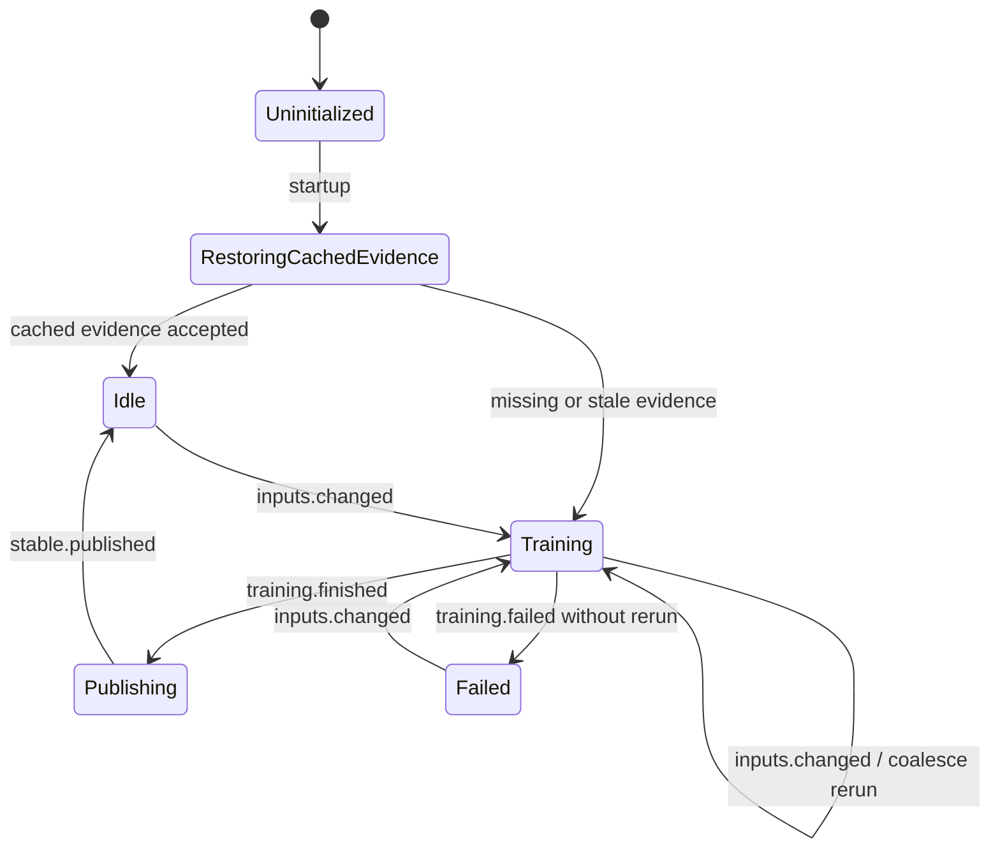

### AudioStyleModelRuntime Must Not

- block `PlaylistItemClick`;
- decide `Preparing...`;
- mutate an already valid next queue;
- train inside player boundary;
- make model absence illegal for FirstSlot or NextTrack fallback;
- publish an older or same-generation snapshot over a newer stable snapshot.

## Lifecycle: LoudnessEvidence

### Boundary

`LoudnessEvidence` owns the background measurement of a playback track whose
loudness is `0.0`, persistence of finite non-zero LUFS evidence, and projection
back into the current session when generation and identity still match.

### Owned State

```ts
LoudnessEvidence =
  | ["idle"]
  | ["requested", generation: Number, identity: TrackIdentity]
  | ["measuring", generation: Number, identity: TrackIdentity]
  | ["persisting", generation: Number, identity: TrackIdentity, lufs: Number]
  | ["published", generation: Number, identity: TrackIdentity, lufs: Number]
  | ["stale", generation: Number, identity: TrackIdentity]
  | ["failed", generation: Number, identity: TrackIdentity, reason: String];
```

### Transition

```ts
Action =
  | ["trackWillPlay", generation: Number, track: Track]
  | ["analysis.ok", lufs: Number]
  | ["analysis.failed", reason: String]
  | ["persist.ok", lufs: Number]
  | ["session.stale"]
  | ["identity.mismatch"];

idle() =
  next().is(
    | ["trackWillPlay", generation, track] =>
        track.loudness == 0.0
          ? requested(generation, identity(track))
          : idle()
  );

requested(generation: Number, identity: TrackIdentity) =
  measuring(generation, identity);

measuring(generation: Number, identity: TrackIdentity) =
  next().is(
    | ["analysis.ok", lufs] =>
        finiteNonZero(lufs)
          ? persisting(generation, identity, lufs)
          : failed(generation, identity, "invalid_loudness")
    | ["analysis.failed", reason] =>
        failed(generation, identity, reason)
    | ["session.stale"] =>
        stale(generation, identity)
  );

persisting(generation: Number, identity: TrackIdentity, lufs: Number) =
  next().is(
    | ["persist.ok", lufs] =>
        currentSessionStillMatches(generation, identity)
          ? published(generation, identity, lufs)
          : stale(generation, identity)
  );
```

### State Motion

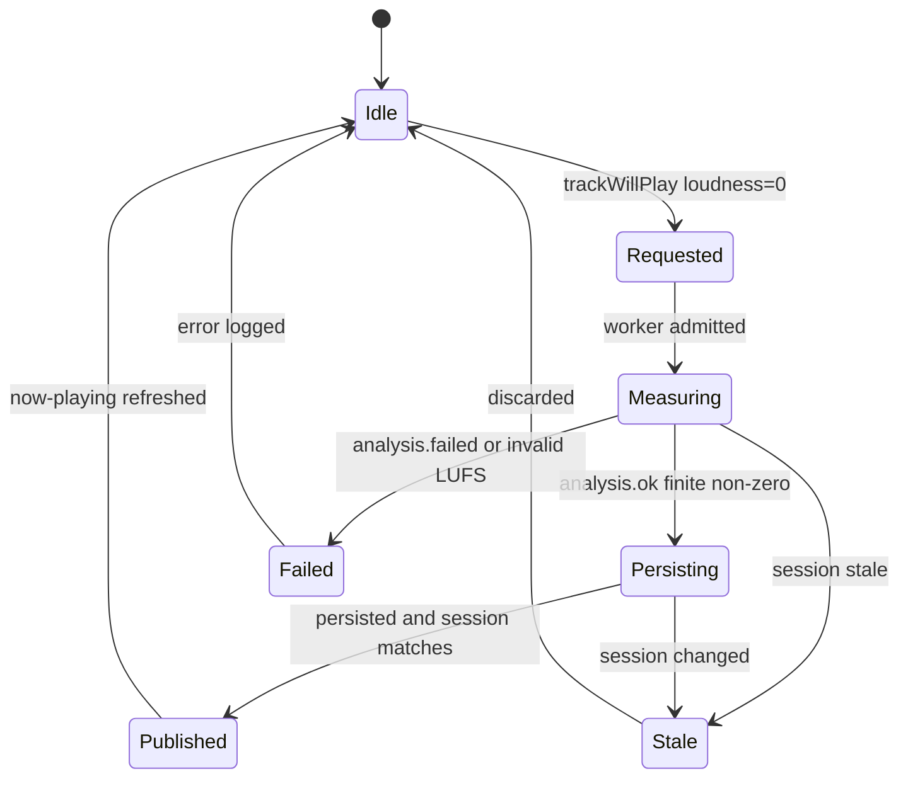

### LoudnessEvidence Must Not

- block playback;
- create `Preparing...`;
- apply evidence to a different file/range identity;
- change first or next selection;
- treat `0.0` as a target normalization value.

## Lifecycle: SpectrumScope

### Boundary

`SpectrumScope` owns the linear scope opened from an accepted playback session
for spectrum editing and preview playback. It coordinates app page shape,
player scope id, preview/restore commands, loop signal, and check/back return.

### Owned State

```ts
SpectrumScope =
  | ["closed"]
  | ["opening", sourceSession: SessionGeneration]
  | ["open", scopeId: Number, sourceSession: SessionGeneration]
  | ["previewing", scopeId: Number, track: Track]
  | ["restoring", scopeId: Number, track: Track | null]
  | ["exiting", scopeId: Number]
  | ["returned", sourceSession: SessionGeneration]
  | ["failed", reason: String];
```

### Transition

```ts
Action =
  | ["open.request", sourceSession: SessionGeneration]
  | ["scope.accepted", scopeId: Number]
  | ["preview.play", track: Track]
  | ["preview.pause"]
  | ["loop.updated", track: Track, startMs: Number, endMs: Number]
  | ["restore.request", track: Track | null]
  | ["check"]
  | ["back"]
  | ["scope.exited", scopeId: Number]
  | ["error", reason: String];

closed() =
  next().is(
    | ["open.request", sourceSession] =>
        opening(sourceSession)
  );

opening(sourceSession: SessionGeneration) =
  enterPlayerSpectrumScope();
  next().is(
    | ["scope.accepted", scopeId] =>
        open(scopeId, sourceSession)
    | ["error", reason] =>
        failed(reason)
  );

open(scopeId: Number, sourceSession: SessionGeneration) =
  next().is(
    | ["preview.play", track] =>
        previewing(scopeId, track)
    | ["restore.request", track] =>
        restoring(scopeId, track)
    | ["check"] =>
        restoring(scopeId, currentPrimaryTrackOrNull())
    | ["back"] =>
        restoring(scopeId, currentPrimaryTrackOrNull())
  );

previewing(scopeId: Number, track: Track) =
  next().is(
    | ["loop.updated", track, startMs, endMs] =>
        previewing(scopeId, track.withRange(startMs, endMs))
    | ["restore.request", restoreTrack] =>
        restoring(scopeId, restoreTrack)
    | ["check"] =>
        restoring(scopeId, currentPrimaryTrackOrNull())
    | ["back"] =>
        restoring(scopeId, currentPrimaryTrackOrNull())
  );

restoring(scopeId: Number, track: Track | null) =
  restorePrimaryPlaybackIfNeeded(scopeId, track);
  exiting(scopeId);

exiting(scopeId: Number) =
  exitPlayerSpectrumScope(scopeId);
  next().is(
    | ["scope.exited", scopeId] =>
        returned(sourceSessionFor(scopeId))
  );
```

### State Motion

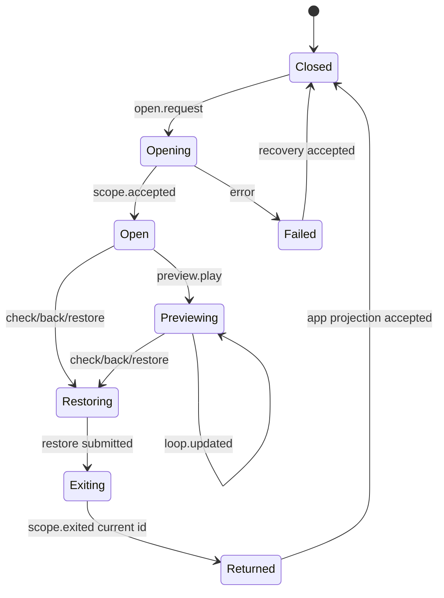

### SpectrumScope Must Not

- open without an accepted playback session;
- consume a stale scope id;
- turn check/back into playlist stop unless the app explicitly requested stop;
- mutate first-slot or next-track state;
- apply loop signal to a different preview track identity.

## Lifecycle: AppBootstrap

### Boundary

`AppBootstrap` owns app startup loading and retry from error. It accepts startup
snapshot evidence and moves the app to `ready`; it does not own later download,
model, or playback work.

### Owned State

```ts
AppBootstrap =
  | ["idle"]
  | ["loading", attempt: Number]
  | ["ready", snapshot: StartupSnapshot]
  | ["error", attempt: Number, reason: String];
```

### Transition

```ts
Action =
  | ["run"]
  | ["load.ok", snapshot: StartupSnapshot]
  | ["load.error", reason: String]
  | ["retry"];

idle() =
  next().is(
    | ["run"] =>
        loading(attempt = 1)
  );

loading(attempt: Number) =
  next().is(
    | ["load.ok", snapshot] =>
        ready(snapshot)
    | ["load.error", reason] =>
        error(attempt, reason)
  );

error(attempt: Number, reason: String) =
  next().is(
    | ["retry"] =>
        loading(attempt + 1)
  );
```

### AppBootstrap Must Not

- train the model synchronously;
- complete downloads;
- start playback;
- infer playable first credentials;
- hide startup failure by entering `ready` with partial mandatory snapshot data.

## Lifecycle: TraceLifecycle

### Boundary

`TraceLifecycle` owns optional diagnostic trace collection. It installs a
registry, accepts a startup declaration of enabled probes, records only events
owned by enabled probes, keeps a bounded in-memory JSONL buffer, clears, and
saves the buffer when explicitly requested.

It does not own app state, playback state, performance policy, UI timing, or
backend task progress. A trace line is evidence for humans and tests during
diagnosis; it is never a command, wake signal, cache value, or state transition.

### Owned State

```ts
TraceLifecycle =
  | ["uninstalled"]
  | ["installed", enabled: Set<TraceProbe>, entries: TraceEntry[], nextSeq: Number]
  | ["saving", enabled: Set<TraceProbe>, entries: TraceEntry[], nextSeq: Number]
  | ["saveFailed", enabled: Set<TraceProbe>, entries: TraceEntry[], nextSeq: Number, reason: String];

TraceProbe =
  | "app-logic-state"
  | "app-viewport"
  | "list-config-check"
  | "playback-diagnostics"
  | "playback-mode-effect"
  | "playlist-page"
  | "playlist-playback"
  | "spectrum-flow"
  | "trace-lifecycle";
```

### Transition

```ts
Action =
  | ["install", enabledProbes: TraceProbe[]]
  | ["setEnabledProbes", enabledProbes: TraceProbe[]]
  | ["record", event: String, payload: Json]
  | ["clear"]
  | ["save"]
  | ["save.ok", path: String]
  | ["save.error", reason: String];

uninstalled() =
  next().is(
    | ["install", enabledProbes] =>
        installed(Set(enabledProbes), entries = [], nextSeq = 0)
  );

installed(enabled: Set<TraceProbe>, entries: TraceEntry[], nextSeq: Number) =
  next().is(
    | ["setEnabledProbes", enabledProbes] =>
        installed(Set(enabledProbes), entries, nextSeq)
    | ["record", event, payload] =>
        shouldRecord(event, enabled)
          ? installed(enabled, appendBounded(entries, traceEntry(nextSeq, event, payload)), nextSeq + 1)
          : installed(enabled, entries, nextSeq)
    | ["clear"] =>
        installed(enabled, entries = [], nextSeq = 0)
    | ["save"] =>
        saving(enabled, entries, nextSeq)
  );

saving(enabled: Set<TraceProbe>, entries: TraceEntry[], nextSeq: Number) =
  writeJsonl(entries);
  next().is(
    | ["save.ok", _path] =>
        installed(enabled, entries, nextSeq)
    | ["save.error", reason] =>
        saveFailed(enabled, entries, nextSeq, reason)
  );
```

### State Motion

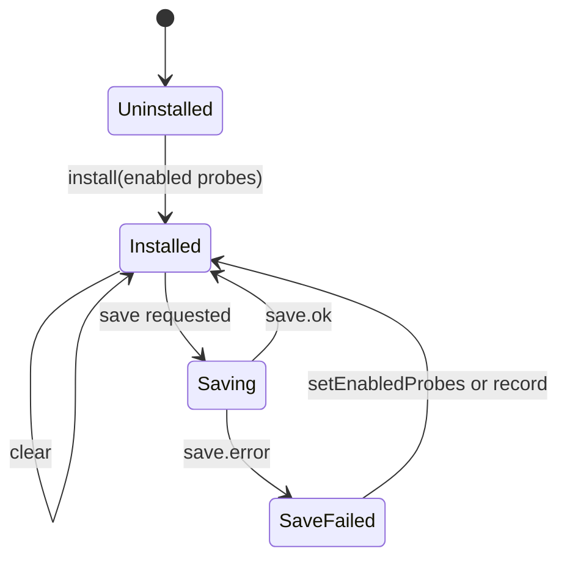

### TraceLifecycle Must Not

- enable probes unless startup declares them;
- record unknown events;
- mutate any lifecycle state;
- block click, check/back, download, import, model, or playback paths;
- become a readiness signal;
- rename behavior states through trace event names.

## Transfer Layer

Transfers are how lifecycles pass evidence. They are separate from lifecycle
state. The access kind is part of the transfer contract.

| Transfer | Access | Source owner | Target | Cargo or signal | Rule |
| --- | --- | --- | --- | --- | --- |
| startup snapshot | `command` | app runtime | `AppBootstrap` | `run`, startup bootstrap result, save path | startup may enter `ready` or `error`; it does not complete background lifecycles |
| startup app projection | `project` | `AppBootstrap` | `appLogic` | playlists, config library, save path | replaces app shape only after mandatory snapshot evidence is accepted |
| startup playable wake | `wake` | `appLogic ready projection` | `FirstSlot` | current playlist names and library generation | fills missing prepared sources outside click path |
| startup model wake | `wake` | `appLogic ready projection` | `AudioStyleModelRuntime` | library snapshot | model owner restores or trains on its own clock |
| click intent | `command` | `PlayListPage` | `PlaylistItemClick` | playlist name | opens pending request only in `ready` or `play` |
| pending title response | `project` | `PlaylistItemClick` | `PlaylistInteractionResponse` | playlist name, request id | same-turn title lock only; never preparing text |
| backend start | `command` | `PlaylistItemClick` | `PlaybackStart` | playlist name, request id | request id closes stale callbacks |
| first credential read | `read` | `FirstSlot` | `PlaybackStart` | generation, credential id, source | read is not refill and not consumption |
| first credential discard | `consume` | `PlaybackStart` | `FirstSlot` | invalid credential id plus generation | owner removes matching stale credential and schedules repair |
| first credential consume | `consume` | `PlaybackStart` | `FirstSlot` | accepted credential id plus generation | only after player acceptance |
| player acceptance | `command` | `PlaybackStart` | `PlayerSession` | `[first]`, request handle, queue mode | player may accept, reject, or supersede; it does not choose first |
| accepted playback | `project` | `PlaybackStart` | `appLogic` | playlist name, request id, session | enters `play` only if request still current |
| request closure | `project` | `PlaybackStart` | `PlaylistItemClick` and `PlaylistInteractionResponse` | `pending_first_track`, `superseded`, error, request id | closes matching overlay; does not enter play and does not show preparing |
| playback accepted title | `project` | `appLogic play projection` | `PlaybackSurface` and `PlaylistInteractionResponse` | accepted playlist, request id, session generation | shows playlist title before track evidence |
| playback surface track | `project` | `PlayerSession` | `PlaybackSurface` and `PlaylistInteractionResponse` | track identity, title, liked, session generation | track text/icons replace title only for current accepted target |
| playback surface non-playable | `project` | `PlayerSession` | `PlaybackSurface` and `PlaylistInteractionResponse` | non-playable now-playing status text | `Preparing...` is legal only inside accepted play surface |
| playback surface close | `project` | `appLogic play exit` | `PlaybackSurface` and `PlaylistInteractionResponse` | playlist name, return target | restore is released only by Torph return evidence |
| config open | `command` | playlist page/app action | `PlaylistDraftCommit` | create/edit intent and baseline | enters draft editing without touching downloads/imports |
| config check/back | `command` | list config | `PlaylistDraftCommit` | draft, baseline, title handoff | returns to `ready` immediately; persistence continues as background evidence |
| playlist upsert command | `command` | `PlaylistDraftCommit` | playlist repository | `PlaylistWriteRequest` | repo may accept or reject; UI return is not blocked |
| playlist upsert accepted | `project` | playlist repository | `PlaylistDraftCommit`, `appLogic`, `FirstSlot` | playlist name, previous name, canonical playlist | app projection updates lists; FirstSlot wakes affected playlist |
| paste text | `command` | list config paste action | `PasteDownloadCandidate` | raw clipboard text | creates a candidate row and starts URL resolution |
| candidate root title | `project` | `PasteDownloadCandidate` | list config and `appLogic` draft | display title and collection shell | shell can update draft/display; it is not downloaded music evidence |
| candidate enqueue | `command` | `PasteDownloadCandidate` | `DownloadTaskRuntime` | source URL | backend task owner accepts/rejects enqueue independently from config return |
| candidate task signal | `wake` | `DownloadTaskRuntime` | `PasteDownloadCandidate` | task id, status, collection shell fields | candidate may update display or load terminal collection; it cannot set task terminal state |
| candidate terminal collection | `read` | `CollectionImport` | `PasteDownloadCandidate` and `appLogic` draft | collection rows after task terminal collection load | candidate releases only after import owner can supply collection evidence |
| model publication | `wake` | `AudioStyleModelRuntime` | `FirstSlot` and `NextTrack` | model generation | FirstSlot may replace random fallback; NextTrack retries only missing-next attempts |
| audio-style snapshot read | `read` | `AudioStyleModelRuntime` | `FirstSlot` and `NextTrack` | stable snapshot and generation | missing model is fallback evidence, not a wait state |
| download enqueue plan | `command` | `PasteDownloadCandidate` or auto-update | `DownloadTaskRuntime` | normalized URL and trigger | task owner probes, persists residual plan, and emits task snapshots |
| download task change | `wake` | `DownloadTaskRuntime` | app projection, `FirstSlot`, `NextTrack` | task id, task url, collection url, status | observers may refresh their own slots; they cannot declare the task terminal |
| leaf finalization | `command` | `DownloadTaskRuntime` | `CollectionImport` | temp artifact, leaf URL, group context, collection shell | only import owner writes stable file, music rows, manifest |
| collection import commit | `read` | `CollectionImport` | playlists repo and config projection | collection shell, music rows, manifest | consumers read canonical rows only after the import owner commits |
| now-playing | `project` | `PlayerSession` | `appLogic` and `PlaybackSurface` | session generation, track payload | can update track surface, liked, loudness |
| next repair request | `wake` | `PlayerSession` | `NextTrack` | session generation, playlist name, active anchor, queue snapshot | starts or replaces one repair attempt only when distinct next is missing |
| next queue | `command` | `NextTrack` | `PlayerSession` | explicit queue | player consumes queue only; recommendation policy stays outside player |
| loudness | `project` | `LoudnessEvidence` | playlists repo and player session | finite non-zero LUFS | updates same identity; does not block playback |
| spectrum open | `command` | playlist page/app action | `SpectrumScope` | accepted playback source identity | opens only from accepted play and allocates a backend scope id |
| spectrum scope | `consume` | `PlayerSession` | `SpectrumScope` | scope id | linear handle, exits only if still current |
| spectrum preview | `command` | `SpectrumScope` | `PlayerSession` | scope id, preview track, position/range | scoped player command may reject stale or missing scope |
| spectrum return | `project` | `SpectrumScope` | `appLogic` and `PlaybackSurface` | source session, return target, scope exit result | check/back restores play page shape without owning playlist stop |
| spectrum music commit | `command` | spectrum page edit transaction | playlists/collection music repository | changed draft titles/ranges | edits are scoped by track identity and do not mutate playback queue |
| trace enablement | `command` | app startup declaration | `TraceLifecycle` | enabled probe list | empty declaration leaves trace installed but silent |
| trace record | `project` | any instrumented owner | `TraceLifecycle` | event name and payload | recorded only when event is registered and probe is enabled |
| trace save | `command` | human/debug action | `TraceLifecycle` | save request | writes JSONL evidence; no lifecycle consumes it as behavior |

No transfer is allowed to silently allocate another lifecycle's state. If a
transfer cannot produce required evidence, it returns rejection evidence and the
target stays legal. A missing cargo slot keeps the consumer in a legal state; it
does not grant permission to rebuild the producer locally.

## Closed Paths

These paths are intentionally illegal:

- Click playlist item -> frontend scans all musics -> first track.
- Click playlist item -> frontend shows `Preparing...` while backend is still
  preparing first evidence.
- `pending_first_track` -> `play`.
- Trace event -> state transition.
- FirstSlot miss -> synchronous click-path refill.
- Player boundary -> playlist membership scan.
- Player boundary -> recommendation model call.
- NextTrack model publication -> replace existing distinct next.
- NextTrack stale attempt -> queue commit.
- `play.evolved` evidence -> create `play` from `ready`.
- Loudness missing -> block playback.
- Spectrum open -> pending click.
- Ready projection -> destructive replacement of full first-slot pool.
- AppLogic transaction helper -> hidden owner of backend lifecycle.
- Check/back/ready projection -> mark active download or import tasks complete.
- Pasted URL resolution -> persisted collection or playable music evidence.
- Playlist config projection -> inferred collection group membership.
- Download task change -> direct playback state transition.
- AudioStyleModelRuntime -> mutate current playback without a missing-cargo
  request from FirstSlot or NextTrack.
- AppBootstrap -> complete downloads, train model, prepare first slot, or start
  playback synchronously.
- PlaylistDraftCommit -> wait for playlist persistence, download, import, or
  model completion before returning to `ready`.
- PlaylistDraftCommit -> clear or release paste candidates only because check or
  back was clicked.
- PasteDownloadCandidate -> backend task terminal status.
- PasteDownloadCandidate -> root title shell becomes persisted music evidence.
- PasteDownloadCandidate -> active candidate removed by non-terminal collection
  shell evidence.
- DownloadTaskRuntime -> collection folder naming or canonical music row
  authority.
- CollectionImport -> decide first-slot/playback readiness.
- SpectrumScope -> open from pending click or ready list without accepted
  playback identity.
- SpectrumScope -> check/back stops playlist playback as a side effect of scope
  exit.
- TraceLifecycle -> enable a probe by first record call.
- TraceLifecycle -> readiness, wait, fallback, or state transition source.

## UI Timing Is Behavior

The playlist page has behavior that exists for human perception:

- title handoff while a click request is outstanding;
- immediate accepted-play centering when the machine enters `play`;
- keeping playlist title until a real player track arrives;
- showing `Preparing...` only as non-playable player status inside `play`;
- restoring text only after Torph transition stages prove the visual return
  started;
- avoiding layout jumps and duplicate title ownership during play/ready/config
  handoffs.

These details are not optional polish. Refactoring must preserve them as
observable behavior unless a new document explicitly replaces them.

## Checker Anchors

The following tests and seams anchor this document:

- `src/flow/appLogic/machine.test.ts`
  - bootstrap moves through idle/loading/error/ready without stealing later
    lifecycles;
  - accepted playback evidence must own the pending request;
  - `pending_first_track` closes pending playback intent and stays `ready`;
  - now-playing cannot revive a closed missing-first request;
  - preview playback remains out of `play` until backend acceptance.
- `src/flow/appLogic/events.test.ts`
  - startup bootstrap snapshot is used without unnecessary cold playlist
    queries;
  - pending or stale startup snapshots fall back through explicit bootstrap
    evidence.
- `src/flow/appLogic/core.test.ts`
  - draft commit requests are materialized from canonical draft state;
  - collection group memberships are explicit and are not inferred from music
    rows;
  - draft hydration uses canonical collection/library projections.
- `src/components/ListConfig.back-action.test.ts`
  - processing visuals stay isolated from draft dirtiness;
  - admitted download candidates do not keep check/back processing alive;
  - config title return source waits for the intended frame boundary.
- `src/flow/pasteDownload/core.test.ts`
  - candidate root-title evidence updates display without terminal task
    authority;
  - active download candidates stay visible after shell collection evidence.
- `src/flow/pasteDownload/machine.test.ts`
  - title probing and enqueue are sibling effects;
  - later pasted URLs are admitted while earlier URLs are still resolving;
  - active candidates survive non-terminal task signals with collection shell
    evidence.
- `src/debug/renderPerformanceTrace.test.ts`
  - trace events resolve through the registry;
  - only enabled probes record entries.
- `src/flow/appLogic/playbackMode.test.ts`
  - spectrum open/exit uses dedicated backend scope effects;
  - spectrum back is scope exit, not playlist stop.
- `src/flow/appLogic/spectrumOpenTransaction.test.ts`
  - spectrum open commits only after entering a dedicated playback scope;
  - stale source evidence cleans up the opened scope.
- `src/components/playListPlaybackSurface.model.test.ts`
  - playback surface appears when machine play starts;
  - playlist title stays until player track arrives;
  - `Preparing...` is non-playable player status;
  - restore surface waits for Torph transition evidence.
- `src/components/PlayListPage.test.ts`
  - pending playback targets lock the clicked title without preparing text;
  - track/preparing text comes from accepted playback surface evidence;
  - return handoff is shared path evidence and releases after the visual path.
- `src/components/spectrum/SpectrumPage.test.ts`
  - spectrum drafts, selection, playback actions, and exit presentation stay
    scoped to the current spectrum/playback identity.
- `src-tauri/src/domain/playlist_playback/playable_index.test.rs`
  - reads prepared source without rebuilding;
  - stale consumption cannot remove newer prepared source;
  - ready refresh fills missing source and skips full pool;
  - consumption schedules replacement without broad invalidation.
- `src-tauri/src/domain/playlist_playback/service.test.rs`
  - startup and queue repair use explicit anchors;
  - next-track refresh is gated by missing distinct next;
  - queue planning stays playlist-scoped.
- `src-tauri/src/domain/playlist_playback/recommendation.test.rs`
  - stable audio-style snapshots, centerless candidates, fallback selection,
    and training runtime profile stay inside recommendation ownership.
- `src-tauri/src/domain/player/service.test.rs`
  - loudness evidence is optional and non-zero before normalization exists;
  - spectrum scope exit, loop signals, playback ranges, and pause/resume stay
    scoped to active identity.
- `src-tauri/src/domain/downloads/download-behavior.design.md`
  - task status and residual leaf work belong to download/import owners, not
    page projection.
- `src-tauri/src/domain/downloads/model.test.rs`
  - terminal task status is derived from leaf status and cannot be overwritten
    by unrelated UI transitions.
- `src-tauri/src/domain/collection_import.test.rs`
  - collection shell, manifest, and music row materialization stay inside the
    import lifecycle.

Future design documents should follow the same split:

```text
lifecycle timeline first
evidence transfer second
effects third
render timing called out explicitly
closed paths listed as behavior, not preferences
```

## References

- `src/flow/appLogic/index.ts`
- `src/flow/appLogic/machine.ts`
- `src/flow/appLogic/core.ts`
- `src/flow/appLogic/events.ts`
- `src/flow/appLogic/playbackMode.ts`
- `src/flow/appLogic/spectrumOpenTransaction.ts`
- `src/flow/appLogic/spectrumMusicCommitTransaction.ts`
- `src/flow/appLogic/playbackExcludeTransaction.ts`
- `src/flow/pasteDownload/machine.ts`
- `src/flow/pasteDownload/core.ts`
- `src/debug/renderPerformanceTrace.ts`
- `src/components/ListConfig.back-action.ts`
- `src/components/PlayListPage.view-model.ts`
- `src/components/playListPlaybackSurface.model.ts`
- `src/components/usePlayListPlaybackSurface.ts`
- `src/components/spectrum/SpectrumPage.view-model.ts`
- `src/components/spectrum/SpectrumVisualizer.design.md`
- `src/components/spectrum/SpectrumPlaybackSession.ts`
- `src-tauri/src/domain/downloads/download-behavior.design.md`
- `src-tauri/src/domain/downloads/service.rs`
- `src-tauri/src/domain/collection_import.rs`
- `src-tauri/src/domain/playlist_playback/playable_index.rs`
- `src-tauri/src/domain/playlist_playback/service.rs`
- `src-tauri/src/domain/playlist_playback/recommendation.rs`
- `src-tauri/src/domain/player/service.rs`
- `src-tauri/src/domain/playlists/repo.rs`
