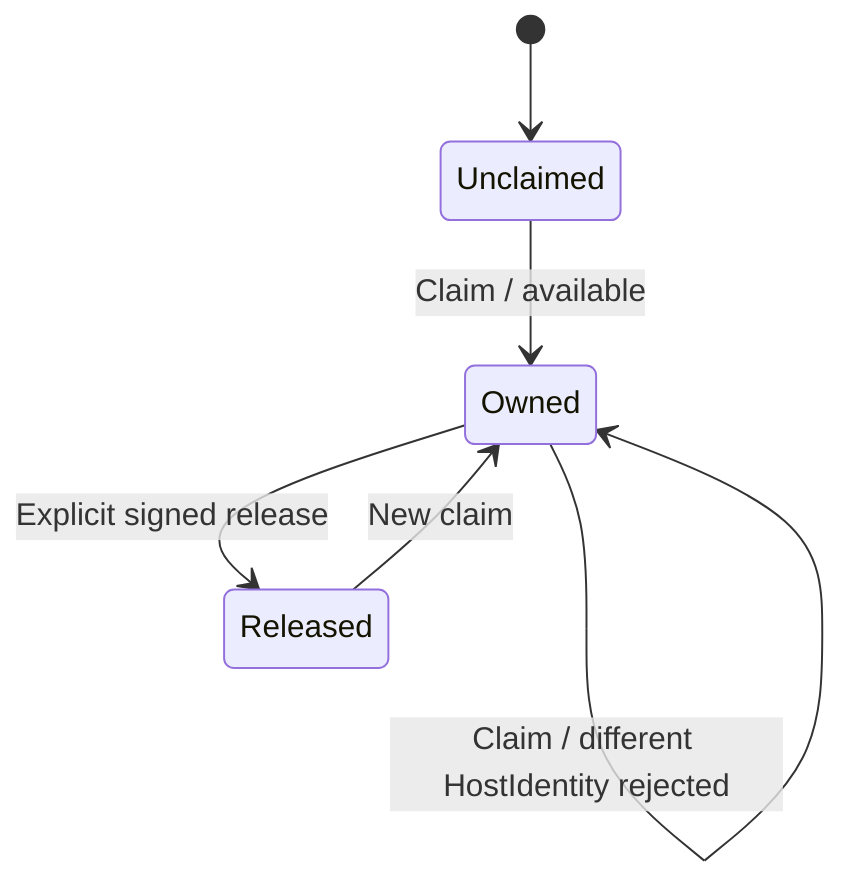
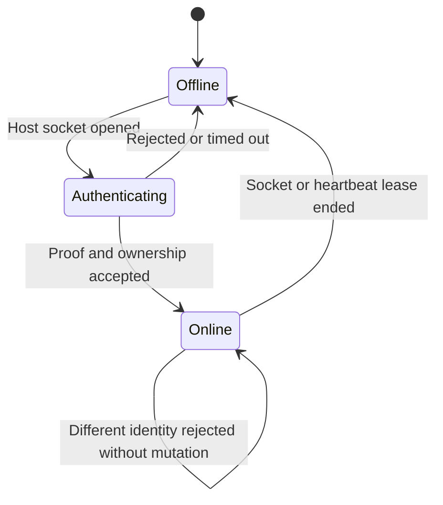
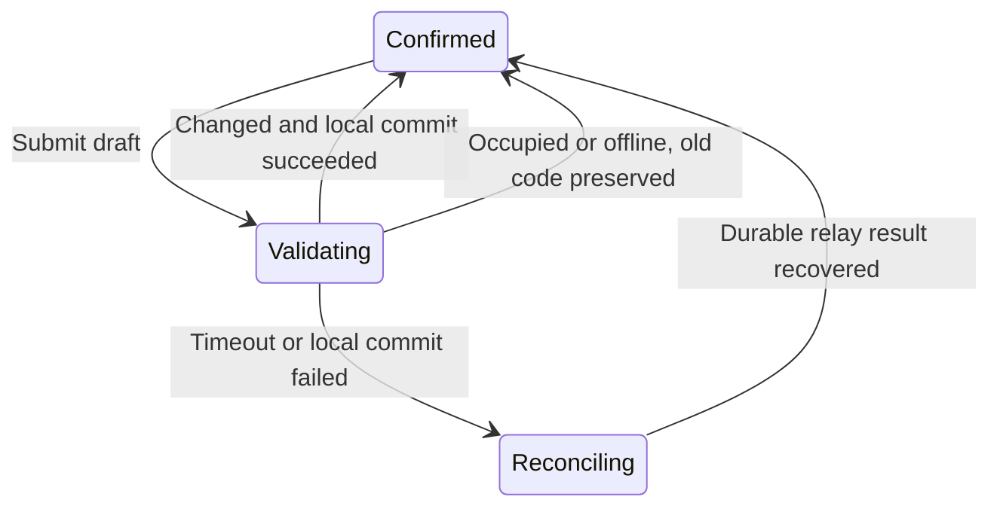

# Remote Connection Code Ownership Architecture

## Status

Implemented locally across Slisic and the relay. Production rollout remains pending until the
existing `GRAHLNN` code is prebound to the new Slisic Host public key.

## Unique Product Goal

A viewer enters exactly one connection code and receives read-only remote playback. A connection
code can belong to only one Slisic Host identity, remains reserved while that Host is offline, and
cannot be taken over by another Host that merely knows the code.

The design must not require viewer registration, a second password, Host login, or an online
account system in the initial implementation.

## Scope

This design covers:

- connection-code normalization and uniqueness;
- durable Host ownership and ephemeral Host presence;
- authenticated Host registration and reconnect;
- online code changes with atomic conflict detection;
- local/server reconciliation after timeout or process failure;
- migration of existing codes, including `GRAHLNN`;
- a future optional account layer for recovery and administration.

This design does not change:

- the one-field Hero connection experience;
- Hero's read-only authority;
- the P2P HLS media path;
- relay's signaling-only media boundary;
- playlist or recommendation behavior.

## Design Decision

The visible connection code is a single read capability and routing coordinate. It is not Host
ownership evidence. Host ownership is proven by a persistent device key generated and stored by
Slisic without user interaction.

The relay owns the durable relation:

```text
ConnectionCode -> HostIdentity
```

Slisic owns the private key for `HostIdentity`. Hero knows only `ConnectionCode`. Host online state
and viewer sessions are projections of this durable ownership relation, not replacements for it.

No ownership lease expires when a Host disconnects. A code is released only by an authenticated
code change, an authenticated explicit release, or an administrator recovery operation.

## Domain Language

### `RawConnectionCode`

Untrusted user input before normalization.

### `ConnectionCode`

The canonical uppercase ASCII alphanumeric value accepted by the product. The current maximum
length remains eight characters unless a separate product decision changes it.

### `HostIdentity`

A stable opaque identifier derived from, or stored beside, an Ed25519 public key. Its private key
never leaves the Slisic Host.

### `CodeOwnership`

The durable binding of one `ConnectionCode` to one `HostIdentity`. It has no online/offline state
and no inactivity expiry.

### `HostPresence`

An ephemeral heartbeat lease describing whether the owning Host currently has an authenticated
relay connection.

### `ViewerSession`

An ephemeral read-only session indexed by `(HostIdentity, ClientId, SessionEpoch)`. It is never an
ownership record.

### `OwnershipTransaction`

An idempotent command identified by `TransactionId` that claims, changes, releases, or reconciles a
code binding.

### `AccountBinding`

A future optional recovery relation from an account to one or more `HostIdentity` values. It is not
part of connection-code routing or normal playback authorization.

## Structural Model

### Stable-code projection

Normalization is the unique projection:

```text
projectCode : RawConnectionCode -> Result<ConnectionCode, CodeFormatError>
embedCode   : ConnectionCode -> RawConnectionCode
```

with:

```text
projectCode(embedCode(code)) = code
embedCode(projectCode(raw)) = normalize(raw)
```

No relay, UI, or persistence adapter may define a second normalization rule.

### Ownership uniqueness

`CodeOwnership` is a partial one-to-one relation. Both projections are unique:

```text
ownerOf : ConnectionCode -/-> HostIdentity
codeOf  : HostIdentity   -/-> ConnectionCode
```

Database uniqueness constraints on both `code` and `host_id` are the concrete equalizer that
rejects states in which two Hosts own one code or one Host owns two active codes.

### Product state as a limit

The observed remote state is the product of three independently owned functors:

```text
RemoteAccessView = limit(CodeOwnership, HostPresence, ViewerSession)
```

The projections are unique and non-overlapping:

- ownership answers who may publish a code;
- presence answers whether that owner is online;
- session answers which viewer is currently reading.

There is no morphism from `Offline` to `Unclaimed`, from `ViewerConnected` to `HostOwner`, or from
`RelayRestarted` to `OwnershipReleased`.

### Code change as the unique ownership substitution

For one owner and one expected revision, a successful code change is the unique atomic
substitution:

```text
(oldCode -> host, revision)
    -- ChangeCode(transactionId, oldCode, newCode, revision) -->
(newCode -> host, revision + 1)
```

No intermediate externally visible state may contain both bindings or neither binding. The
database transaction is the sole effect interpreter for this substitution.

## Core Invariants

### Safety

1. At most one Host identity owns a normalized connection code.
2. A different Host key cannot replace, disconnect, mutate, or release the owner.
3. Host disconnection changes presence only; ownership is preserved.
4. Knowing a connection code grants only the existing read-only viewer capability.
5. Local Slisic settings change only after relay ownership is confirmed.
6. A stale or duplicated transaction cannot overwrite a newer ownership revision.
7. Relay restart preserves every ownership binding.
8. Disabling Remote Share preserves ownership.

### Liveness

1. The owning Host can reconnect with the same key and code after any offline interval.
2. An unclaimed generated code can eventually be claimed while the relay is reachable.
3. An ambiguous timeout can be resolved by replaying or querying the same transaction.
4. A successful server-side code change eventually becomes the local Slisic code after startup
   reconciliation, even if Slisic crashes before its local write.

### Exclusivity

1. Only the relay ownership transaction can create or move `CodeOwnership`.
2. Only the authenticated Host key can authorize normal ownership changes.
3. Hero, relay presence cleanup, WebSocket replacement, and playback RPC cannot mutate ownership.

## Ownership Boundaries

### Slisic `HostIdentityStore`

Owns:

- first-run Ed25519 key generation;
- private-key persistence;
- challenge signing;
- local ownership revision and confirmed-code projection.

Does not own:

- global code availability;
- ownership conflict resolution;
- Host presence;
- viewer authorization beyond presenting the configured read capability.

### Slisic `CodeOwnershipClient`

Owns:

- one in-flight ownership transaction;
- transaction IDs and expected revisions;
- typed relay result interpretation;
- startup reconciliation before Host registration;
- committing confirmed relay state to local settings.

It is the only Slisic module allowed to change the confirmed local connection code.

### Relay `OwnershipRegistry`

Owns:

- durable ownership rows;
- linearizable claim/change/release transactions;
- idempotency records;
- uniqueness constraints;
- ownership revision allocation;
- administrator recovery operations.

Does not own WebSockets, playback sessions, P2P signaling, or UI messages.

### Relay `HostAuthenticator`

Owns:

- challenge nonce generation;
- signature verification;
- replay rejection;
- construction of `AuthenticatedHost` evidence.

Only `AuthenticatedHost` evidence may enter `OwnershipRegistry` commands.

### Relay `PresenceRegistry`

Owns authenticated Host sockets and heartbeat expiry. It may replace an older socket only when the
new socket presents the same `HostIdentity` and a newer connection epoch.

It cannot create, move, or delete ownership rows.

### Hero

Owns one viewer code input and a read-only viewer session. It does not receive a Host private key,
perform ownership claims, or distinguish unclaimed codes from offline Hosts through user-facing
errors.

### Future `AccountRecovery`

May authorize key recovery, key rotation, explicit release, and cross-device administration. It
does not enter normal viewer connection, Host heartbeat, or playback paths.

## Persistent Model

The initial single-replica relay may use SQLite on a durable Dokploy volume. The schema must remain
compatible with a later shared SQL backend.

```text
host_identity(
  host_id            primary key,
  public_key         unique not null,
  created_at         not null,
  revoked_at         null
)

code_ownership(
  code               primary key,
  host_id            unique not null references host_identity,
  revision           not null,
  updated_at         not null
)

ownership_transaction(
  transaction_id     primary key,
  host_id            not null,
  operation          not null,
  expected_code      null,
  desired_code       null,
  expected_revision  null,
  outcome            not null,
  resulting_code     null,
  resulting_revision null,
  created_at         not null
)
```

`ownership_transaction` may be garbage-collected only after a retention interval longer than every
client retry window. Replaying a retained `TransactionId` returns the original outcome.

## Host Authentication Protocol

The current `/ws/host?code=...` first-socket-wins behavior is removed.

```text
Host -> Relay: host_hello(hostId, publicKey, requestedCode, connectionEpoch)
Relay -> Host: host_challenge(nonce, expiresAt)
Host -> Relay: host_proof(
  signature(version || nonce || hostId || requestedCode || connectionEpoch)
)
Relay:
  verify signature
  reconcile requestedCode against durable ownership
Relay -> Host:
  host_accepted(code, ownershipRevision)
  | code_occupied
  | ownership_mismatch(currentCode, ownershipRevision)
  | invalid_proof
```

The relay does not install the Host socket into `PresenceRegistry` until authentication and
ownership reconciliation succeed. A rejected socket cannot close the current owner's socket.

For an existing owner, `requestedCode` is only a local projection hint. If it differs from the
relay's durable current code, the relay returns `ownership_mismatch`; Slisic reconciles locally and
reconnects with the durable code.

## Online Code-Change Protocol

Changing a code is not preceded by a separate connectivity probe. The ownership transaction itself
is the network validation.

```text
UI -> CodeOwnershipClient:
  ChangeCode(rawDesiredCode)

CodeOwnershipClient:
  normalize locally
  allocate transactionId
  capture hostId, expectedCode, expectedRevision
  send signed ChangeCode command

Relay OwnershipRegistry transaction:
  verify current owner and expected revision
  reject if desired code belongs to another Host
  atomically replace old binding with desired binding
  persist deterministic transaction outcome

CodeOwnershipClient:
  on committed: persist resulting code and revision
  on occupied: preserve old local code
  on unavailable: preserve old local code
  on timeout: replay/query the same transactionId
```

The UI never optimistically publishes the draft as confirmed state.

### Typed outcomes

```text
Changed(code, revision)
Unchanged(code, revision)
Occupied
Offline
TimedOutUnknown
StaleRevision(currentCode, currentRevision)
InvalidFormat
IdentityRejected
InternalFailure
```

UI adapters must not parse error strings to choose behavior.

### Sileo projection

Recommended English UI messages:

- `Occupied`: `Connection code is already in use.`
- `Offline`: `Connect to the internet to verify this code.`
- unresolved timeout: `Could not verify the connection code. The previous code is unchanged.`
- `Changed`: `Connection code updated.`

On every rejection, the input returns to the last confirmed code. While the transaction is active,
the input is read-only and exposes a bounded pending indicator. Blur and Enter invoke the same
command; Escape cancels only before the command is published.

## State Machines

### Ownership state



`HostOffline`, `RemoteShareDisabled`, and `RelayRestarted` are not ownership transitions.

### Presence state



### Slisic code-change state



## Failure Semantics

| Failure                         | Durable ownership          | Local code          | UI result              |
| ------------------------------- | -------------------------- | ------------------- | ---------------------- |
| No network before publish       | unchanged                  | unchanged           | needs network          |
| Desired code occupied           | unchanged                  | unchanged           | occupied               |
| Timeout before relay commit     | unchanged or unknown       | unchanged           | reconcile              |
| Timeout after relay commit      | changed                    | old until reconcile | reconcile              |
| Slisic crash after relay commit | changed                    | old on disk         | startup reconcile      |
| Relay restart                   | preserved                  | unchanged           | reconnect              |
| Host offline for any duration   | preserved                  | unchanged           | viewer sees offline    |
| Different Host claims code      | preserved                  | unchanged           | claimant rejected      |
| Same Host reconnects            | preserved                  | unchanged           | presence restored      |
| Local private key lost          | preserved for old identity | cannot claim        | admin/account recovery |

The externally visible viewer response should not reveal whether a code is unclaimed or belongs to
an offline Host. Both project to a generic unavailable state.

## Account-Compatible Future

An account system is useful for recovery, administration, device lists, and ownership transfer. It
is deliberately deferred because current Slisic has no login design and normal playback does not
need it.

Future tables may add:

```text
account_host_binding(account_id, host_id, role, created_at)
```

The operational relation remains:

```text
ConnectionCode -> HostIdentity
```

An account authorizes recovery of `HostIdentity`; it does not replace Host signatures on every
reconnect. This makes account registration additive rather than a migration of the playback
protocol.

Without an account, a lost private key requires administrator recovery. The system must not solve
lost-key recovery by expiring offline ownership.

## Migration

### Existing `GRAHLNN` owner

Migration must not use first socket wins.

1. Updated Slisic generates its persistent Host key locally.
2. Slisic displays or logs only the public fingerprint for migration.
3. The relay deployment receives a one-time bootstrap binding from `GRAHLNN` to that fingerprint.
4. The first signed Host connection consumes and confirms the bootstrap binding.
5. The bootstrap configuration is removed after confirmation.

No private key or reusable ownership secret is placed in Dokploy environment variables.

### Other legacy codes

Every known existing Host must be prebound or migrated during an authenticated maintenance window.
An unbound legacy code must not silently become owned by whichever Host connects first after
deployment.

## Security Boundary

Read-only access reduces damage but does not remove privacy and resource risks. A viewer may receive
playlist metadata, titles, and audio, and may consume Host bandwidth.

The relay therefore also requires:

- rate limiting by source address and normalized code coordinate;
- bounded concurrent viewers per Host;
- generic unavailable responses;
- challenge nonce expiry and one-time use;
- constant-time proof comparison where applicable;
- no private keys, raw signatures, or full codes in normal logs;
- an administrator-only audited recovery path.

These controls do not change the one-code viewer experience.

## Verification Model

### Relay integration tests

1. Two simultaneous first claims for one code produce exactly one owner.
2. A different Host cannot replace an online owner.
3. A different Host cannot claim an offline owner's code.
4. The same Host can reconnect after arbitrary offline time.
5. Ownership survives relay process restart.
6. Replaying one transaction ID returns the original outcome.
7. A stale revision cannot overwrite a newer code change.
8. Code change exposes neither a two-code state nor a no-code state.
9. Presence cleanup never deletes ownership.
10. A rejected Host socket does not close the accepted socket.

### Slisic sidecar tests

1. First run creates one stable Host identity.
2. Restart reuses the same key.
3. Occupied, offline, and invalid outcomes preserve the old local code.
4. A committed result persists code and revision together.
5. Timeout keeps the transaction identity and enters reconciliation.
6. Startup reconciliation repairs a crash between relay commit and local commit.
7. Disabling Remote Share preserves identity and ownership projection.

### UI tests

1. One input remains the complete viewer-facing and Host-setting interaction.
2. Pending validation cannot publish a draft as confirmed.
3. Every typed failure maps to the specified Sileo message.
4. Escape before publication cancels; Escape after publication cannot erase reconciliation.

### Checker invariants

For every generated command trace:

```text
count(code_ownership where code = c) <= 1
count(code_ownership where host_id = h) <= 1
presence(h) = offline does not imply ownerOf(c) = none
viewerKnowledge(c) does not produce AuthenticatedHost(h)
completed(transactionId) is deterministic under replay
```

The minimal forbidden trace is:

```text
Host A claims C
Host A disconnects
Host B presents C
ownerOf(C) becomes B
```

Any implementation admitting this trace is rejected regardless of UI behavior.

## Implementation Slices

### Slice 1: Durable ownership registry

- Add relay persistence and uniqueness constraints.
- Add pure ownership transitions and integration tests.
- Do not change current playback routing yet.

### Slice 2: Hidden Host identity

- Add Slisic key generation and persistence.
- Add relay challenge/proof authentication.
- Preserve the current visible connection code.

### Slice 3: Authenticated presence

- Install Host sockets only after identity and ownership acceptance.
- Remove first-socket-wins replacement across different identities.
- Keep viewer and P2P protocol behavior otherwise unchanged.

### Slice 4: Transactional code changes

- Route Topbar commits through `CodeOwnershipClient`.
- Add typed outcomes, reconciliation, and Sileo projections.
- Keep the previous code on every unconfirmed result.

### Slice 5: Existing-code migration

- Prebind `GRAHLNN` to the current Host fingerprint.
- Deploy the new relay and confirm signed reconnect.
- Remove bootstrap configuration.

### Slice 6: Optional account recovery

- Deferred until Slisic login and account product design exist.
- Must remain outside normal viewer and playback paths.

## Completion Standard

The refactor is complete only when:

1. Hero still requires exactly one connection code and no account;
2. a code remains owned while its Host is offline or disabled;
3. a different Host cannot evict or replace the owner;
4. code changes require a reachable relay and are atomic;
5. ambiguous results reconcile without losing the old or committed code;
6. relay restart preserves ownership;
7. existing `GRAHLNN` ownership is migrated without a first-claim race;
8. all relay, Slisic, UI, restart, concurrency, and replay tests pass.

## Closed Paths

- Viewer registration is not required for playback.
- Host login is not required for normal ownership or reconnect.
- Offline code changes are rejected rather than staged.
- Ownership does not expire due to inactivity.
- Knowing a code cannot create Host authority.
- Relay presence and WebSocket replacement cannot mutate durable ownership.

## Revisit Conditions

Revisit the deferred account layer when at least one of these becomes a product requirement:

- self-service recovery after device-key loss;
- ownership transfer between users;
- multiple Hosts managed as one collection;
- an administrative web console;
- cross-device synchronization of Host ownership.
