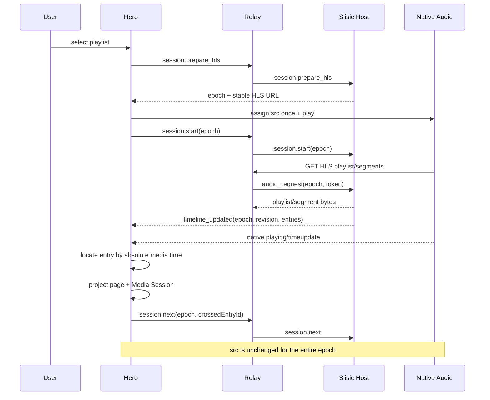

# Remote Share HLS Architecture

## 1. Decision

Remote Share has one playback semantics: one native HLS resource owned by one browser
`HTMLAudioElement` for the lifetime of a playback session.

The relay owns control forwarding and HTTP delivery of HLS playlists and segments. It does
not own playback state. The host owns playlist selection, recommendation, HLS
materialization, and the canonical HLS timeline. The hero owns the browser media element
and projects native media evidence to the page and Media Session.

The following active playback paths are removed:

- Whole-track blob playback.
- Range-based stream playback.
- WebRTC DataChannel audio playback.
- Playback-mode fallback ladders.
- Prefetch caches that can replace the active media source.
- Recovery that changes the active media resource.

This closes the possibility of using the page's WebRTC DataChannel as the byte source for
native iOS HLS. Native background HLS fetches are issued by WebKit/AVFoundation against an
HTTP URL; page-owned DataChannel bytes cannot supply that resource while preserving the
same native media lifetime. Stable iOS background playback is the governing requirement,
so HLS bytes pass through the relay.

## 2. Behavior Object

The behavior object is a remote playback session:

```text
RemotePlaybackSession =
  one host recommendation session
  + one append-only HLS timeline
  + one stable HLS URL
  + one browser audio element
  + one monotone session epoch
```

It is not a collection of interchangeable audio engines. Transport retries, cache hits,
relay reconnects, metadata updates, and Media Session calls are effects around this object;
none of them may redefine it.

The public seams are:

- Host RPC: `connect`, `bootstrap`, `session.prepare_hls`, `session.start`,
  `session.next`, and `session.stop`.
- Media HTTP: `GET /api/audio/{hls-token}` for a playlist or segment.
- Host events: session/timeline observations scoped by client and epoch.
- Hero commands: connect, select playlist, stop, and native media controls.

## 3. Domain Language

| Term | Meaning |
| --- | --- |
| `SessionEpoch` | Monotone identity of one user-started playback lifetime. |
| `HlsResource` | Stable playlist URL allocated exactly once per epoch. |
| `CanonicalTimeline` | Host-owned ordered entries with absolute media offsets. |
| `TimelineRevision` | Monotone version of the published timeline prefix. |
| `TimelineEntry` | Track metadata plus absolute HLS start/end positions. |
| `PrimingPrefix` | Silent HLS prefix that keeps the native resource alive until real media exists. |
| `MediaEvidence` | Native events and observed time from the one audio element. |
| `AudibleState` | Playback state derived only from active-epoch media evidence. |
| `BoundaryCommit` | Exactly-once `session.next` for a crossed timeline entry. |
| `RecoveryEffect` | A liveness attempt that preserves epoch, source, and timeline. |

`current track`, `HLS entry`, and `Media Session metadata` are projections of one timeline
entry. They are not independently mutable concepts.

## 4. Categories

The category language below is an engineering specification. Each object and morphism maps
to a concrete type, transition, protocol field, or checker.

### 4.1 Session category `S`

Objects:

```text
Idle
Prepared(epoch, playlist, resource)
Running(epoch, playlist, resource, timeline, current)
Recovering(epoch, resource, timeline, current)
Stopped(epoch)
```

Morphisms are legal commands or evidence-backed transitions. Identity morphisms preserve
the complete session index. Composition is defined only when epoch and resource indexes
match. A late result from another epoch has no morphism into the current object.

### 4.2 Timeline-prefix category `T`

Objects are finite published prefixes `T0 <= T1 <= ...`. There is one morphism `Ti -> Tj`
when `Ti` is a prefix of `Tj`. This is a thin category, so competing histories cannot be
silently merged.

The canonical timeline is the filtered colimit:

```text
T∞ = colim(T0 -> T1 -> T2 -> ...)
```

Its inclusions preserve every existing entry identity and absolute offset. New queue data
may append entries; it may not reorder, replace, or shift an already published entry.

### 4.3 Media-evidence category `M`

Objects are observations of one `(epoch, source)` pair:

```text
SourceAssigned -> PlayRequested -> Playing(time) -> Paused(time)
                                     |              |
                                     +-> Stalled ---+
                                     +-> Ended
```

Morphisms are native media events. Promise resolution from `audio.play()` is command
completion, not a `Playing` morphism.

### 4.4 Effect category `E`

Effects form a tagged coproduct:

```text
E = RelayEffect + MediaEffect + TimerEffect + ProjectionEffect + DiagnosticEffect
```

Each summand has one interpreter. No interpreter may emit another summand's semantic
state. In particular, a timer may request recovery but cannot assert `Playing`.

## 5. Minimal Universal Properties

Every owner exists because it is the unique solution to one minimal universal property.
An owner with no unique property is removable.

### 5.1 `HlsSession` is the initial fresh-resource allocation

Given a playlist selection and the previous host state, `prepare_hls` constructs the unique
fresh `(epoch, HlsResource)` through which all operations for that start factor.

```text
PlaylistSelection -> HlsSession(epoch, resource)
```

Any start, materialization, segment token, timeline update, stop, or late async result must
factor through that epoch. Reusing the previous epoch or URL violates initiality and allows
Safari's old media timeline to enter the new session.

### 5.2 `CanonicalTimeline` is the colimit of published prefixes

Priming and real-track assets produce compatible finite prefixes. Their unique
append-preserving cocone is `CanonicalTimeline`. HLS text and timeline metadata are two
projections of this same cocone; neither may maintain a second sequence.

### 5.3 `AudibleState` is a pullback

The system may claim audible playback only when host and media evidence agree on the same
index:

```text
                        MediaEvidence(epoch, source)
                                  |
                                  v
AudibleState -----> SessionEpoch x HlsResource
     |                            ^
     v                            |
HostTimelineEntry(epoch, source, entry)
```

`AudibleState` is the pullback of these projections. A host `Playing` field without native
evidence, or a native event from an old source, has no element in the pullback.

### 5.4 `CurrentEntry` is a limit over time and timeline

For a media time `t`, the current entry is the unique entry satisfying:

```text
entry.start <= t < entry.end
```

The limit is undefined in the priming prefix and beyond the published suffix. UI and Media
Session must represent those cases as preparing/waiting; they must not guess an entry from
the last title received.

### 5.5 `BoundaryCommit` is a linear coequalizer

`timeupdate`, watchdog, and `ended` may all observe the same crossed boundary. They are
coequalized by `(epoch, entry_id)` into one `session.next` commit. After consumption, the
commit key is not reusable. This gives exactly-once semantic advance while allowing
duplicate observations.

### 5.6 `MediaSessionProjection` is a terminal read-only projection

Page UI and `navigator.mediaSession` receive the unique projection from
`(AudibleState, CurrentEntry)`. They have no arrows back into core playback state. OS media
commands produce explicit commands to the media owner; OS display state is never read as
truth.

### 5.7 `Recovery` is an endomorphism on session identity

Recovery may reconnect relay control, reissue `audio.play()`, reload the same fatal native
resource, or wait for a larger HLS prefix. It must be an endomorphism on `(epoch, resource)`:

```text
recover : S(epoch, resource) -> S(epoch, resource)
```

Changing `src`, allocating a blob URL, changing playback mode, or advancing metadata is not
recovery. It is an undeclared substitution and is forbidden.

### 5.8 `Diagnostics` is the forgetful functor

Diagnostics forget behavior into observations:

```text
Trace : S x M x E -> Jsonl
```

It preserves order and indexes but has no inverse and no transition authority. Removing
diagnostics must not change behavior.

## 6. Variance

### 6.1 Covariant structures

- Timeline publication is covariant with prefix extension: `Ti -> Tj` maps every existing
  entry to the same entry and offset in `Tj`.
- Host session evolution is covariant with accepted commands: legal command composition
  maps to state-transition composition.
- UI and Media Session projection are covariant with active-epoch native evidence.
- HLS rendering is covariant with canonical timeline extension: appending an entry appends
  playlist segments and never rewrites the prior rendering.

### 6.2 Contravariant structures

- Guards and commit eligibility are predicates `S^op -> Bool`. Reindexing an async result
  from its captured epoch to the current epoch pulls the predicate back; a mismatch yields
  `false` and cannot commit.
- Cancellation is contravariant over outstanding effects: narrowing the active epoch
  invalidates every effect captured by the removed future path.
- Authorization is contravariant over requests: a request is accepted only after pulling
  its code/client/epoch context back to the owning session.
- Media Session position validation is contravariant over a timeline entry: absolute media
  time is pulled back into entry-local time before projection.

No structure is declared both covariant and contravariant over mutable source identity.
Source substitution is an explicit new-session transition.

## 7. Natural Transformations

Each natural transformation must commute for every epoch and every legal prefix extension.

### 7.1 `prepare`

```text
PlaylistSelection => FreshHlsSession
```

Allocates one new epoch and one fresh stable URL. Calling `start` after `prepare` binds real
tracks into that prepared session; it does not allocate or replace the URL.

### 7.2 `materialize`

```text
PlaybackTrack => HlsTrackAsset
```

Preserves track identity, range, gain plan, and duration. Materialization timing may vary,
but the resulting timeline meaning does not.

### 7.3 `publish`

```text
HlsTrackAsset => CanonicalTimelinePrefix
```

Appends only a contiguous ready prefix. A missing earlier asset blocks later assets so HLS
and metadata cannot observe different track orders.

### 7.4 `render`

```text
CanonicalTimeline => HlsPlaylistText
CanonicalTimeline => TimelineView
```

Both components are derived in one host operation. For every prefix inclusion, rendering
then including equals including then rendering.

### 7.5 `observe`

```text
NativeMediaEvent => PlaybackEvidence
```

Attaches the captured epoch/source before reduction. Events from stale media identities
map to `Ignored(stale_epoch)` rather than to a state transition.

### 7.6 `locate`

```text
(TimelineView, AbsoluteMediaTime) => CurrentEntry
```

This is the only transformation allowed to choose track metadata. Playlist messages,
prefetch completion, and queue responses cannot bypass it.

### 7.7 `project`

```text
(PlaybackEvidence, CurrentEntry) => (PageView, MediaSessionView)
```

Both views are projections of the same pair. Their playback state, title, duration, and
position therefore cannot diverge by construction.

### 7.8 `advance`

```text
CrossedBoundary(epoch, entry) => HostNextCommand(epoch, entry)
```

Consumes one boundary key. The resulting host timeline may extend, but the browser source
and existing offsets remain unchanged.

### 7.9 `recover`

```text
LivenessFailure(epoch, source) => RecoveryEffect(epoch, source)
```

Preserves session semantics and cannot emit success. Only subsequent native media evidence
can return the state to `Playing`.

### 7.10 `stop`

```text
ActiveSession(epoch) => Stopped(epoch)
```

Cancels pending RPC commits, boundary keys, timers, and late async results. The audio source
is cleared once by the media owner. A new start must pass through `prepare` and a new epoch.

## 8. Ownership

### Host session owner

Owns:

- Session epoch and stable HLS token.
- Recommendation current/queue/history.
- Canonical timeline and revision.
- Priming-prefix sealing.
- HLS materialization and segment token lifetime.

Depends on:

- Playlist and recommendation services.
- FFmpeg materialization.

Does not own:

- Browser playback truth.
- Media Session state.
- Relay liveness.

### Relay owner

Owns:

- Host/client socket pairing.
- RPC correlation and timeout.
- HLS HTTP request/response correlation.
- Forwarding host timeline events.

Depends on:

- Host availability.

Does not own:

- Session transitions.
- Audio recovery.
- Timeline order.

### Hero transport owner

Owns:

- Relay WebSocket lifecycle.
- RPC correlation, retry, and reconnection.

Does not own:

- HLS source identity.
- Playback state.
- Track boundaries.

### Hero HLS media owner

Owns:

- The one audio element.
- One source assignment per epoch.
- Native event reduction.
- Recovery effects preserving source identity.
- Boundary observation and linear commit keys.

Depends on:

- Canonical timeline views from the host.

Does not own:

- Recommendation order.
- Relay socket semantics.

### Projection owner

Owns:

- Page playback view.
- Media Session metadata, playback state, and position.

Depends on:

- Active-epoch native evidence and located timeline entry.

Does not own:

- Playback commands except explicit OS control callbacks.

## 9. Transition Definition

| From | Event | Guard | To | Effects |
| --- | --- | --- | --- | --- |
| `Idle` | `SelectPlaylist` | code connected | `Preparing(e+1)` | prepare HLS, assign source, request play, start host session |
| `Preparing` | `TimelinePublished` | same epoch, real entry exists | `AwaitingEntry` | update canonical timeline view |
| `Preparing` | `NativePlaying` | same epoch/source, time in priming | `Preparing` | project preparing only |
| `AwaitingEntry` | `NativeTime` | time locates entry | `Playing` | project entry and playing state |
| `Playing` | `NativeTime` | same entry | `Playing` | project local position |
| `Playing` | `NativeTime` | next boundary crossed | `Advancing` | consume boundary key, request next |
| `Advancing` | `NextCommitted` | same epoch/key | `Playing` | accept timeline extension; keep source |
| active | `NativePause` | explicit user/OS pause | `Paused` | project paused |
| active | `NativePause` | hidden before native playing | `Recovering` | defer recovery until visible; keep source |
| active | `NativeError` | native `NETWORK_NO_SOURCE`, visible | `Recovering` | reload and play the same source |
| active | `NativeStalled` | same epoch/source | `Recovering` | reconnect control if needed; request play |
| `Recovering` | `NativePlaying/Time` | same epoch/source | derived active state | project native evidence |
| active | `Stop` | any | `Stopped` | cancel epoch effects, pause and clear source once |
| any | stale async/native event | epoch/source mismatch | unchanged | diagnostic only |

`Preparing` is allowed to produce silent priming audio. It is not allowed to install track
metadata until `locate` identifies a real timeline entry.

## 10. Protocol

All playback-bearing responses and events carry `sessionEpoch` and `timelineRevision`.

```ts
type RemoteHlsSessionView = {
  sessionEpoch: number;
  timelineRevision: number;
  streamUrl: string | null;
  entries: RemoteHlsTimelineEntry[];
};

type RemoteHlsTimelineEntry = {
  id: string;
  track: RemoteTrack;
  startSeconds: number;
  endSeconds: number;
};
```

`session.prepare_hls` returns the fresh resource immediately. `session.start` binds the
first recommendation result to that prepared epoch. Every generated HLS playlist and
timeline event is indexed by the same epoch.

The HTTP playlist is append-only for one epoch. Segment URLs are immutable. The response
uses no-store semantics for the playlist and immutable semantics for materialized segments.

The Host owns priming as the initial prefix of that same resource. It publishes at least six
independently decodable two-second AAC/MPEG-TS silence segments before real media exists.
`TARGETDURATION`, `MEDIA-SEQUENCE`, and `DISCONTINUITY-SEQUENCE` are fixed in the first
response and never rewritten. Repeated priming cycles and every real-track boundary append an
explicit discontinuity. Hero never constructs a second fake source.

Materialization and publication are different morphisms. A complete track asset may already
exist in the host cache, but the media playlist exposes only one monotone prefix of the
materialized timeline. The real-media publication clock starts when that prefix is first
exposed, not when preparation starts. Its initial frontier is one native HLS hold-back window
(`3 * TARGETDURATION`) and advances with session time. Therefore an EVENT playlist cannot
present an entire track as its initial live edge, while the same stable resource can still
append future tracks without changing `audio.src`.

## 11. State Sequence



## 12. Composition Laws

- Epoch matching is associative and identity-preserving.
- Timeline append is associative, has the empty prefix as identity, and is not commutative.
- Boundary observations are idempotent after coequalization by boundary key.
- Projection composition preserves native evidence and timeline identity.
- Recovery composes only as source-preserving endomorphisms.
- Stop is terminal for an epoch; only a fresh prepare opens a new epoch.
- Diagnostics commute with behavior but cannot be inverted into behavior.
- Relay reconnect may reorder transport attempts but may not reorder semantic RPC commits.

No distributive law exists between source replacement and recovery. No commutative law
exists between `next` and `stop`. No natural transformation exists from cache availability
to playback truth.

## 13. Checker Properties

The test model must generate duplicate, late, reordered, hidden-page, and network-change
events and verify:

1. Exactly one source assignment occurs per epoch.
2. A fresh start always has a strictly newer epoch and different HLS URL.
3. Every accepted async result matches the current epoch.
4. Timeline revisions are monotone and entries are prefix-preserving.
5. Published entry offsets never change.
6. UI and Media Session use the same located entry.
7. Playing is impossible without active-source native evidence.
8. Priming time never appears as track-local progress.
9. Each entry boundary commits `session.next` at most once.
10. Recovery never changes source, epoch, or current entry.
11. Stop rejects all late results from the stopped epoch.
12. Relay/P2P/blob availability cannot alter playback semantics because those playback
    branches do not exist.

Minimal counterexample traces must include epoch, source URL, timeline revision, entry ID,
native event, command, and resulting phase.

## 14. Future Paths

Preserved:

- Different HLS codecs and segment durations behind the same materialization boundary.
- Direct host HTTP delivery for LAN use through the same HLS protocol.
- Multiple clients, each with an independently indexed session.
- Server-side persistent timeline storage.
- Low-latency HLS as a new renderer of the same canonical timeline.
- Native applications consuming the same timeline protocol.

Closed:

- Multiple browser playback engines in one session.
- P2P DataChannel as native iOS HLS byte source.
- Blob/stream fallback changing the semantic media owner.
- Source replacement as recovery.
- Segment-request order as audible playback evidence.
- Metadata received from recommendation/prefetch as current-track truth.
- Retry success as playback success.

## 15. Verification

Host:

```text
cargo test --manifest-path src-tauri/Cargo.toml remote_hls -- --nocapture
cargo check --manifest-path src-tauri/Cargo.toml
```

Hero:

```text
npm run test:remote-playback
npm run build
```

Relay:

```text
npm test
npm run build
```

The final manual iOS trace must show one HLS URL per start, no source mutation during
recovery or track advance, monotone timeline revisions, one boundary commit per entry, and
Media Session position derived from the same timeline entry as the page title.
