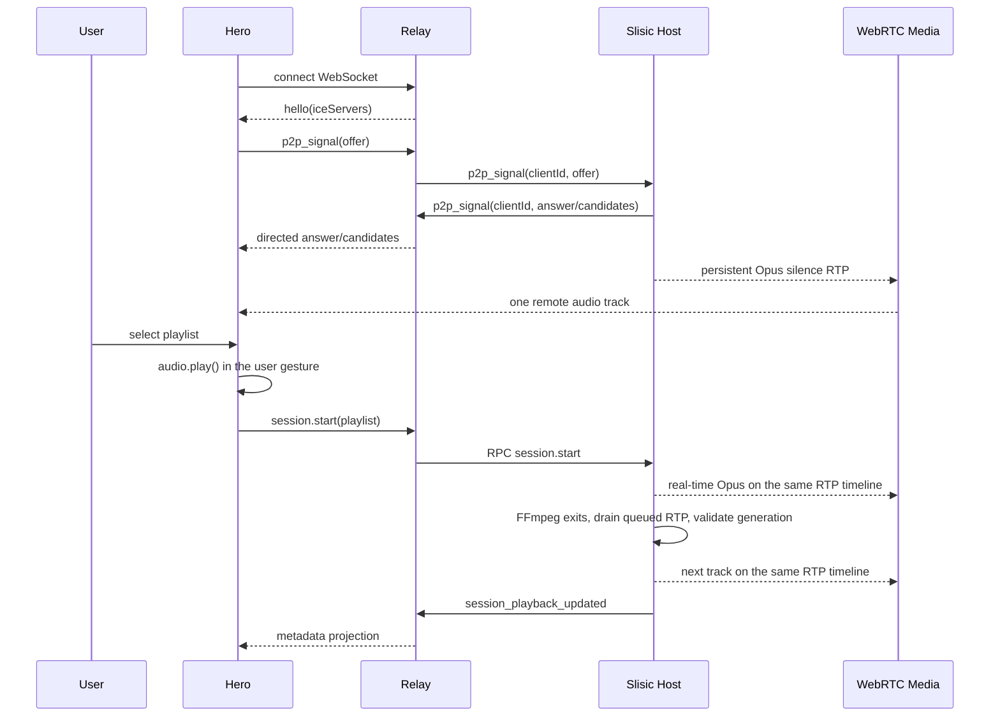

# Remote Share WebRTC Architecture

## Decision

Remote Share has one media semantics: one persistent WebRTC audio track from the Slisic Host
to one persistent browser `MediaStream`, rendered by one `HTMLAudioElement` for the lifetime of
the remote connection.

The Relay is signaling-only. It owns socket pairing, RPC correlation, ICE/TURN configuration,
and directed `p2p_signal` forwarding. It has no HTTP audio route and cannot represent audio
bytes. TURN is an ICE-selected fallback transport for the same SRTP media track; it is not the
application Relay.

The Host owns recommendation, current track, queue, Opus encoding, RTP time, and track-boundary
advance. Hero owns one browser PeerConnection, one MediaStream, one audio element, and native
user playback authority. Metadata is a read-only projection of Host state and never drives
media transitions.

The following paths do not exist:

- HLS playlist or segment delivery through Relay.
- Whole-track Blob assembly or DataChannel downloads.
- Browser-owned track-boundary detection.
- A fallback ladder that replaces the active media object.
- Network classification such as `wifi` or `4g` as playback state.

## Behavior Object

```text
RemoteMediaSession =
  HostRecommendationSession
  x PersistentPeerConnection
  x PersistentOpusRtpTimeline
  x PersistentBrowserMediaStream
```

Idle silence, real tracks, track changes, Relay reconnects, direct ICE, and TURN ICE are states
or routes inside this object. They are not alternative playback engines.

## Domain Language

| Term | Meaning |
| --- | --- |
| `ControlPlane` | Relay WebSocket messages: liveness, RPC, ICE configuration, and signaling. |
| `MediaPlane` | WebRTC SRTP packets flowing directly or through an ICE-selected TURN server. |
| `PersistentTrack` | The one Host `TrackLocalStaticRTP` and browser remote audio track. |
| `PageSession` | Ephemeral client identity owned by one Hero page and all of its Relay reconnects. |
| `PlayoutGeneration` | Monotone identity of the Host track currently allowed to end. |
| `IdleFrame` | A valid 20 ms Opus silence frame on the persistent RTP timeline. |
| `EncodedFrame` | A 20 ms Opus payload produced in real time by FFmpeg. |
| `LatestRtpWrite` | The newest canonical RTP packet still awaiting the network sink. |
| `TrackEnded` | Host evidence emitted only after FFmpeg exits and queued RTP is drained. |
| `PathRestart` | ICE restart on the existing PeerConnection. |
| `MetadataProjection` | Host playback state mapped to page and Media Session metadata. |

## Categories And Universal Properties

The category language is an executable ownership specification. Every owner has one unique,
non-duplicated universal property.

### Session category `S`

Objects are:

```text
Disconnected
Connected(peer, stream, rtp)
Idle(peer, stream, rtp)
Playing(peer, stream, rtp, generation, track)
Recovering(peer, stream, rtp, generation, track)
Closed
```

Morphisms preserve `(peer, stream, rtp)` except `Disconnected -> Connected` and explicit
`* -> Closed`. A playlist selection changes Host playout content, not media identity.

### Recommendation category `Q`

Objects are finite Host states `(current, queue, history, generation)`. Legal morphisms are
`start`, `refill`, `track_ended`, and `stop`. Queue refill is covariant only when its captured
current track still equals the session current track.

### RTP-prefix category `R`

Objects are finite RTP prefixes ordered by append. The persistent RTP timeline is the filtered
colimit:

```text
R∞ = colim(R0 -> R1 -> R2 -> ...)
```

Every inclusion preserves SSRC, payload type, committed sequence order, and the 48 kHz timestamp
clock. Silence and real audio are payload choices at an index; neither creates another timeline.
Publication to the network is a separate effect and cannot suspend construction of this prefix.

### Effect category `E`

```text
E = Signaling + Encoding + RTP + Projection + Diagnostic
```

Each coproduct summand has one interpreter. Signaling cannot move audio bytes. Projection cannot
advance a track. Diagnostics cannot transition state.

### `PersistentTrack` is the terminal media sink

For every Host content source that can produce Opus payloads, there is one unique map into the
existing track:

```text
IdleOpus ----\
              >---- PersistentTrack
FfmpegOpus --/
```

No caller chooses a sink and no second sink can be introduced by recovery or track change.

### `PlayoutClock` is the colimit of 20 ms frames

Logical timestamps are allocated by the playout owner, not copied from individual FFmpeg
processes. FFmpeg RTP headers are forgotten; only Opus payloads enter the canonical clock.
Sequence numbers are allocated by the network writer and committed only after a successful write.
Therefore cancelled or superseded packets can create a timestamp jump but cannot consume SRTP
packet indexes, while per-track encoder restarts still compose into one monotone RTP stream.

### `LatestRtpWrite` is the terminal pending network effect

Every packet produced behind the one in-flight write maps to one pending value. A newer packet
uniquely replaces the older pending value because live playback values current audio over stale
backlog. The in-flight write remains affine and is never cancelled by the 20 ms clock; once it
finishes, the writer samples the latest pending packet. Network effects cannot delay Play, Idle,
Shutdown, FFmpeg packet intake, or RTP clock allocation. A transport epoch boundary is the only
operation allowed to cancel an in-flight write: `Disconnected` or `Failed` suspends publication,
and a later `Connected` epoch samples the latest packet without rewinding the playout clock.

### `CurrentTrack` is a pullback

An end event may advance the recommendation session only when it agrees with the active
generation:

```text
AcceptedEnd ----> TrackEnded(generation)
    |                    |
    v                    v
PlayingSession -> ActiveGeneration
```

Late encoder completion from a stopped or replaced track has no element in this pullback.

### Relay is the initial signaling factorization

Every browser-to-Host signaling message factors uniquely through a `(code, pageSession)` Relay
pair. One page session survives Relay reconnect but not page replacement. The Relay overwrites
client identity on client-originated frames and directs Host frames to exactly one page session.
No media morphism factors through this object because the Relay protocol has no media constructors.

### ICE recovery is an endomorphism

```text
restartIce : Connected(peer, stream, rtp) -> Connected(peer, stream, rtp)
```

Relay reconnect replays an unanswered offer. Network-path change requests an ICE restart on the
same peer. Direct and TURN candidates are alternative solutions to ICE connectivity, not
different application modes.

### Browser media binding is a limit

The audio element is assigned the unique MediaStream that contains every accepted remote audio
track event for this connection. Duplicate track events are coequalized by track ID. The limit
is constructed once; no track change can assign `audio.srcObject` again.

### Metadata is a terminal read-only projection

```text
HostPlayback -> PageView
HostPlayback -> MediaSessionMetadata
```

Neither projection has an arrow back into Host recommendation or native audio state. Native
play/pause remains the audio element's evidence, not a manually synchronized boolean.

## Variance

Covariant structures:

- RTP publication maps prefix extension to prefix extension.
- Accepted Host commands map session transitions to composed session transitions.
- Host playback events map to page and metadata projections.
- ICE candidate discovery maps to signaling frames without changing peer identity.

Contravariant structures:

- Generation guards are predicates `S^op -> Bool`; moving to a newer generation invalidates
  all completion events captured by older generations.
- Authorization pulls a request back through the active pairing code.
- Directed Host signaling pulls a frame back through `clientId`; missing clients reject it.
- Cancellation removes future paths owned by an old encoder generation.

No mutable media identity is both covariant and contravariant. Identity replacement is an
explicit close followed by a new connection.

## Natural Transformations

### `signal`

```text
BrowserRtcIntent => DirectedRelayFrame => HostRtcIntent
```

It preserves signal type and SDP/candidate content while canonicalizing client identity.

### `encode`

```text
PlaybackTrack => RealtimeOpusPayloads
```

It preserves the selected file, range, loudness gain, stereo channel count, and 48 kHz clock.
Encoding is real-time (`-re`) and never waits for a whole-track artifact.

### `clock`

```text
IdleOpus + RealtimeOpusPayloads => PersistentRtpTimeline
```

This transformation assigns one logical timestamp stream and feeds one committed sequence stream.
An empty bounded payload queue maps to valid Opus silence, so startup and source handoff preserve
native media liveness.
The resulting packet is published through a latest-value channel; publication never awaits the
network inside the playout state machine.

### `advance`

```text
TrackEnded(client, generation) => HostNextTrack(client, generation + 1)
```

It is defined only by the generation pullback. It consumes the prepared queue, starts the next
encoder on the same RTP track, emits metadata, and refills the queue.

### `recover`

```text
PathFailure(peer) => IceRestart(peer)
RelayFailure(offer) => Replay(offer)
```

Both transformations preserve PeerConnection, MediaStream, audio element, RTP identity, and
Host generation.

### `stop`

```text
Playing(generation) => Idle(generation + 1)
```

The encoder is cancelled and the persistent track continues with silence. Explicit connection
close, code change, or disabled sharing closes the PeerConnection.

## Ownership

### Host recommendation owner

Owns current track, queue, history, and playout generation. It alone performs automatic next.

### Host WebRTC playout owner

Owns PeerConnections, one `TrackLocalStaticRTP` per client, FFmpeg child lifetime, the bounded
Opus queue, RTP sequence/timestamp allocation, silence insertion, and drained track-end events.

### Relay owner

Owns pairing, ICE/TURN configuration, RPC correlation, and directed signaling. It cannot carry
audio because `/api/audio`, `audio_request`, and `audio_response` do not exist.

### Hero transport owner

Owns one Relay WebSocket, pending RPC, unanswered-offer replay, and signaling dispatch. Relay
disconnect does not imply P2P close.

### Hero media owner

Owns one PeerConnection, one MediaStream, one audio element, candidate buffering, native play
from the playlist click gesture, and in-place ICE restart.

## State Sequence



## Composition Laws

- RTP append is associative, non-commutative, and has the empty prefix as identity.
- Pending network publication is idempotent under replacement by the same packet and coalesces
  older unstarted writes into the newest packet without cancelling the in-flight write inside one
  transport epoch.
- Transport loss terminates exactly one publication epoch; reconnect starts a new epoch from the
  latest RTP packet while preserving Host playout time.
- Silence insertion and real-payload insertion share the same clock allocator.
- Queue refill is idempotent for a captured current track and rejected after current changes.
- Track-end acceptance is invariant under duplicate and late completion events.
- Relay reconnect composes with media playback as an identity when P2P remains connected.
- ICE restart composes only as a peer-preserving endomorphism.
- Stop is terminal for an encoder generation but not for the persistent media track.
- Diagnostics commute with behavior and cannot be inverted into commands.

No distributive law exists between Relay disconnect and P2P close. No natural transformation
exists from network labels, metadata, or UI timers to audible playback truth.

## Checker Properties

1. Relay has no media route or media envelope constructor.
2. One client connection creates one PeerConnection and one `audio.srcObject` assignment.
3. ICE restart preserves PeerConnection and MediaStream object identity.
4. An unanswered offer is replayed after Relay reconnection.
5. Incoming candidates before the answer are buffered then applied.
6. The Host's idle track produces valid Opus RTP in a real loopback negotiation.
7. The playout payload queue is bounded and discards oldest latency, not newest audio.
8. FFmpeg completion drains pending UDP RTP before emitting `TrackEnded`.
9. Timestamp advances once per 20 ms frame; sequence advances only after a committed network write.
10. A stale generation cannot advance the Host session.
11. Stop cancels real encoding while keeping the persistent track alive with silence.
12. Host-owned track advance does not depend on foreground browser JavaScript.
13. A blocked RTP write cannot delay Play, Idle, Shutdown, or encoder packet intake.
14. New RTP packets coalesce behind one in-flight write and cannot starve that write.
15. RTP publication is absent before `Connected`, suspended on transport loss, and recreated from
    the latest packet after reconnect.
16. Relay reconnect preserves page-session identity; page replacement allocates a fresh identity.
17. Each transport epoch logs at most one first committed RTP packet as publication evidence.

## Verification

Host:

```text
cargo test --manifest-path src-tauri/Cargo.toml --lib remote_share -- --nocapture
cargo check --manifest-path src-tauri/Cargo.toml
```

Hero:

```text
npm run test:remote-playback
npm run build
```

Relay:

```text
npm test
npm run build
```

The device trace must show one `p2p_audio_track_attached` per connection, no HLS source URL,
unchanged `audio.srcObject` during network changes and track changes, ICE restart offers on path
changes, Host-side `session_playback_updated` at boundaries, and uninterrupted native audio
while the page is backgrounded.
