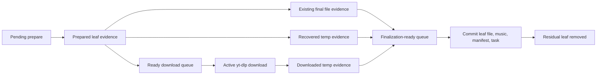

# Download Behavior Design

## Behavior

The download system turns a user supplied collection URL into a stable playlist
collection on disk. It probes the root URL once during enqueue, projects it into
a complete ordered leaf plan, persists that plan as residual task work, downloads
each leaf into a scoped temporary artifact, commits each artifact into its final
collection-relative path, persists collection metadata, and then removes the
completed leaf from the resumable task record. The task row keeps only residual
work and diagnostic counters; completed music identity is owned by the
collection and its manifest.

## Participants

- `yt_dlp`: owns external probing and audio artifact creation.
- `collection_import`: owns collection identity, final file paths, music rows,
  manifests, and file moves from temporary to stable paths.
- `downloads::planning`: owns URL normalization, root probe admission,
  collection plan projection, residual task plan projection, and leaf identity.
- `downloads::service`: owns task lifecycle, leaf scheduling, retry policy,
  recovery decisions, and terminal task status.
- `LeafPipelineState`: owns worker composition, ready queues, active counters,
  and future launch order.
- `LeafDownloadWindow`: owns adaptive download parallelism only.

## Core Invariants

- A playlist plan is complete or explicit failure. The system must not silently
  turn a partial root probe into a completed task.
- A leaf can be consumed as completed only after its audio file is committed to
  a stable collection-relative path and its music metadata is persisted.
- Completed music evidence is owned only by `Collection.musics` and the
  collection manifest. `DownloadTask.leafs` is residual work, not a history log.
- Enqueue persists the complete residual leaf plan after a successful root
  probe. The later task runner must consume that residual plan instead of
  probing the same root URL again.
- Concurrent root probes are bounded at the provider-effect boundary. Repeated
  paste can queue distinct URLs, but it must not start an unbounded number of
  metadata provider processes.
- Resume must rebuild its plan from residual task leafs when they exist. It must
  not root-probe already materialized music to rediscover completed work.
- A temporary artifact is not a stable file. It can only be consumed by the leaf
  commit path that owns the matching leaf context.
- A leftover temporary artifact can be recovered only when the target is
  unambiguous. Ambiguous residue is rejected instead of guessing.
- Re-running the same task is idempotent: materialized leaves are absent from
  the residual queue, final files are reused only for still-residual leaves, and
  uncommitted temporary artifacts are either committed once or rejected
  explicitly.
- Download failures and post-download commit failures are leaf-local for list
  downloads. One failed leaf cannot stop the remaining leaf pipeline.
- Leaf preparation, leaf download, and leaf finalization are separate pipeline
  stages. A completed download enters the finalization-ready queue and must be
  committed before new prepare-side enrichment work can run. Download slots are
  released by download completion, not by later metadata enrichment.
- Provider access failures, including private videos and authentication-required
  videos, are terminal leaf failures. They are not retried because repeating the
  same unauthenticated request cannot change the provider's access decision.
- Task terminal status is derived from residual failures plus consumed
  completion count. A task with unresolved non-terminal leaves cannot be marked
  `Completed`.
- Cache, existing files, and temporary residue are acceleration or recovery
  evidence only. They do not define playlist membership.

## Owned Invariants

`yt_dlp` owns:

- Root probe output reflects every entry the provider exposes for that playlist
  probe.
- Audio download success returns a readable local file path.

`collection_import` owns:

- Final relative paths stay inside the collection folder.
- The temporary marker is removed during finalization.
- File replacement is scoped to the target leaf URL and group.
- Manifest writes reflect persisted collection state.

`downloads::service` owns:

- Leaf identity is indexed by task, leaf URL, and group context.
- Active worker counters match worker events.
- Enqueued collection tasks carry enough residual leaf evidence to start
  without a second root probe.
- Root probe process parallelism is bounded independently from leaf download
  parallelism.
- Retry classification distinguishes transient download failures from
  provider access failures.
- Existing final files and residual temporary files are consumed through the
  same leaf completion semantics as fresh downloads.
- Completed leafs are garbage collected from the task row after collection
  persistence succeeds.
- Residual leafs carry the group context needed to resume without re-expanding a
  root playlist.
- Group context is plan-time or collection-catalog evidence. The leaf hot path
  may reuse known group evidence, but it must not perform provider discovery to
  improve grouping while downloads or finalizations are waiting.
- Unresolved leaves are terminally rejected before task status is finalized.

`LeafDownloadWindow` owns:

- Future parallelism changes only from worker download outcomes.
- Manifest, metadata, and file move errors do not become scheduler signals.

## Stable Domains

`RawUrl -> NormalizedUrl`

- Owner: `downloads::planning::normalize_url`.
- Total: no.
- Failure: explicit URL parse or unsupported-scheme error.

`RootProbe -> CollectionSyncPlan`

- Owner: `downloads::planning::resolve_collection_plan`.
- Total: no.
- Failure: probe failure, empty downloadable list, or unsupported nested depth.
- Projection: one successful playlist root probe must provide collection title,
  collection URL, and all leaf references needed to persist residual task work.

`ResidualDownloadTask -> CollectionSyncPlan`

- Owner: `downloads::planning::residual_collection_plan`.
- Total: no.
- Failure: missing collection identity or collection folder on a residual task.
- Eliminates: root probe and manifest-to-completed-leaf reconstruction during
  resume.

`DownloadedTempFile -> CommittedLeafFile`

- Owner: `collection_import::finalize_downloaded_leaf`.
- Total: no.
- Failure: invalid path, blocked final path, failed remove, or failed move.

`ResidualTempFiles -> RecoverableLeafArtifact`

- Owner: `downloads::service`.
- Total: no.
- Failure: no file, partial artifact, or multiple matching temporary files.

## Transitions

Queued task + root probe success -> Persist residual plan:

- Writes: collection shell, task collection fields, and residual leaf queue.
- Emits: persisted task snapshot.
- Rejection: root probe failure or empty downloadable collection.

Persisted residual plan -> Resolving plan:

- Guard: task has residual leaves plus collection identity fields.
- Writes: resolving status only.
- Emits: no provider root probe.
- Rejection: missing residual task identity.

Queued/failed/interrupted leaf + metadata success -> Prepared leaf:

- Writes: title, duration, chapter count.
- Emits: ready download entry or recovered completion.
- Rejection: leaf-local failed preparation.

Prepared leaf + fresh download success -> Commit leaf:

- Writes: stable file, music entries, manifest, and removes residual leaf.
- Emits: task change signal.
- Rejection: leaf-local failed download or failed commit.
- Scheduling: download completion is queued for finalization immediately and
  drains before prepare-stage enrichment or additional worker launch.

Prepared leaf + existing final file -> Commit existing file:

- Writes: music entries, manifest, and removes residual leaf.
- Emits: task change signal.
- Rejection: metadata persistence failure.
- Scheduling: existing-file evidence enters the same finalization-ready queue
  as fresh and recovered downloads. Preparation must not commit collection or
  manifest state directly.

Prepared leaf + unambiguous temp residue -> Commit recovered temp:

- Writes: stable file, music entries, manifest, and removes residual leaf.
- Emits: task change signal.
- Rejection: ambiguous residue or failed commit.
- Scheduling: recovered temp evidence enters the finalization-ready queue and
  follows the same commit path as fresh downloads.

Pipeline drained -> Terminal task:

- Guard: no active workers, no ready downloads, no pending preparations.
- Writes: failed status for unresolved leaves, then task terminal status.
- Rejection: any unresolved leaf becomes explicit failed evidence.

## Checker Coverage

Focused tests must cover:

- Root playlist probe arguments request YouTube continuation pages.
- 116-entry YouTube playlists are not capped at the initial 100-entry page.
- Enqueue plan persistence saves residual leafs so task startup does not repeat
  the root probe.
- Empty provider lists are rejected before they can become completed
  collections.
- Existing final files complete leaves without redownload.
- Completed leaves are removed from `DownloadTask.leafs`; the task row contains
  only residual work.
- Resume from residual task leafs does not root-probe completed music.
- Exact residual temp files are committed and removed.
- Cross-task residual temp files recover only when the stable title match is
  unique.
- Ambiguous residual temp files are rejected.
- A list commit failure marks only that leaf failed and later leaves still
  complete.
- Terminal task status cannot be `Completed` when unresolved leaves remain.

## Effects

- `YtDlpEffect`: external process execution, owned by `yt_dlp`.
- `RootProbeLimiterEffect`: root metadata process admission, owned by
  `downloads::service`.
- `FileCommitEffect`: remove, rename, and directory creation, owned by
  `collection_import`.
- `RepoEffect`: task and collection persistence, owned by repositories.
- `TraceEffect`: logs only. Removing trace must not change behavior.

## Exceptions

None.
