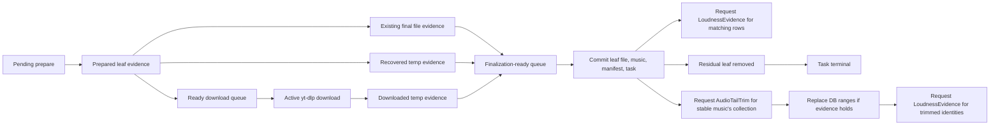

# Download Behavior Design

## Behavior

The download system turns a user supplied collection URL into a stable playlist
collection on disk. It probes the root URL once during enqueue, projects it into
a complete ordered leaf plan, persists that plan as residual task work, downloads
each leaf into a scoped temporary artifact, commits each artifact into its final
collection-relative path, persists collection metadata, and then removes the
completed leaf from the resumable task record. The task row keeps only residual
work and diagnostic counters; completed music identity is owned by the
collection and its manifest.

## Participants

- `yt_dlp`: owns external probing and audio artifact creation.
- `collection_import`: owns collection identity, final file paths, music rows,
  manifests, and file moves from temporary to stable paths.
- `downloads::planning`: owns URL normalization, root probe admission,
  collection plan projection, residual task plan projection, and leaf identity.
- `downloads::service`: owns task lifecycle, leaf scheduling, retry policy,
  recovery decisions, and terminal task status.
- `LeafPipelineState`: owns worker composition, ready queues, active counters,
  and future launch order.
- `LeafDownloadWindow`: owns adaptive download parallelism only.

## Core Invariants

- A playlist plan is complete or explicit failure. The system must not silently
  turn a partial root probe into a completed task.
- A leaf can be consumed as completed only after its audio file is committed to
  a stable collection-relative path and its music metadata is persisted.
- Completed music evidence is owned only by `Collection.musics` and the
  collection manifest. `DownloadTask.leafs` is residual work, not a history log.
- Enqueue persists the complete residual leaf plan after a successful root
  probe. The later task runner must consume that residual plan instead of
  probing the same root URL again.
- Concurrent root probes are bounded at the provider command boundary. Repeated
  paste can queue distinct URLs, but it must not start an unbounded number of
  metadata provider processes.
- Resume must rebuild its plan from residual task leafs when they exist. It must
  not root-probe already materialized music to rediscover completed work.
- A temporary artifact is not a stable file. It can only be consumed by the leaf
  commit path that owns the matching leaf context.
- A leftover temporary artifact can be recovered only when the target is
  unambiguous. Ambiguous residue is rejected instead of guessing.
- Re-running the same task is idempotent: materialized leaves are absent from
  the residual queue, final files are reused only for still-residual leaves, and
  uncommitted temporary artifacts are either committed once or rejected
  explicitly.
- Download failures and post-download commit failures are leaf-local for list
  downloads. One failed leaf cannot stop the remaining leaf pipeline.
- Leaf preparation, leaf download, and leaf finalization are separate pipeline
  stages. A completed download enters the finalization-ready queue and must be
  committed before new prepare-side enrichment work can run. Download slots are
  released by download completion, not by later metadata enrichment.
- Provider access failures, including private videos and authentication-required
  videos, are terminal leaf failures. They are not retried because repeating the
  same unauthenticated request cannot change the provider's access decision.
- Task terminal status is derived from residual failures plus consumed
  completion count. A task with unresolved non-terminal leaves cannot be marked
  `Completed`.
- Cache, existing files, and temporary residue are acceleration or recovery
  evidence only. They do not define playlist membership.
- `DownloadTaskChangeSignal` is task wake evidence only. It cannot become
  playable-track evidence, first-slot cargo, or playback state.
- Playable library wake is emitted only after `CollectionImport` has persisted
  music rows or restored manifest music rows.

## Owned Invariants

`yt_dlp` owns:

- Root probe output reflects every entry the provider exposes for that playlist
  probe.
- Audio download success returns a readable local file path.

`collection_import` owns:

- Final relative paths stay inside the collection folder.
- Collection folder naming is resolved from collection identity and existing
  collection evidence, not from UI state and not from download page state.
- Directory creation happens only while committing a final file or writing the
  collection manifest.
- The temporary marker is removed during finalization.
- File replacement is scoped to the target leaf URL and group.
- Manifest writes reflect persisted collection state.
- Persisted music rows are the only completed music evidence passed to playback
  and model lifecycles.

`downloads::service` owns:

- Leaf identity is indexed by task, leaf URL, and group context.
- Active worker counters match worker events.
- Enqueued collection tasks carry enough residual leaf evidence to start
  without a second root probe.
- Root probe process parallelism is bounded independently from leaf download
  parallelism.
- Retry classification distinguishes transient download failures from
  provider access failures.
- Existing final files and residual temporary files are consumed through the
  same leaf completion semantics as fresh downloads.
- Completed leafs are garbage collected from the task row after collection
  persistence succeeds.
- Residual leafs carry the group context needed to resume without re-expanding a
  root playlist.
- Group context is plan-time or collection-catalog evidence. The leaf hot path
  may reuse known group evidence, but it must not perform provider discovery to
  improve grouping while downloads or finalizations are waiting.
- Unresolved leaves are terminally rejected before task status is finalized.

`LeafDownloadWindow` owns:

- Future parallelism changes only from worker download outcomes.
- Manifest, metadata, and file move errors do not become scheduler signals.

## Stable Domains

`RawUrl -> NormalizedUrl`

- Owner: `downloads::planning::normalize_url`.
- Total: no.
- Failure: explicit URL parse or unsupported-scheme error.

`RootProbe -> CollectionSyncPlan`

- Owner: `downloads::planning::resolve_collection_plan`.
- Total: no.
- Failure: probe failure, empty downloadable list, or unsupported nested depth.
- Projection: one successful playlist root probe must provide collection title,
  collection URL, and all leaf references needed to persist residual task work.

`ResidualDownloadTask -> CollectionSyncPlan`

- Owner: `downloads::planning::residual_collection_plan`.
- Total: no.
- Failure: missing collection identity or collection folder on a residual task.
- Eliminates: root probe and manifest-to-completed-leaf reconstruction during
  resume.

`DownloadedTempFile -> CommittedLeafFile`

- Owner: `collection_import::finalize_downloaded_leaf`.
- Total: no.
- Failure: invalid path, blocked final path, failed remove, or failed move.

`ResidualTempFiles -> RecoverableLeafArtifact`

- Owner: `downloads::service`.
- Total: no.
- Failure: no file, partial artifact, or multiple matching temporary files.

`ExistingFinalFile -> ExistingLeafCompletion`

- Owner: `collection_import::resolve_existing_leaf_file`.
- Total: no.
- Failure: no matching stable file for the prepared leaf title and group.
- Projection: existing file evidence still needs `persist_downloaded_leaf_music`
  and manifest write before the leaf can be consumed as completed.

`LeafCompletion -> PersistedMusicRows`

- Owner: `collection_import::persist_downloaded_leaf_music`.
- Total: no.
- Failure: invalid committed file name or repository write failure.
- Emits: audio-style input wake and playable-library wake.

## Transitions

### Task Runtime

```ts
DownloadTaskRuntime =
  | ["idle"]
  | ["admitting", url: NormalizedUrl, trigger: DownloadTrigger]
  | ["queued", task: DownloadTask]
  | ["resolvingPlan", task: DownloadTask]
  | ["shellPersisted", task: DownloadTask, plan: CollectionSyncPlan, collection: Collection]
  | ["materializedLeafDiscard", task: DownloadTask, collection: Collection]
  | ["leafPipeline", task: DownloadTask, collection: Collection, pipeline: LeafPipelineState]
  | ["terminalizing", task: DownloadTask]
  | ["completed", task: DownloadTask]
  | ["completedWithErrors", task: DownloadTask]
  | ["failed", task: DownloadTask, reason: String]
  | ["interrupted", task: DownloadTask];
```

Idle + enqueue command -> Admitting:

- Reads: normalized URL and active task index.
- Writes: no collection rows and no playable rows.
- Rejection: invalid URL or repository conflict after bounded retries.

Admitting + active task exists -> Queued existing task:

- Writes: task shell fields only if a prepared collection shell already exists.
- Emits: task change only when shell fields are newly attached.
- Rejection: none. Existing active task remains the owner of residual work.

Admitting + no active task -> Queued new task:

- Writes: new task row, optionally with already prepared collection shell cargo.
- Emits: persisted task snapshot.
- Rejection: enqueue URL claim conflict retries inside the runtime owner.

Queued task + residual task plan exists -> Resolving plan:

- Guard: task has collection URL, name, folder, source kind, and residual leafs.
- Writes: resolving status.
- Emits: no root provider probe.
- Rejection: missing residual task identity.

Queued task + root probe success -> Persist residual plan:

- Writes: collection shell, task collection fields, and residual leaf queue.
- Emits: persisted task snapshot.
- Rejection: root probe failure or empty downloadable collection.

Resolving plan + collection shell loaded -> Materialized leaf discard:

- Reads: collection shell, manifest-restored rows, planned leafs, and save root.
- Writes: residual task leafs and completed counter only for leaves whose
  collection row and stable file both already exist.
- Emits: persisted task snapshot.
- Rejection: incomplete existing evidence stays residual. It is not guessed.

Materialized leaf discard + no residual leafs -> Terminalizing:

- Writes: empty collection timestamp if needed, then terminal task status.
- Emits: task terminal change.
- Rejection: none.

Materialized leaf discard + residual leafs remain -> Leaf pipeline:

- Writes: pipeline state only.
- Emits: no playback or first-slot cargo.
- Rejection: none.

### Leaf Pipeline

```ts
LeafPipelineWork =
  | ["pendingPrepare", leaf: PlannedLeaf]
  | ["probingLeaf", leaf: DownloadLeaf]
  | ["prepared", leaf: DownloadLeaf, probe: LeafProbe]
  | ["existingFinalFileDetected", leaf: DownloadLeaf, relativePath: String]
  | ["residualTempDetected", leaf: DownloadLeaf, tempPath: Path]
  | ["readyDownload", leaf: DownloadLeaf]
  | ["downloadingTemp", leaf: DownloadLeaf]
  | ["readyFinalizeDownloaded", leaf: DownloadLeaf, tempPath: Path]
  | ["readyFinalizeExisting", leaf: DownloadLeaf, relativePath: String]
  | ["finalizingLeaf", leaf: DownloadLeaf]
  | ["measuringLoudness", leaf: DownloadLeaf]
  | ["completed", leaf: DownloadLeaf]
  | ["failed", leaf: DownloadLeaf, reason: String];
```

The pipeline fill order is fixed:

1. Drain ready finalizations.
2. Spawn ready downloads up to `LeafDownloadWindow`.
3. Spawn leaf preparations up to prepare parallelism.

This order keeps final file and music-row commits ahead of new prepare-side
enrichment work. It also prevents download completion from waiting behind
metadata probing.

Queued/failed/interrupted leaf + metadata success -> Prepared leaf:

- Writes: title, duration, chapter count.
- Emits: ready download entry or recovered completion.
- Rejection: leaf-local failed preparation.

Prepared leaf + existing final file -> Ready finalize existing file:

- Reads: stable file path under the collection folder.
- Writes: finalization-ready queue entry only.
- Emits: no collection rows yet.
- Rejection: no stable file keeps the leaf on the fresh download path.

Prepared leaf + unambiguous temp residue -> Ready finalize downloaded temp:

- Reads: scoped temporary artifact matching task id and leaf id.
- Writes: finalization-ready queue entry only.
- Rejection: ambiguous residue becomes explicit leaf failure.

Prepared leaf + no existing file and no residual temp -> Ready download:

- Writes: ready download queue entry.
- Emits: no collection rows and no task completion.
- Rejection: none.

Prepared leaf + fresh download success -> Commit leaf:

- Writes: stable file, music entries, manifest, and removes residual leaf.
- Emits: task change signal.
- Rejection: leaf-local failed download or failed commit.
- Scheduling: download completion is queued for finalization immediately and
  drains before prepare-stage enrichment or additional worker launch.

Ready finalize existing file -> Commit existing file:

- Writes: music entries, manifest, and removes residual leaf.
- Emits: task change signal.
- Rejection: metadata persistence failure.
- Scheduling: existing-file evidence enters the same finalization-ready queue
  as fresh and recovered downloads. Preparation must not commit collection or
  manifest state directly.

Ready finalize downloaded temp -> Commit recovered temp:

- Writes: stable file, music entries, manifest, and removes residual leaf.
- Emits: task change signal.
- Rejection: ambiguous residue or failed commit.
- Scheduling: recovered temp evidence enters the finalization-ready queue and
  follows the same commit path as fresh downloads.

Commit leaf -> Post-download work requests:

- Owner: `downloads::service`.
- Reads: committed collection identity, collection source kind, save root, and
  committed relative path.
- Writes: no audio evidence and no music identity changes.
- Emits: two independent cargos:
  - `LoudnessEvidenceRequest` for persisted music rows matching the committed
    relative path.
  - `AudioTailTrimRequest` for the owning collection immediately after this
    single music row is stable.
- Rejection: missing runtime or unsupported collection kind is logged by the
  receiving owner. Download completion is not reopened by post-download work.

Downloaded leaf -> Loudness evidence:

- Owner: `loudness_evidence`.
- Reads: explicit track cargo only.
- Writes: loudness profile for the same file/range identity.
- Rejection: invalid range, missing file, missing DB target, or ffmpeg failure
  closes or preserves the pending task according to loudness evidence rules.
- Closed path: loudness owner does not scan the library for missing evidence.

Stable music row -> Audio tail trim:

- Owner: `audio_tail_trim`.
- Reads: explicit collection cargo only, then the current collection rows.
- Pending store: `audio-tail-trim-pending.json`, keyed by collection URL.
  downloaded/restored/playback cargo is retained while unfinished and removed
  after the owner reaches a logged no-op or applied outcome.
- Writes: `end_ms`, `canonical_music_id`, `occurrence_id`, and cleared
  `loudness_profile` only for rows with strong common-tail evidence.
- Cut point: common-tail evidence identifies which suffix is shared; it is not
  itself the playback cut. `audio_tail_trim` refines each attached track's cut
  to the nearest low-energy boundary around that suffix start, using the
  `ffplayr` tail fingerprint `rms_db` windows and the analysis
  `effective_end_ms` coordinate. If no quiet boundary is available, the owner
  falls back to the common suffix start and still rejects no-op or unsafe
  trims.
- Does not write: `.slisic.collection.toml`; the manifest is download evidence,
  not the normalized DB/playback projection.
- Emits: playable library wake, audio-style wake, current-session identity
  updates for affected playback tracks, and new loudness cargos for trimmed rows.
- Rejection: single-file collections, too few playable files, weak common-tail
  evidence, unsafe trim length, per-track mismatch, and missing files are no-op
  logged outcomes, not download failures.
- Closed path: download task terminal state, UI state, and first/next selection
  do not infer or apply tail trimming directly.

Playback current track -> Audio tail trim priority cargo:

- Owner: `player` emits only the current track event; `audio_tail_trim` owns
  scheduling and detection.
- Reads: current playback track source music identity as focus cargo, then
  resolves save root inside the tail-trim owner without blocking playback
  start.
- Writes: no playback range directly.
- Emits: high-priority `AudioTailTrimRequest` for the source collection.
- Focus rule: the request carries only the current music URL/path/range. The
  tail-trim owner uses that cargo to scan the current track first and, when
  shared-tail evidence already covers it, applies only that focused trim through
  the normal collection commit path while the full collection scan continues.
- Coalesced focus: if playback changes while the collection is already being
  scanned, the active worker may read the coalesced focus cargo before choosing
  the next candidate. This changes scan order only; it never grants playback
  authority to infer or write tail trims.
- Linear consumption: pure `playback_current` cargo coalesced during an active
  scan is absorbed by that scan and removed from the pending store when the scan
  reaches an applied or no-op outcome. `downloaded_leaf` and `restored_manifest`
  cargo remain rerun-required because they may describe a changed collection
  snapshot that the active scan did not observe.
- Rejection: missing source music or collection owner is logged and does not
  alter playback.



Pipeline drained -> Terminal task:

- Guard: no active workers, no ready downloads, no pending preparations.
- Writes: failed status for unresolved leaves, then task terminal status.
- Rejection: any unresolved leaf becomes explicit failed evidence.

### Collection Import Commit

```ts
CollectionImportCommit =
  | ["shellLoaded", collection: Collection]
  | ["manifestRestored", collection: Collection]
  | ["folderReady", collection: Collection]
  | ["finalFileCommitted", relativePath: String]
  | ["musicRowsPersisted", collection: Collection]
  | ["manifestWritten", collection: Collection]
  | ["libraryWakeEmitted", collection: Collection]
  | ["failed", reason: String];
```

Downloaded temp -> Folder ready:

- Owner: `collection_import::finalize_downloaded_leaf`.
- Writes: collection directory only if the final path parent is missing.
- Rejection: invalid final path or failed directory creation.

Folder ready -> Final file committed:

- Owner: `collection_import::finalize_downloaded_leaf`.
- Writes: final collection-relative file path and removes the temp marker.
- Rejection: failed remove, rename, copy, or path containment check.

Existing final file -> Music rows persisted:

- Owner: `collection_import::persist_downloaded_leaf_music`.
- Writes: collection music rows using the existing stable relative path.
- Rejection: existing file without a collection row is not completed music.

Final file committed -> Music rows persisted:

- Owner: `collection_import::persist_downloaded_leaf_music`.
- Writes: materialized music rows and normalized titles.
- Emits: audio-style input wake and playable-library wake.

Music rows persisted -> Manifest written:

- Owner: `collection_import::write_raw_leaf_manifest_evidence`.
- Writes: manifest file from download evidence, creating the collection root if
  needed. Raw title/chapter text comes from `LeafProbe`; measured local audio
  duration can update `end_ms` because it is a downloaded-file fact.
- Does not write: normalized DB title cleanup, audio tail trim, loudness, current
  playback state, or audio-style model state.
- Rejection: manifest serialization or file write failure.

Manifest written -> Download task completion update:

- Owner: `downloads::service`.
- Writes: leaf file fields, measuring/completed status, and residual leaf
  removal.
- Emits: task change signal.

### Playback And FirstSlot Transfer

Download and import do not send playable tracks to waiting playback directly.
The legal transfer is:

```text
CollectionImport.persistedMusicRows
  -> notify_playable_library_changed()
  -> PlayableIndex LibraryChanged wake
  -> FirstSlot/queue owners refresh their own slots
  -> PlaybackStart or PlayerSession reads their owner cargo
```

`DownloadTaskChangeSignal` can wake app projection or playlist queue repair, but
it cannot create a `FirstSlot` credential, choose a track, or move the UI into
play/preparing state by itself.

## Checker Coverage

Focused tests must cover:

- Root playlist probe arguments request YouTube continuation pages.
- 116-entry YouTube playlists are not capped at the initial 100-entry page.
- Enqueue plan persistence saves residual leafs so task startup does not repeat
  the root probe.
- Empty provider lists are rejected before they can become completed
  collections.
- Existing final files complete leaves without redownload.
- Completed leaves are removed from `DownloadTask.leafs`; the task row contains
  only residual work.
- Resume from residual task leafs does not root-probe completed music.
- Exact residual temp files are committed and removed.
- Cross-task residual temp files recover only when the stable title match is
  unique.
- Ambiguous residual temp files are rejected.
- A list commit failure marks only that leaf failed and later leaves still
  complete.
- Terminal task status cannot be `Completed` when unresolved leaves remain.

## Command Owners And Event Outputs

| Command or event | Owner | Output | Closed path |
| --- | --- | --- | --- |
| root probe command | `downloads::service` through bounded root probe admission | `CollectionSyncPlan` | UI or paste candidate starts provider root probes directly |
| leaf prepare command | `LeafPipelineState` through `downloads::service` | prepared leaf evidence or failed leaf evidence | prepare stage writes collection rows |
| leaf audio download command | `LeafPipelineState` through `yt_dlp` | temporary artifact or failed leaf evidence | download stage writes final collection files |
| existing file check | `collection_import` | existing final-file evidence | existing file becomes playable without persisted music rows |
| final file commit | `collection_import` | stable relative path | download runtime creates folders or final files directly |
| music row persist | `collection_import` | canonical collection music rows | task leafs or UI rows become music truth |
| manifest write | `collection_import` | collection manifest file | manifest state is inferred from task status |
| task change publish | `downloads::service` | task wake signal | task wake creates playback state |
| playable library wake | `collection_import` through `playlist_playback::service` | playable index refresh demand | download task change bypasses canonical music rows |
| trace record | trace lifecycle | diagnostic row only | trace event drives any transition |

## Exceptions

None.
